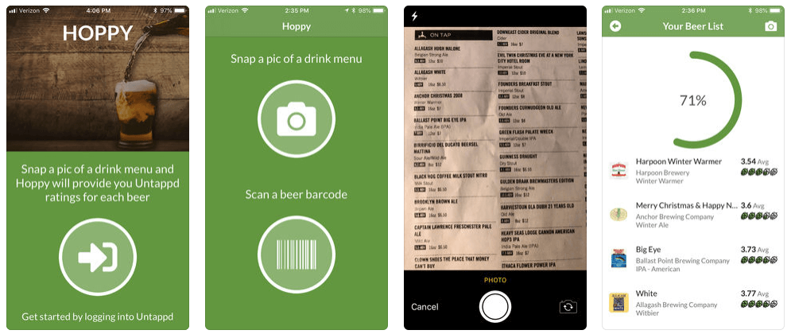
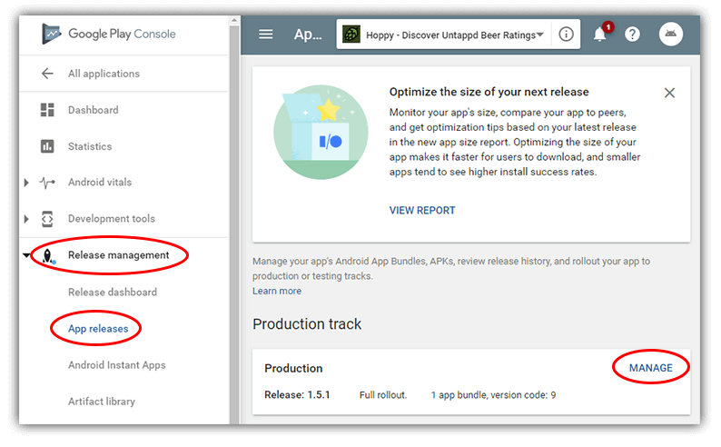
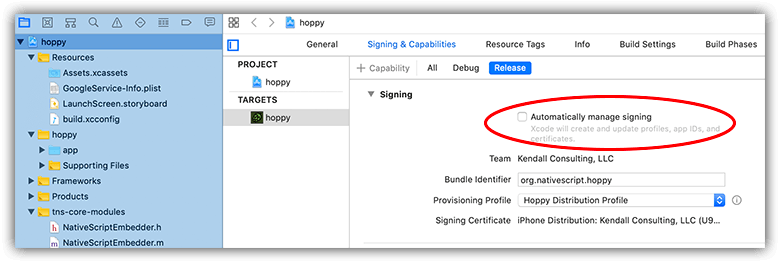
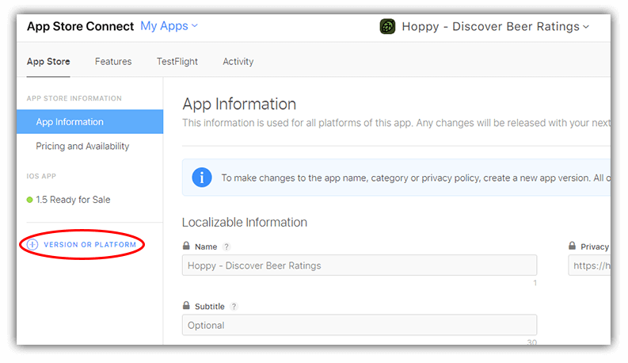
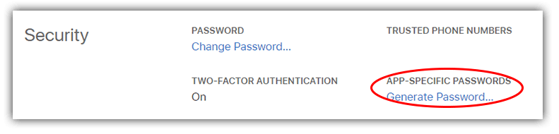

# Tips for Updating NativeScript Apps on App Store and Google Play

So the time has come, once again, to make some updates to my fun little beer app I affectionately call "Hoppy".

> **Shameless promo:** You can find the app on the [iOS App Store](https://apps.apple.com/us/app/hoppy-discover-beer-ratings/id1406526158?ls=1) and [Google Play](https://play.google.com/store/apps/details?id=org.nativescript.hoppy). It's 100% free, you just need a 100% free [Untappd](https://untappd.com/) account to use it! Oh, it's also [fully open source](https://github.com/rdlauer/hoppy).

Now, those of you familiar with the app store submission processes know that you tend to have to *completely re-learn* the steps nearly every time you submit an update (especially on the iOS side 🤬).

Well, I'm here to provide you [NativeScript](https://www.nativescript.org/) developers some shortcuts and save you some hair-pulling when publishing your app updates to the public app stores.

But let's start with the easiest way to update your app: avoiding the app store submission process entirely! 🤯

## NativeScript AppSync

Should you discover an error or minor issue with your app in production, the normal solution to this is to generate a new build of your app and wait the hours (Google Play) or days (iOS App Store) to see your fix go live. Plus you then have to hope and pray that your users are set to automatically install app updates, lest you wait in vain for them to manually install them.

What if you could push an update to your app *immediately*, avoiding the app stores entirely? This is the basic concept behind **NativeScript AppSync**.

> If you've heard of [CodePush](https://microsoft.github.io/code-push/) from Microsoft, you're on the right track. NativeScript AppSync is based on that very same code!

AppSync is a NativeScript plugin (available on the [NativeScript Marketplace](https://market.nativescript.org/plugins/nativescript-app-sync)) and is completely free to install and use:

	tns plugin add nativescript-app-sync

With the plugin installed, you just need to call the `AppSync.sync()` method in your app's `app.js` or `main.ts` file:

	import { AppSync } from "nativescript-app-sync";
	
	AppSync.sync({
	  deploymentKey: "..."
	});

There's a little more to it than that, so be sure to check out TJ VanToll's [excellent blog post about NativeScript AppSync](https://www.nativescript.org/blog/enable-live-updates-of-your-ios-and-android-apps-using-nativescript-appsync) for the full story.

Ok, back to the traditional way of updating our apps. 😭

## Updating Your App on Google Play

Google makes app store submission relatively easy. To create a new version, you'll need to start on the [Google Play Console](https://play.google.com/apps/publish/).

Pick your app, go to **Release management** --> **App releases** --> **Manage** in the *Production Track* tile.

From here, you simply **Create Release**, add some release notes, and upload your build.

### Create Your Build for Android

My go-to way to create a release build for Android is the following NativeScript CLI command:

	tns build android --release --env.snapshot --key-store-path [path to your key store] --key-store-password [key store password] --key-store-alias [key store alias] --key-store-alias-password [key store alias password] --aab --copy-to [path to where you want the aab file created]

There's a lot to unpack in that one command, but you can find all the details of the `build` command in [this doc article](https://docs.nativescript.org/tooling/docs-cli/project/testing/build).

**NOTE:** Due to Google requiring 64-bit builds of your app, I also had to alter my `app.gradle` file and replace the `android` section with this:

	android {
	  defaultConfig {
	    generatedDensities = []
	    ndk {
	      abiFilters.clear()
	      abiFilters.addAll(['armeabi-v7a','arm64-v8a'])
	    }
	  }    
	  buildTypes {
	    debug {
	      ndk {
	        abiFilters 'x86'
	      }
	    }
	  }
	  aaptOptions {
	    additionalParameters "--no-version-vectors"
	  }
	}

YMMV though, as this should be fixed with an upcoming version of NativeScript!

With your `.aab` file created, you will simply upload it via the Google Play Console and you should be good to go.

## Updating Your App on iOS App Store

Oh Apple. I love/hate you so much. You make me spend way too much time in Xcode just to create a release build of my app. Sigh.

Regardless, here are my quick tips for app store glory:

Xcode seems to have a hard time (sometimes) picking the correct certificate and provisioning profile for my app builds. By default, the provisioning profile is "automatically" chosen. However, I've always had to turn this setting off and instead manually pick the distribution profile I wanted to use for a release build:

> If you're having trouble locating the `.xcodeproj` file for your app to open in Xcode, check the `/appname/platforms/ios` directory!

Next, I create a release build of my app with the NativeScript CLI:

	tns build ios --release --for-device --provision [provisioning profile id]

Hmmm...so what is this "provisioning profile id"? I've always found it best to *explicitly define* which provisioning profile I want to use. YMMV of course, but this seems to be the safest way to create a problem-free build.

"How do you get the provisioning profile id" you ask? Open the provisioning profile file you downloaded from Apple in your text editor of choice, and scroll down to the `UUID` key. Therein lies the id:

	<key>UUID</key>
	<string>aaaaaaa-bbbb-cccc-dddd-eeeeeeeeeeee</string>

With your build created, you'll find the `.ipa` file at `/appname/platforms/ios/build/Release-iphoneos/appname.ipa`.

Head over to Apple's [App Store Connect](https://developer.apple.com/app-store-connect/) site and create a new version of your app:

Now you'll need to somehow *upload* this newly-created build. You'd think Apple would just let you upload your build through the website. But no!

To upload an app build, we've traditionally had to use a utility called Application Loader. This tool is no longer available in Xcode though, and, to be completely frank, I was not able to get my app build uploaded using the process in Xcode 11 🤷. So I went the CLI route:

	xcrun altool --upload-app --type ios --file [path to ipa] --username [apple id username] --password [app-specific password]

Using this command will use the Xcode CLI tools to upload and verify your app.

What's this "app-specific password" thing? Since Apple now requires two-factor auth by default, you'll have to head to [Apple ID Account Management](https://appleid.apple.com/account/manage) and create an app-specific password for this step. It's actually quite easy:

When this is done, you should get a couple of emails from Apple notifying you about the status of your build. When you get the all-clear, head back into your developer console and select the new build as part of this new version!

## I Feel Your Pain

Yep, app store approval processes can be a huge drag, no doubt. BUT, you can make your life easier in the future by giving [NativeScript AppSync](https://www.nativescript.org/blog/enable-live-updates-of-your-ios-and-android-apps-using-nativescript-appsync) a try! 🤩

