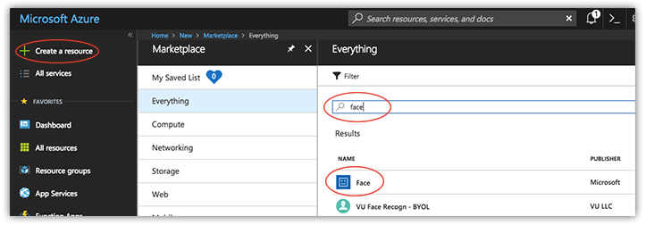
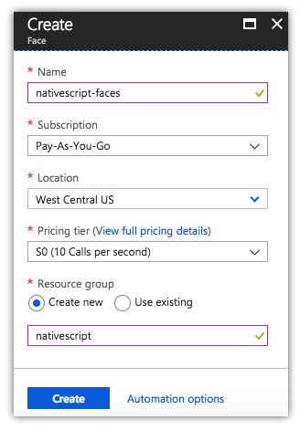
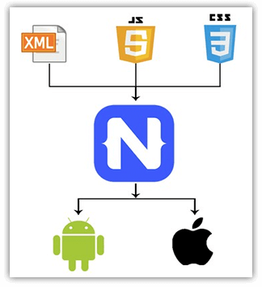
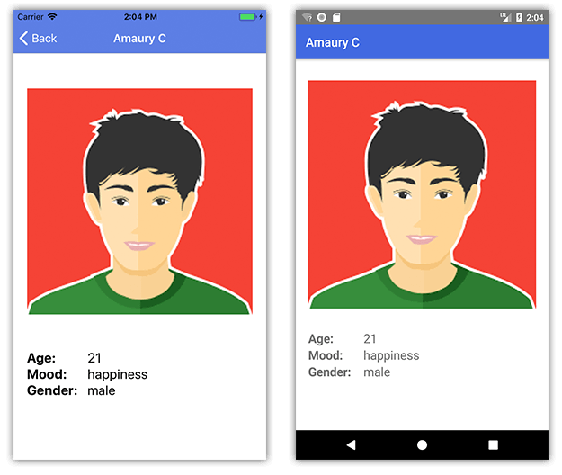

# Using Azure Cognitive Services with NativeScript

Let's face facts: the computers have won! The future now effectively lies in the hands of our supreme robot leaders.

While the present day isn't *quite* a Terminator-style reality 🤖, the truth is that "cognitive services" are exploding. From machine learning to artificial intelligence to other cognitive APIs, these "thinking" services are offloading incredible capabilities to the cloud.

When we talk about specialized cognitive APIs, [Microsoft Azure](https://azure.microsoft.com/) stands out as a reliable option for engaging APIs such as:

- [Vision](https://azure.microsoft.com/en-us/services/cognitive-services/directory/vision/)
- [Knowledge](https://azure.microsoft.com/en-us/services/cognitive-services/directory/know/)
- [Language](https://azure.microsoft.com/en-us/services/cognitive-services/directory/lang/)
- [Speech](https://azure.microsoft.com/en-us/services/cognitive-services/directory/speech/)
- [Search](https://azure.microsoft.com/en-us/services/cognitive-services/directory/search/)

## Azure Face API

One of the more fun APIs to play with is Azure's [Face API](https://azure.microsoft.com/en-us/services/cognitive-services/face/). Using the Face API, you can send Azure an image with a person's face, and it will return a variety of interpreted properties:

	{
		"faceId": "da450841-201c-40a4-b330-2e43ba7f509f",
		"faceRectangle": {
			"top": 87,
			"left": 61,
			"width": 107,
			"height": 107
		},
		"faceAttributes": {
		"gender": "male",
		"age": 21,
			"emotion": {
				"anger": 0,
				"contempt": 0.001,
				"disgust": 0,
				"fear": 0,
				"happiness": 0.762,
				"neutral": 0.237,
				"sadness": 0,
				"surprise": 0
			}
		}
	}

Let's take a look at how we can get started with the Face API.

## Setting Up an Azure Account

Azure provides a completely free 7 day trial to use its cognitive services (and more). After that, you'll have to use a credit card to continue access.

No worries though, as Azure also provides a $200 credit for the first 30 days AND will warn you before you start accruing any fees.

With your Azure account created, open the [Azure portal](https://portal.azure.com/) and navigate to **Create a resource**, search for "face" and enable the Face API:

After clicking the **Create** button you'll fill out a short form with a *name* of the service, *subscription* type (pre-filled), *location* (choose the one closest to you!), *pricing tier* (choose the free one!), and enter a *resource group* name:

At this point, take a note of two things (you'll need both of these in your NativeScript app):

1. Your API key.
2. The URL of your Azure endpoint.

Done? **Great!** That's all we need from the Azure console.

## Brief Intro to NativeScript

If you're new to [NativeScript](https://www.nativescript.org/), don't be shy. It's an easy framework to wrap your head around!

NativeScript is a free and open source framework used to create *truly native* apps for both iOS and Android ([and Web](https://blog.angular.io/apps-that-work-natively-on-the-web-and-mobile-9b26852495e7)) from a single codebase.

NativeScript lets you use your web skills (like JavaScript/TypeScript and CSS) along with popular JavaScript frameworks (like [Angular](https://www.nativescript.org/nativescript-is-how-you-build-native-mobile-apps-with-angular) and [Vue.js](https://www.nativescript.org/vue)) to create mobile apps. It's similar to Ionic in many ways, but without using webviews for your UI layer.

> **TIP:** The best way to get started with NativeScript is by running through the quick tutorials on the [NativeScript Playground](https://play.nativescript.org/?template=play-ng&tutorial=getting-started-ng). You can also learn how the UI layout system works at [Learn NativeScript Layouts](https://www.nslayouts.com/)!

## Building a NativeScript App

Let's build a simple app that has two pages/views. One view to list people and another to show an individual's picture along with facial attributes returned from Azure.

> **NOTE:** This app is inspired by a meetup session given by [Ignacio Fuentes](https://twitter.com/ignacioafuentes) at the JavaScript NYC meetup. [Click here](https://livestream.com/internetsociety/js-nyc-feb18?t=1519343631) to view the complete session.

Since the [Meetup API](https://www.meetup.com/meetup_api/) is so gracious to return photos, we can easily use that as our data source for our first view.

	https://api.meetup.com/JS-NYC/events/246938509/rsvps?response=yes&only=member

...returns the following JSON for the selected [JavaScript NYC](https://www.meetup.com/JS-NYC/) meetup:

	{
		"member": {
			"id": 207291595,
			"name": "Adam Chen W.",
			"photo": {
				"id": 271369722,
				"highres_link": "https://secure.meetupstatic.com/photos/member/c/2/3/a/highres_271369722.jpeg",
				"photo_link": "https://secure.meetupstatic.com/photos/member/c/2/3/a/member_271369722.jpeg",
				"thumb_link": "https://secure.meetupstatic.com/photos/member/c/2/3/a/thumb_271369722.jpeg",
				"type": "member",
				"base_url": "https://secure.meetupstatic.com"
			},
			"event_context": {
				"host": false
			}
		}
	},

Consuming this in NativeScript is extremely easy, with a simple `http` call:

	function fetchAllPeople() {
	  http
	    .getJSON(
	      'https://api.meetup.com/JS-NYC/events/246938509/rsvps?response=yes&only=member'
	    )
	    .then(
	      function(u: any) {
	        vm.set('items', u);
	      },
	      function(e) {
	        console.log(e);
	      }
	    );
	}

### List of People

We can then display this data in a [NativeScript ListView](https://docs.nativescript.org/ui/list-view) (which is a cross-platform abstraction of native iOS and Android listview controls):

    <ListView items="{{ items }}" itemTap="fetchPerson" class="list-group">
        <ListView.itemTemplate>
			<GridLayout class="list-group-item" rows="auto" columns="auto, *">
				<Image row="0" col="0" src="{{ member.photo.thumb_link }}" class="thumb img-rounded" />
				<StackLayout row="0" col="1" >
					<Label text="{{ member.name }}" class="list-group-item-heading" />
					<Label text="{{ member.photo.type }}" class="list-group-item-text" />
				</StackLayout>
			</GridLayout>
        </ListView.itemTemplate>
    </ListView>

Let's sprinkle in a little CSS to clean up the look of our app:

	.btn {
		font-size: 22;
		background-color: royalblue;
	}
	
	.action-bar {
		background-color: royalblue;
		color: white;
	}
	
	.lbl-bold {
		font-size: 20;
		font-weight: bold;
	}
	
	.lbl {
		font-size: 20;
	}
	
> Yep, the same CSS you use on the web is used to style your native mobile apps, cross platform! Learn more about [using CSS with NativeScript](https://docs.nativescript.org/ui/styling).

This should magically return the following screen on iOS and Android:

> Now is a good time to note that the full source code for this app (built with TypeScript) is available in [this GitHub repository](https://github.com/rdlauer/meetupfaces). If you're looking for a similar version for Angular, [take a look here](https://github.com/ignaciofuentes/meetupfaces).

### Photo Details with Facial Attributes

When I tap on one of the individuals in the `ListView`, I can send a URI of the image to Azure and the Face API:
	
	http.request({
	  url:
	    'https://westcentralus.api.cognitive.microsoft.com/face/v1.0/detect?returnFaceId=true&returnFaceLandmarks=false&returnFaceAttributes=age,gender,emotion&subscription-key=YOURAPIKEY',
	  method: 'POST',
	  headers: { 'Content-Type': 'application/json' },
	  content: JSON.stringify({
	    url: vm.get('photo') // a reference to your photo
	  })
	})

...it's at this point the Azure magic happens and returns the following:

	{
	  "faceId": "1cd4bd2e-c88c-491d-b6f0-7f20d75ae579",
	  "faceRectangle": {
	    "top": 87,
	    "left": 61,
	    "width": 107,
	    "height": 107
	  },
	  "faceAttributes": {
	    "gender": "male",
	    "age": 21,
	    "emotion": {
	      "anger": 0,
	      "contempt": 0.001,
	      "disgust": 0,
	      "fear": 0,
	      "happiness": 0.762,
	      "neutral": 0.237,
	      "sadness": 0,
	      "surprise": 0
	    }
	  }
	}

You'll see we can retrieve Azure's best guess at an `age`, `gender`, and `mood` (mood being the **highest** number value of all possible moods).

Provided we haven't missed anything (hey, I'm an awful coder sometimes, you never know!) we should see a screen that looks something like this:

**And we are done!** 😀

## Conclusion

While this was a fairly simple example, it does give you a brief glimpse of the power of cognitive services. Whether you are using Azure, AWS, or [Progress](https://www.progress.com/cognitive-business-apps), rest assured cognitive-first is the future of engaging app development across all devices and experiences.