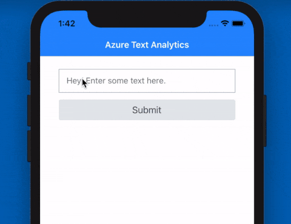

# Language Detection with NativeScript and Azure Cognitive Services

Ever have the need to determine the *language* of a text input in your mobile app? While this may seem like a niche bit of functionality, if you think about it, there are numerous use cases for language detection:

- Providing a customized experience based on language, not location;
- Identifying and translating text between languages;
- Routing questions to a person with the appropriate language knowledge.

Thankfully we can look to the cloud for an easy solution to this problem. Specifically, [Microsoft Azure](https://docs.microsoft.com/en-us/azure/).

> Interested in using Azure with NativeScript? Learn more at our upcoming [webinar on Thursday, November 7th](https://attendee.gotowebinar.com/register/3325827363192779779?source=blog)!

Azure provides a variety of "cognitive services" that allow your apps to interact with AI-powered algorithms in the cloud. You can enable your app to use some of its "human" senses by seeing, hearing, speaking, and interpreting input via traditional communication methods.

Let's take a look at how we can tap into just one of these Azure Cognitive Services APIs today: [Text Analytics](https://docs.microsoft.com/en-us/azure/cognitive-services/text-analytics/overview).

> **NOTE:** Before you continue, if you don't already have a free Azure account, [create one now](https://azure.microsoft.com/en-us/free/). You'll need your subscription key and remote endpoint address to actually do anything!

## Create an Azure Cognitive Services Resource

We need the all-important **subscription key** and **remote endpoint** to authenticate our NativeScript app with Azure. So first, you'll need to create a new *Azure Cognitive Services resource* using either the Azure Portal or the Azure CLI. This resource will enable access to the Text Analytics APIs.

> **TIP:** No need to replicate the docs! Microsoft provides some simple instructions on how to do this via the [Azure portal](https://docs.microsoft.com/en-us/azure/cognitive-services/cognitive-services-apis-create-account) or the [Azure CLI](https://docs.microsoft.com/en-us/azure/cognitive-services/cognitive-services-apis-create-account-cli).

With this step complete, you should have a **remote endpoint** that looks something like this:

	https://myservicename.cognitiveservices.azure.com

...and a **subscription key** for authentication with Azure, looking something like this:

	8hj3jks686l98098jhkhhu678686adfe
	
Don't try using either of the above, they won't work 😉.

## English, Bulgarian, or...Esperanto?

With your key and endpoint in-hand, we can get to the code. The sample app I create today is going to be awfully simple. It's going to include:

- A `TextField` UI component for, well, text input;
- A `Button` component for the user to tap (stop me of this is getting too complicated);
- A `Label` component to display Azure's best guess at a language of the inputted text.

Here is my basic UI layer:

	<Page 
		xmlns="http://schemas.nativescript.org/tns.xsd" 
		navigatingTo="navigatingTo"
		class="page">
		
	    <Page.actionBar>
	        <ActionBar title="Azure Text Analytics" class="action-bar"></ActionBar>
	    </Page.actionBar>
	    
	    <StackLayout class="p-20">
			<TextField hint="Hey! Enter some text here." text="{{ theText }}" returnKeyType="done" />
	        <Button text="Submit" tap="{{ onTap }}" class="-primary -rounded-sm" />
	        <Label id="lblLanguage" class="h2 text-center" textWrap="true"/>
	    </StackLayout>
	    
	</Page>

With a sassy sprinkling of SASS in my `app.scss` file to give my app a "Bootstrap" kind of look and feel:

	$base-theme: Bootstrap;
	$skin-name: Bootstrap;
	$swatch-name: Bootstrap;
	$border-radius: 0.25rem;
	$accent: #007bff;
	$secondary: #e4e7eb;
	$info: #17a2b8;
	$success: #28a745;
	$warning: #ffc107;
	$error: #dc3545;
	$body-bg: #ffffff;
	$body-color: #292b2c;
	$component-bg: #ffffff;
	$component-color: #292b2c;
	$card-cap-bg: #f7f7f9;
	$card-cap-color: #292b2c;
	$series-a: #0275d8;
	$series-b: #5bc0de;
	$series-c: #5cb85c;
	$series-d: #f0ad4e;
	$series-e: #e67d4a;
	$series-f: #d9534f;
	
	@import '~nativescript-theme-core/index';

> **TIP:** If you're new to NativeScript, my favorite resources include the [NativeScript Playground tutorials](https://play.nativescript.org/) and [nslayouts.com](https://www.nslayouts.com/) to learn about native user interface layouts.

**Next I want to wire up my UI layer to Azure.** I don't need any fancy Azure SDK for this in particular - though there is a [JavaScript SDK](https://docs.microsoft.com/en-us/azure/javascript/) should you need to use one in the future.

	import { Observable } from 'tns-core-modules/data/observable';
	import { request } from 'tns-core-modules/http';
	const topmost = require('tns-core-modules/ui/frame').topmost;
	
	export class HelloWorldModel extends Observable {
	    theText: string;
	
	    onTap() {
	        const page = topmost().currentPage;
	        const key = '[insert your key]';
	        const endpoint = '[insert your endpoint]';
	        const path = '/text/analytics/v2.1/languages';
	
	        let docs = { documents: [{ id: '1', text: this.theText }] };
	
	        let getLanguage = function(d) {
	            let body = JSON.stringify(d);
	
	            request({
	                url: endpoint + path,
	                method: 'POST',
	                headers: {
	                    'Content-Type': 'application/json',
	                    'Ocp-Apim-Subscription-Key': key
	                },
	                content: body
	            }).then(
	                response => {
	                    let res = response.content.toJSON();
	                    let lblLanguage = page.getViewById('lblLanguage');
	                    lblLanguage.text = '"' + d.documents[0].text + '" is probably ' + res.documents[0].detectedLanguages[0].name + '.';
	                },
	                e => {
	                    console.log(e); // error
	                }
	            );
	        };
	
	        getLanguage(docs);
	    }
	}

> **NOTE:** This example is using "core" NativeScript (the plain vanilla JavaScript/TypeScript flavor). You can also use [Angular](https://www.nativescript.org/nativescript-is-how-you-build-native-mobile-apps-with-angular) or [Vue.js](https://www.nativescript.org/vue) of course.

Let's walk through this code:

- My `onTap` method responds to a user tapping on the button.
- The `getLanguage` method inserts the entered text into an array of `documents` that Azure is anticipating.
- With the cross-platform HTTP `request` module, we can `POST` our data and receive a response from Azure!

**Easy peasy!**

The resulting JSON response from the above request is going to look something like this:
	
	{
	   "documents": [
	      {
	         "id": "1",
	         "detectedLanguages": [
	            {
	               "name": "English",
	               "iso6391Name": "en",
	               "score": 1.0
	            }
	         ]
	      }
	   ]
	}

You can see in the `detectedLanguages` node that we've identified "English" as the most probable language. Try it for yourself with some other languages:

- Español: "Hola Mundo"
- Simplified Chinese: "你好，世界"
- Bulgarian: "Здравей свят"
- Esperanto: "Saluton mondo"

At this point your app logic can take over and direct the user's experience based on the language detected!

## What's Next?

We'll be taking a closer look at Microsoft Azure, Azure Functions, and other Cognitive Services in future articles.

Happy NativeScripting with Azure! ☁️