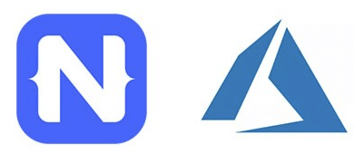

# Webinar: Scale Your Apps with NativeScript and Microsoft Azure

One could argue that it’s never been easier and yet never been more difficult to build a mobile app.

Today’s tooling (like VS Code) and frameworks (like NativeScript) allow you to quickly build performant, native mobile apps for iOS and Android. All using the skills you’ve come to know and love ❤️.

But what about the backend? What about tapping into the expanding power of the cloud to enable previously unattainable features in your app? Building an app that scales with both modern features AND expanding user needs can be a struggle. Enter [Microsoft Azure](https://docs.microsoft.com/en-us/azure/).

🚨 Webinar Alert! 🚨

[Join us on Thursday, November 7th](https://attendee.gotowebinar.com/register/3325827363192779779?source=blog) as we tap into the capabilities offered to mobile app developers by Azure. No longer “just” a backend-as-a-service, Azure includes a myriad of scalable storage offerings, “smart” AI-enabled services, mobile DevOps, and more, enabling you to tackle the frontend AND backend of app development.

We’ll show you how to make the most out of [using Azure with NativeScript](https://www.nativescript.org/nativescript-and-microsoft-azure)!

[Register for the Webinar](https://attendee.gotowebinar.com/register/3325827363192779779?source=blog)