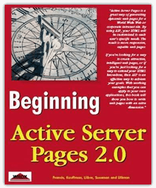
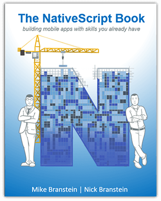

# Curl Up with Two New NativeScript Books

While I may be dating myself a bit, my first exposure to programming was via *Beginning Active Server Pages 2.0*. According to the jacket cover:

> ASP is the future of the web. With ASP, you can customize your web pages to be more dynamic, more efficient and more responsive to your users. This book will teach you everything you need to create useful real-world applications on the web.

I can't disagree! As long as the definition of the "future" is 1999-2001.

While it's always funny to look back, it's important to recognize these learning materials as building blocks that helped to make us into the developers we are today.

**That's why I'm happy to provide information on two NEW books on NativeScript, available today:**

## NativeScript for Angular Mobile Development

Written by two prominent community members, [Nathan Walker](https://twitter.com/wwwalkerrun) and [Nathanael Anderson](https://twitter.com/CongoCart), *NativeScript for Angular Mobile Development* focuses on the key concepts you need to know when building NativeScript apps with Angular.

The authors walk you through building a fun multi-track recording studio app, touching on powerful native key concepts you need to know when you start building an app of your own. You'll gain understanding of NativeScript's `tns` command-line utility to run the app on iOS and Android. After covering some fundamentals, the book ventures into integration of third-party plugins, in addition to providing rich details on how to work with Objective C/Swift and Java APIs to tap into each platform's full potential. Because app state management can be quite challenging, the book guides the reader through integrating `@ngrx/store` plus `@ngrx/effects` to establish some solid practices (Redux-inspired) to deal with state management.

Having great data flow and solid architecture is meaningless if the app doesn't look good or offer a great user experience, so the book details how to use SASS to polish a style for the app. Once the feature sets are largely implemented, the book covers how to deal with debugging problems and invests some time into writing tests to prevent bugs in the future. Lastly, the app is bundled with webpack and deployed to the Apple App Store and Google Play.

By the end of the book, you'll know the majority of the key concepts needed to build a cross-platform native mobile app with Angular and NativeScript!

**[Grab your copy of NativeScript for Angular Mobile Development.](https://www.packtpub.com/web-development/nativescript-angular-mobile-development)**

## The NativeScript Book

Another outstanding set of community members, the [Brosteins](https://twitter.com/Brosteins) ([Nick](https://twitter.com/NickBranstein) and [Mike](https://twitter.com/MikeBranstein) to be specific), have collaborated on a book titled, appropriately enough, *The NativeScript Book*. While *NativeScript for Angular Mobile Development* focuses on developing with Angular, *The NativeScript Book* approaches NativeScript development from the perspective of the traditional vanilla JavaScript developer (although it also contains three chapters on Angular).

Topics covered in *The NativeScript Book* include:

- App structure;
- Pages and navigation;
- Layouts (stack, grid, etc.);
- Working with data, observables, and binding;
- Interfacing with native hardware (camera, gps, etc.);
- Themes and styling;
- Refining the user experience with dialogs, modals, etc.;
- Deploying to iOS and Android;
- iOS security and using Xcode;
- Angular and NativeScript: components, routing, modules, data binding, services.

**You can't go wrong with the price of The NativeScript Book, because it's free!**

You can download your own copy (in epub and/or pdf formats) by visiting [nativescript.org/book](https://nativescript.org/book).
