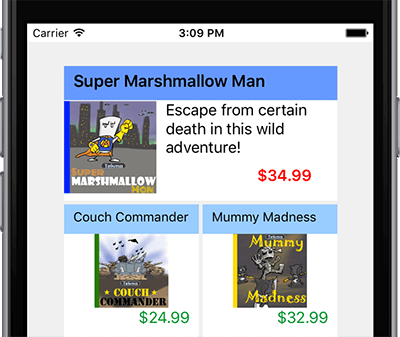
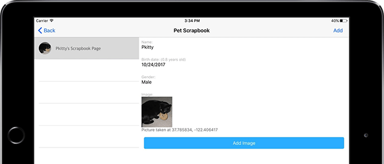
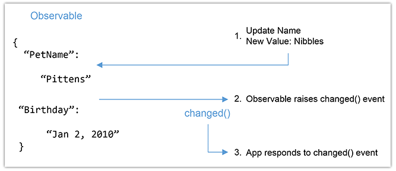
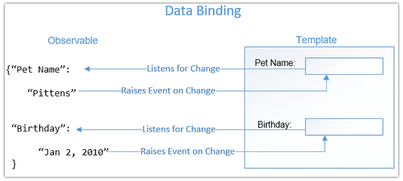

# Working with Data in NativeScript

*Save 50% off [NativeScript in Action](https://www.manning.com/books/nativescript-in-action) with code `nstelerik`.*

Learning the ins and outs of a new framework is something you’ll do regularly as a developer. It may be for work, home, or even just for fun…because, why not? Right? Although different, most frameworks look the same from afar, providing three core UI-related functionalities: definition of the UI, getting data, and marrying the two together. NativeScript is no different – you define your UI with XML, you get data by writing JavaScript code, and NativeScript’s data binding system and observable objects make them work together.

This post is an excerpt from NativeScript in Action, a book we’re writing about developing native mobile apps with NativeScript. We’ll teach you about writing less code and making your apps more dynamic with data binding.

## Why do you need dynamic UIs?

Since the beginning of the Internet, we understood the importance of a dynamic UI: without them we’d have to resort to massive amounts of text-based data on web pages. And when the data needed to change, we’d manually update it. If we were lucky, we only had one copy of the data, but in most cases, there were multiple. A solution to this problem was storing the data centrally and programming the UI to pull data form the central location, dynamically changing what the UI displayed.

NativeScript in action takes you through the journey of static to dynamic UIs. In the first half of the book, you learn how to create static UIs by creating the Tekmo app, a mobile store front for the Tekmo company, who sells vintage video games to enthusiasts. (If you want to learn more about the Tekmo app, [check out our previous post](https://brosteins.com/2016/12/13/understanding-basics-nativescript-app-layouts/).)

Look at the products page of the Tekmo app. Although it’s hard to tell, the UI is static and hard-coded:

*The products page from the Tekmo app, showing several hard-coded products.*

Each of the products has been hard-coded in the product page’s XML file. Yeah, it’s only six products, but what if there were dozens of products. Better yet, what if the products changed on a regular basis? Updating hard-coded UI elements would become cumbersome rather quickly. Plus, we’d have to re-deploy the app for users to get an updated version!

Let’s take a different approach: imagine we pulled the product listings for the Tekmo app from a file, database, or publically-accessible API endpoint? After retrieving this data, we could update the product listing with the retrieved data. This would allow us to write less code and our app would be more dynamic because we’re no longer hard-coding everything. So, how do we write less code, while still allowing users to create multiple pages with their scrapbook? It may not be obvious, but we’ll do this using templates.

> Templates are a way to create the UI element structure of page, without adding the actual text or image data displayed. Once created, the UI elements in a template act as placeholders for the real element displayed on the screen.

## The journey to a more dynamic UI

Let’s set aside the Tekmo app and visit a second app we build in NativeScript in Action: the Pet Scrapbook. The Pet Scrapbook lets users capture the fun moments of their pet’s life by creating virtual scrapbook of pages filled with images and captions. 

In the Pet Scrapbook, it makes sense to create a template representing the structure of a single scrapbook page. The template will contain placeholders for a pet’s name, age, the title of the page, images, and captions. You might still be wondering how this will save you time, and allow you to write less code. Let’s think about this in the context of a real scrapbook. Imagine you’re creating a physical scrapbook, and want to add a page to the book. You get a piece of colored paper and start by organizing the page: measuring and using a ruler to ensure items are aligned, straight, and arranged like other pages in your scrapbook. You do this for each picture, sticker, and text you add to the page. This sounds time-consuming, but what if you started with a template: a page that was already laid out with placeholders for the page’s title, your pet’s name, pictures, and other design elements? Suddenly adding a new page becomes much easier because the heavy lifting has been done and you only need to worry about the page’s content.

Using templates in our app is like using a template in a real scrapbook. When you add a new page to the NativeScript pet scrapbook, you’ll be able to use the same template, but display different details. Because we’re re-using the same template, we’ll also re-use the code we write for the page.

Let’s see where the template concept could apply in the context of our Pet Scrapbook app. Below is an example image from Pet Scrapbook. On the left side of the screen there’s a list of scrapbook pages, and the right shows the details of a page when it’s selected on the left.

*An example page from the Pet Scrapbook app.*

Using a template for the left list view makes sense – as pages are added, we can re-use the template over and over, filling in the spaces for the pet’s image and the pet’s name. The details view on the right side is also a great candidate for a template. As different pages are selected on the left, a template could be used to fill in the pet’s name, birth date, etc.

## Databinding

Now that you know about templates, we want to introduce you to how a single UI template can be reused to display different details. The underlying technology used to do this is called *databinding*.

> Databinding is the process of linking UI elements to objects in code. When a change is made to a UI element it’s linked to an object in code, the change is reflected in the object or property. UI elements that’re linked to objects in code are referred to as being *data-bound*.

Databinding is the name for the overall process of linking together a JavaScript object and UI elements. Databinding is important because it solves the problem of needing to hardcode products into the product page of the Tekmo app or updating an age field on the Pet Scrapbook app based on the birthday that a user enters. Before we dive further into using databinding, let’s learn about one more concept that drives the inner-workings of databinding: *observables*.

> Observables are special JavaScript objects that provide your code with notifications when one of their values changes.

We like to think of observables like kids in a classroom: every time something changes, they raise their hands to tell their teacher. It could be a runny nose, they need to use the bathroom, or want to show their teacher the cool robot picture they drew. It doesn’t matter what changed, but they’ll raise their hand whenever something changes to make sure their teacher knows about it. Kids are like observable objects (also known as observables), except observables don’t raise their hands, they raise an event. Figure 3 shows how an observable object raises an event when one of its internal values changes. In the context of the Pet Scrapbook, we may have an observable tracking the name and birthdate of our pet.

*Your app can respond to an observable object when one of its internal values changes.*

At this point, you may be wondering how this ties together. Templates, databinding, observables, events (oh my)! Together these concepts form the foundation that we’ll be working with to solve the hard-coding problem. Figure 4 shows the relationship between these four concepts.

*The relationship between databinding, templates, observables, and observable change events.*

Databinding describes the act of linking together a UI template and an observable. Once linked, the template listens for change events to be raised by the observable. When a change happens to an observable’s value, an event is raised. The registered event listener then responds to the observable’s change by displaying the observable’s new value.

There! Now you’ve seen a simple example of how databinding is used to track a pet’s name and birthdate. So, if you’re interested in databinding and how it’s done, or if you want to know how a cat got a hold of a bagel in the pet scrapbook, check out the free first chapter of [NativeScript in Action](https://www.manning.com/books/nativescript-in-action?a_aid=nativescript&a_bid=ea1dc18b) and see this [Slideshare Presentation](http://www.slideshare.net/ManningBooks/nativescript-in-action).

**Don’t forget to save 50% off [NativeScript in Action](https://www.manning.com/books/nativescript-in-action) with code `nstelerik`.**