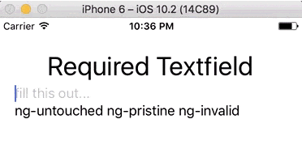
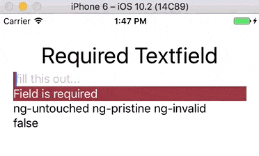

# Requiring Form Fields with NativeScript and Angular

*The following is a guest blog post by Nick Brainstein, co-author of the upcoming NativeScript in Action book. The first nine chapters of the book are [already available](https://bit.ly/nsinaction), and if you purchase today with the code **nstelerik** you’ll get 50% off.*

I’ve been dabbling in NativeScript since the early beta days in 2015 so needless to say I’ve been following NativeScript for quite some time now and I love the ease as to which it helps me create iOS and Android apps. Last year at [ng-conf](https://www.ng-conf.org/), the NativeScript team made a big splash by announcing the integration of Angular and NativeScript. Secretly, I had been looking for an excuse to learn Angular and this marriage of the two frameworks gave me that excuse. In this post we’re going to talk about the integration of a feature from Angular into a NativeScript with Angular app. I’ll assume that you’ve already completed a basic NativeScript and Angular app. If you aren’t familiar with Angular and how it integrates with NativeScript it’s pretty quick to pick up so [head on over to the tutorial](http://docs.nativescript.org/angular/tutorial/ng-chapter-0) and meet me back here when you are done!

## Forms

One of the things that I find myself doing a lot in apps (mobile and web) is collecting input and data from the user. In a web app, you have a form element that you can use to capture multiple data points from a user. Angular comes with a lot of features out of the box that work directly with the form control of a web app such as data binding, validation, and error handling. You can learn more about Angular forms and features [right here](https://angular.io/docs/ts/latest/guide/forms.html).

In a NativeScript app, there is no native form element like there is for the web. If you are building a NativeScript app with Angular, you can still take full advantage the features that Angular provides for forms. Let’s take a look and see how we can port this functionality over to a NativeScript with Angular app.

## "Forms" in NativeScript with Angular

When using two-way databinding in your app (done by importing NativeScriptFormsModule into your AppModule), Angular automatically tracks the state of controls by applying the following classes to each element: `ng-touched`, `ng-untouched`, `ng-dirty`, `ng-pristine`, `ng-valid`, and `ng-invalid` (for more information you can review these classes in the [official Angular documentation](https://docs.angularjs.org/api)).

Let’s take a look at a simple example “form” in a NativeScript view:

	<StackLayout class="p-20">
	    <Label text="Required Textfield" class="h1 text-center"></Label>
	    <TextField required hint="fill this out..." [(ngModel)]="textField" #element></TextField>
	    <Label [text]="element.className"></Label>
	</StackLayout>

As you can see, Angular will apply the appropriate classes to NativeScript components the same way it works with forms in a web page. One important note is that Angular is tracking the valid/invalid state of the native `TextField` because we added the required property to it; even though required is not a property that NativeScript exposes, Angular is still able to read it.

## Field Validity

If we modify the example slightly and get a reference to the backing model of the `TextField`, then we are able to also read the valid property model that Angular is tracking for us to quickly determine if the `TextField` is populated or not.

	<StackLayout class="p-20">
	    <Label text="Required Textfield" class="h1 text-center"></Label>
	    <TextField required hint="fill this out..." [(ngModel)]="textField" #element #elementModel="ngModel"></TextField>
	    <Label [text]="element.className"></Label>
	    <Label [text]="elementModel.valid"></Label>
	</StackLayout>

## Finishing Touches

Since we know we can leverage Angular 2 in our NativeScript app to keep track of fields we want to require let’s finish porting the Angular 2 examples over to a NativeScript app. First, we can apply styling to our TextField based on the classes Angular 2 is creating.

	.ng-valid[required] {
		border-left-color: #42A948; 
		border-left-width: 3;
	}
	.ng-invalid {
		border-left-color: #a94442; 
		border-left-width: 3;
	}
	.validation {
	    background-color: #a94442;
	    color: #ffffff;
	}

Next, we can show/hide a save button on our page if the field is invalid.

	<StackLayout class="p-20">
	    <Label text="Required Textfield" class="h1 text-center"></Label>
	    <TextField required hint="fill this out..." [(ngModel)]="textField" #element #elementModel="ngModel"></TextField>
	    <Label class="validation" [visibility]="elementModel.valid ? 'collapse' : 'visible'" text="Field is required" ></Label>
	    <Label [text]="element.className"></Label>
	    <Label [text]="elementModel.valid"></Label>
	    <Button [visibility]="elementModel.valid ? 'visible' : 'collapse'" text="Save" class="btn btn-primary"></Button>
	</StackLayout>

## Results!

In this post we’ve discussed how to require fields using Angular forms. You can get the full code for this example on [GitHub](https://github.com/NickBranstein/nativescript-samples/tree/master/angular-requiredfield).