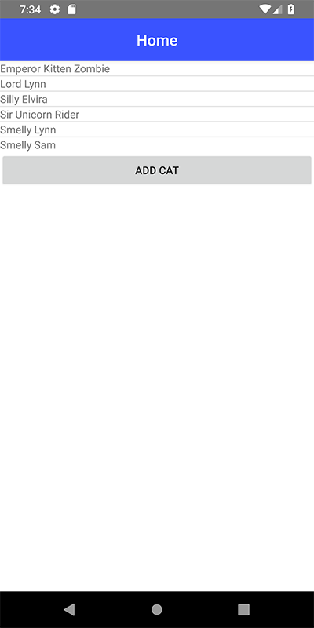

# Client-Side Storage in NativeScript Applications

While working on the outline of a new [NativeScript-Vue](https://nativescript-vue.org/) demo I want to create (and write about!), I discovered another aspect of NativeScript development that I had not explored yet - Client-Side Storage. I'm very well versed in the various means of storing data on the client in a web application, but I had not yet looked at what NativeScript supports. In this article, I'm going to discuss what you can do, show some examples, and draw comparisons to how they relate to standard Web APIs. And yes, there will be a cat demo.

## Storage on the Web

For some time now browsers have had the ability to store data on the client, although how much and how well has been in flux for just as long. Broadly speaking, and ignoring deprecated technologies we will not speak of, storage on the web comes down to two core technologies:

* [Web Storage](https://developer.mozilla.org/en-US/docs/Web/API/Web_Storage_API), more commonly known as Local Storage, is a simple "key/value" system for storing small pieces of data. It has performance issues when used with a large amount of data, but in my opinion that's an improper use of the technology and less a failing of the spec itself. It is *incredibly* easy to use and is great for things like persisting forms, shopping carts, and user preferences. 
* [IndexedDB](https://developer.mozilla.org/en-US/docs/Web/API/IndexedDB_API) is *not* a simple API but is much more appropriate for large data that needs to be searched and filtered. Broadly you can compare it to MongoDB and other NoSQL type solutions.

Both of these have incredibly good support. According to [CanIUse](https://caniuse.com) support for [web storage](https://caniuse.com/#feat=namevalue-storage) has nearly 97% support across browsers and [IndexedDB](https://caniuse.com/#feat=indexeddb) is at nearly 96%. Obviously none of these technologies replace a "real", Enterprise-level storage server, but they are both incredibly helpful for storing data and improving performance by allowing the browser to hold on to and persist data across page views.

## Storage in NativeScript

So I've made it clear that I'm coming into NativeScript from a web developers perspective and when I was planning my next demo application, I didn't even *think* about the storage aspect as I just assumed it was a given based on my experience with web development. I came to a quick halt when I realized that I'd have to actually figure out what I'd use instead. Luckily I found *multiple* useful methods of storing data that actually paralleled my existing knowledge very well. 

## Keeping it Simple with ApplicationSettings

The simplest storage option for NativeScript applications is ApplicationSettings. If you have any familiarity with Local Storage then this feature will be easy to pick up. Like Local Storage, ApplicationSettings is used to store simple values by a key name. The API supports:

* Setting values (duh)
* Getting values (of course)
* Checking if a value exists
* Deleting a value
* Deleting *everything*
* And providing quick access to the underlying native APIs that ApplicationSettings wraps if you need lower level access

The only real "complexity" with ApplicationSettings is that separate APIs exist for working with boolean, string, and number values. Let's take a look at an incredible simple example of this in action.

The following application will simply keep track of the number of times it's been opened. Trivial, but actually kind of a cool metric you may want to track. Here's the initial template.

	<template>
	    <Page class="page">
	        <ActionBar title="Home" class="action-bar" />
	        <ScrollView>
	            <StackLayout class="home-panel">
	                <!--Add your page content here-->
	                <Label textWrap="true" :text="numberOfVisits" />
	            </StackLayout>
	        </ScrollView>
	    </Page>
	</template>
	
	

My view is just a `Label` element bound to a computed variable I'm using to create a descriptive message. It makes use of `hits` which for now is just 0. Now let's add in ApplicationSettings support. To begin, we import the library:

	const appSettings = require("application-settings");

Next, we can add the `created` method to execute code as the component is setup:

	created() {
		this.hits = appSettings.getNumber("hits");
		if(!this.hits) this.hits = 0;
		appSettings.setNumber("hits", ++this.hits);
	}

We begin by loading in the value from `appSettings`. Notice `getNumber`. As I said, `ApplicationSettings` supports loading booleans, strings, and numbers. The API is the same for all, it's just the method names changing. So if you wanted to get a boolean, you would use `getBoolean` and obviously `getString` for strings. 

If the value wasn't defined, I set it to 0, which may seem odd as I had defaulted it to 0 in the `data` block, but it will be `undefined` otherwise. Finally I store the value back after incrementing it by one.

Test this a few times and you'll see the number increment every time you save your code and rerun the project. If you're using the [NativeScript Playground](https://play.nativescript.org) this will be automatic. We can make the code a bit simpler though. 

Unlike Local Storage, `ApplicationSettings` supports providing a default for when values don't exist yet. This is done by simply providing a default as the second argument:

	this.hits = appSettings.getNumber("hits",0);
	appSettings.setNumber("hits", ++this.hits);

> You can view, and fork, a copy of this simple project [here](https://play.nativescript.org/?template=play-vue&id=bGF2G1&v=3).

Let's consider another example that is a bit more real world. Imagine an application that allows the user to customize the color scheme of the application. One simple way of doing that would be changing the color of the `ActionBar` on top. To enable this, we can first bind the color to a value:

	<ActionBar title="Home" class="action-bar" :color="color" />

Next, we can add a simple field to let the user edit this value:

	<Label text="Enter RGB Color" />
	<TextField v-model="color" hint="Try #00ff00" />

Finally, here's the code to handle reading the current value and updating it when changed.

	export default {
		data() {
			return {
				color:"#ff0000"
			};
		},
		created() {
			this.color = appSettings.getString("color","#ff0000");
		},
		watch: {
			color(val) {
				appSettings.setString("color", val);
			}
		}
	};

Now when the application is loaded, the color will be read from the local settings and the user has the ability to change it at will. 

> You can play with this project [here](https://play.nativescript.org/?template=play-vue&id=M1Q57F&v=3).

To learn more about ApplicationSettings, be sure to [read the docs](https://docs.nativescript.org/ns-framework-modules/application-settings) and keep in mind that like all client-side data, it should *absolutely not* be used for sensitive data!

Before we move on, do know that there is a NativeScript plugin that adds both LocalStorage and SessionStorage APIs: [nativescript-localstorage](https://github.com/NathanaelA/nativescript-localstorage). This plugin could be handy if you simply want to make use of an API you are already familiar with. Another reason would be trying to incorporate another library that requires the API.

## Making it Complex with CouchDB

Ok, so "complex" isn't necessarily the best term, but for more complex storage needs, a great solution is the [CouchDB plugin](https://github.com/triniwiz/nativescript-couchbase-plugin) by Osei Fortune. This plugin makes it easy to store ad hoc data of any sort while also providing the ability to retrieve that data, update it, delete it, and even search and sort it. Not only that, you can set up a sync between your NativeScript application and a remote CouchDB server. 

To begin, you would add the plugin to your application via `tns plugin add nativescript-couchbase-plugin`. This plugin will *not* work on the Playground so you'll need to work locally to test. 

Next, you import the code and create a database object:

	import { Couchbase } from 'nativescript-couchbase-plugin';
	const database = new Couchbase('my-database');

In the code above, `my-database` is the name of the CouchDB database and could be anything that makes sense for your application. Let's look at a simple example that simply works with random, but persistent, data. 

In the above screen shot, you can see a list of cats. Beneath the list is a button to add a new cat. In a better application I'd use a form to let you enter details about the cat, but to keep things simple I used some randomization to name (and age) the cats. Now let's take a look at the code.

	<template>
	    <Page class="page">
	        <ActionBar class="action-bar">
	            <Label class="action-bar-title" text="Home"></Label>
	        </ActionBar>
	
	        <StackLayout>
	            <ListView for="cat in cats">
	                <v-template>
	                    <Label :text="cat.name"></Label>
	                </v-template>
	            </ListView>
	            <Button @tap="addCat" text="Add Cat"></Button>
	        </StackLayout>
	    </Page>
	</template>
	
	

The UI handles iterating over my cat data displaying the name. My cats have names and ages, but obviously you don't have to display every part of the data. The button at the bottom handles executing my logic to add a new cat.

Inside the application logic, you can see where I open the CouchDB database. I've got a utility function, `getCats`, that makes use of the `query` method of my database object. I'm not doing any filtering here, just sorting, but you could absolutely "slice and dice" the data as you see fit. 

Finally, `addCat` makes use of the `createDocument` API to add the cat. Both the name and age are random values but as I said above, could be based on form fields instead. 

That's basically it, but definitely check the [plugin docs](https://github.com/triniwiz/nativescript-couchbase-plugin) for more examples, including the sync I mentioned above as well as how to use transactions.

## Other Options?

There's other options available to you besides what I've listed above. One would be using [SQLite](https://www.npmjs.com/package/nativescript-sqlite), an option that may be preferable to CouchDB if you are more familiar with SQL-based databases. 

You can also make use of the [file system](https://docs.nativescript.org/ns-framework-modules/file-system) on the device as well. I'd probably avoid using that for "abstract data" and instead use it to store things like pictures and audio files. 

As always, I'd love to see what you've done. Leave me a comment below with your examples and what worked (or didn't) for you!
