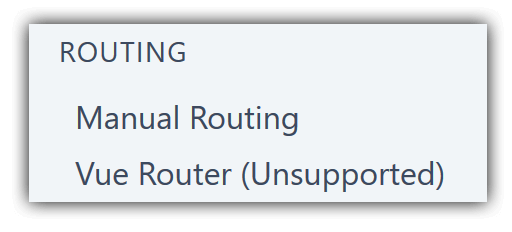
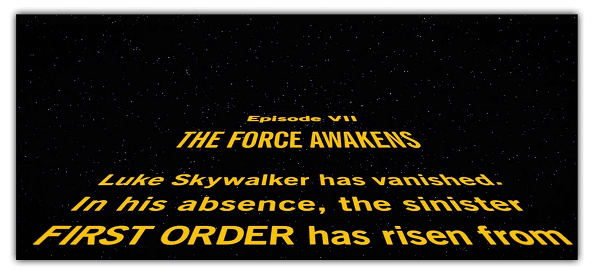

# Getting Your Route On with NativeScript-Vue: Episode One

As someone new to [NativeScript-Vue](https://nativescript-vue.org/), you may be a bit concerned when you see this in the [navigation documentation](https://nativescript-vue.org/en/docs/routing/manual-routing/):

Vue Router...unsupported????!? What does that mean? Are we
forever locked to Vue apps with one single view? Why is this so
and what have we done to have this horrible curse placed upon us?

Luckily things are not quite as dire as you may think. As you can probably guess, the option right above, "Manual Routing", leads you to a discussion on how to route *without* our familiar Vue Router. Not only that, there's other alternatives you can apply as well. 

In this article I'm going to go over some examples of routing for Vue and NativeScript. You'll have complete examples you can take and use with your own projects right away. Before I go any further, I want to give huge thanks to [Jen Looper](https://www.jenlooper.com/) for help with this article. If you haven't yet taken a look at the incredible [Vue Vixens](https://vuevixens.org/) project yet you should do so as soon as possible!

## Navigating Like Our Ancestors

The first, and simplest, way to handle navigation is like our grandparents. Uphill, both ways, in the snow. Ok, maybe not that bad. The [docs](https://nativescript-vue.org/en/docs/routing/manual-routing/) for manual routing discuss two different methods. (A third method is also discussed which handles modals. Personally I don't consider that "navigation", but know that it's an option.) 

The first, `$navigateTo`, discusses how you move from one view in your app to another. In it's simplest form, you'll simply say what component to navigate to, but you can also pass multiple arguments detailing things like transitions and data you want to send along the way.

The second, `$navigateBack`, handles returning you to the last view. Nice and simple. 

Given these two methods, how about a full example? Let's start with a two view (route) app. The first component will link to the first and second will link back. I created a new NativeScript Vue application on the [NativeScript Playground](https://play.nativescript.org). Here's the initial component:

	<template>
	    <Page class="page">
	        <ActionBar title="Home" class="action-bar" />
	        <StackLayout>
	            <Button @tap="goToSecond" text="Go to Second"></Button>
	        </StackLayout>
	    </Page>
	</template>
	
	
	
	

The layout contains a grand total of one UI item, a button with a `tap` event executing `goToSecond`. That method then uses `this.$navigateTo` to send the user to the next component. Let's look at that.

	<template>
	    <Page class="page">
	        <ActionBar title="Second" class="action-bar" />
	        <StackLayout>
	            <Button @tap="this.$navigateBack" text="Go Back"></Button>
	        </StackLayout>
	    </Page>
	</template>
	
	
	
	

This one also just has one UI item, a button, but note that instead of defining a method for the `tap` event I simply inlined it right there. That would have worked for the first component as well. You can test it yourself in [this NativeScript Playground project](https://play.nativescript.org/?template=play-vue&id=07CoYZ&v=2).

## Navigating with Style (and Data)

When using `$navigateTo` you can pass a second argument that lets you specify a transition effect as well as `props` (data) to be sent to the second view. You can do even more with this argument and can find the full documentation in the reference guide for [NavigationEntry](https://docs.nativescript.org/api-reference/interfaces/_ui_frame_.navigationentry). Here's a simple example using a `fade` transition.

	this.$navigateTo(Second, {
		transition: {
			name:'fade',
			duration: 200
		}
	})

Passing data is done via the `props` key:

	this.$navigateTo(Second, {
		transition: {
			name:'fade',
			duration: 200
		},
		props: {
			something: 1, 
			somethingElse: 'cat'
		}
	})

When using props, those values end up being passed to the next page as props. So just as in any Vue component, if you define an array of props, `props: ['something', 'somethingElse']`, then you can use the code passed in simply:

	Hello, I like to eat pie and {{ something }} along with {{ somethingElse }}.

This will make a bit more sense with a full example. Let's build a simple two page application making use of the [Star Wars API](https://swapi.co/). The first page will hit the API for a list of films. We'll display that as a list of film titles. On `tap`, we'll then navigate to a new page. The API returns all film data at once, so we can pass the film data as a `props` value to the next view.

Let's start with the first page, a component called `Films.vue`:

	<template>
	    <Page class="page">
	        <ActionBar title="Movies" class="action-bar" />
	        <ScrollView height="100%">
	            <ListView for="movie in movies" @itemTap="loadMovie">
	                <v-template>
	                    <Label :text="movie.title" padding="20" />
	                </v-template>
	            </ListView>
	        </ScrollView>
	    </Page>
	</template>
	
	

The layout is fairly simple, just a `ListView` component. I'm bringing it to a `movies` array that will be loaded later. The `tap` event will fire off `loadMovie` and that's where we'll do the navigation.

In the JavaScript, I'm using the `created` event to make my call to the Star Wars API. I parse the JSON and then assign the results to the `movies` array. 

The `loadMovie` method uses `this.$navigate` to specify where I'm going (the `Film` component), define a transition, and my `props` value which in this case is just one, `film`. Now lets look at the `Film` component:

	<template>
	    <Page class="page">
			<ActionBar :title="film.title" class="action-bar" />
			<StackLayout height="100%">
	            <Label :text="film.opening_crawl" textWrap="true" />
	            <Button @tap="this.$navigateBack" text="Back" />
	        </StackLayout>
	    </Page>
	</template>
	
	

In this component, all I've done is define `film` as a prop. Since the navigation will pass it in, I can then use the film data in my component. The Star Wars API returns a lot of information about films, but to keep things simple I'm just going to display the opening crawl.

You can play with it yourself in [this NativeScript Playground project](https://play.nativescript.org/profile/projects?template=play-vue&id=km4mRY&v=9).

## Next Steps?

In this article I looked at the basics of navigation when using NativeScript and Vue. In my next article, I'm going to kick it up a notch with two more examples: tabbed interfaces and the use of a "Vue Router"-like resource from the NativeScript community.
