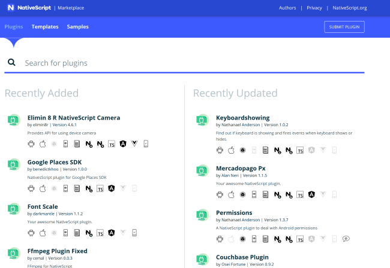
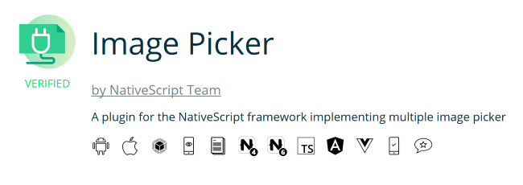
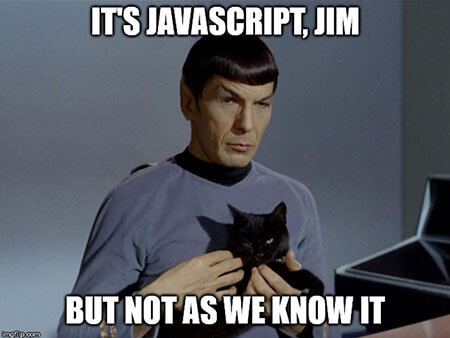
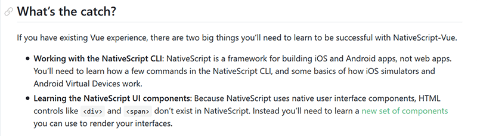
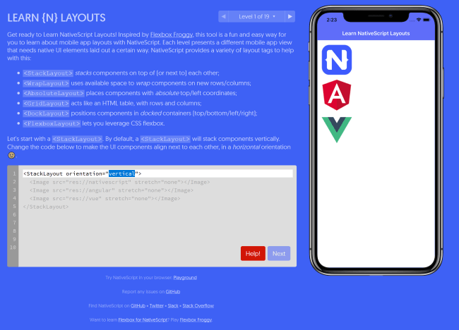
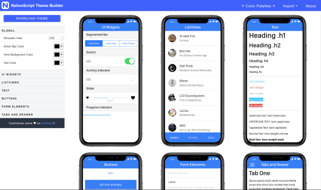

# Tips for Vue Developers Picking Up NativeScript

I've been a somewhat "casual" fan of NativeScript for some time now. I was interested in it when it originally came out but never really had the time to get deep into the platform. It was only late last year when I had a client who wanted a demo built that I was able to truly get some experience with NativeScript. I was also lucky enough to be able to use [NativeScript-Vue](https://nativescript-vue.org/). I had been using Vue already for a while and had fallen in love with how easy it was. To me, this was the best of both worlds. I got to use Vue while getting practical experience with NativeScript.

In general, it was an amazing experience. However, I ran into a few things that surprised me along the way and I thought I'd share some tips for others looking to use their Vue experience to work with NativeScript. I'll also add that I had many, *many* years of experience with hybrid mobile apps using [Apache Cordova](https://cordova.apache.org/) and [Ionic](https://ionicframework.com/). That experience also colored my expectations and led to some surprises along the way.

## Plugins

One of the things the Apache Cordova project did pretty well was define a set of "core" plugins that were guaranteed to work with the latest release of the project. These plugins included fairly common needs like camera, location, and so forth. 

When I first began working on my NativeScript-Vue project, I was a bit surprised to find that camera support was not quite as stable. To be clear, this is possibly just my personal opinion, but I had a very rough time working with the camera and I had just assumed it would "just work". It ended up being somewhat frustrating, so I turned my frustration into a blog post: [Working with the Camera in a NativeScript Vue App](https://www.raymondcamden.com/2018/11/15/working-with-the-camera-in-a-nativescript-vue-app). As an example, I ran into multiple documentation issues (all of which are fixed now I believe). While that's a fairly common problem to run into when working with open source projects (we're human, we've got limited free time, and docs tend to suffer the most), my expectation coming from a Cordova background was that it would be better supported. 

That being said...I got over it. I worked with it. When I ran into documentation problems I filed them as issues. And going forward, I understand that NativeScript itself is a bit more "hands off" than Cordova and makes no assumptions about some plugins over others.

All of that sounds somewhat scary perhaps, but it isn't a bad situation at all. Mainly I needed to know where to look. The [NativeScript Marketplace](https://market.nativescript.org ) has over one thousand plugin options.

There's a great search experience here and make note of how plugins are listed:

That row of icons there provide you a quick look at what's supported for the plugin and with what JavaScript libraries it can be used in. 

Don't worry if all of those icons don't quite make sense. If you mouseover them you get a nice tooltip telling you exactly what they mean. From left to right you've got:

* Android support.
* iOS support.
* Webpack support.
* Demo support (i.e. the plugin repository has demos).
* License information.
* The "N4" icon represents the *minimum* NativeScript version supported.
* And then the "N6" icon represents the *current* NativeScript version supported.
* The TypeScript icon means typings are available.
* The next two icons represent Angular and Vue (yay!) support. 
* Second from the right is an icon representing Travis CI support and finally...
* The last icon represents that this is popular plugin.

And remember how I said Cordova had a set of plugins they always ensure worked? Turns our NativeScript has something similar, "Verified" plugins. (You can see in the screen shot above that the Image Picker plugin verified.) 

Verified plugins are checked for multiple different criteria, including things like have demos. In fact, there's over ten different requirements a plugin has to pass. The NativeScript folks have [written up](https://github.com/NativeScript/marketplace-feedback/blob/master/docs/verified-plugins.md) these rules as well as the thinking behind them. (Which as a developer I greatly appreciate. Don't just tell me "I must do X" but tell me why as well.)

So that's the Marketplace, but you can also find NativeScript plugins at:

* [NativeScript Plugins](https://www.nsplugins.com/) (https://www.nsplugins.com)
* [Plugins.NativeScript.Rocks](https://plugins.nativescript.rocks/) (https://plugins.nativescript.rocks)

## Router

This one is short and sweet. The Vue Router doesn't work. There's an easy [manual](https://nativescript-vue.org/en/docs/routing/manual-routing) solution. That's it. 😀 For more information, I've got two articles to help you out:

* [Getting Your Route On with NativeScript-Vue: Episode One](https://www.nativescript.org/blog/getting-your-route-on-with-nativescript-vue-episode-one)
* [Getting Your Route On with NativeScript-Vue: Episode Two](https://www.nativescript.org/blog/getting-your-route-on-with-nativescript-vue-episode-two) 

## JavaScript

This one was really surprising. It made total sense once I figured it out, but it really threw me at first.

The good news is that you can, of course, write JavaScript in your NativeScript apps. The bad news is that you can't write *all* the JavaScript you're used to.

So what's different? JavaScript *syntax*, the core way you write code, works just fine. You want to use fancy hipster arrow functions in your code, go ahead! 

But *features*, things that are browser specific, will *not* work (normally), things like `LocalStorage` and `IndexedDB`.

I suppose this is a bit like when you move from client-side code to Node. Of course you can't use `IndexedDB` in Node as that's a browser technology. But for me, it wasn't immediately obvious. 

In general this isn't something you need to worry about as there's typically a solution that mirrors your need. Using `LocalStorage` and `IndexedDB` as an example, you can find multiple solutions for [client-side storage](https://www.nativescript.org/blog/client-side-storage-in-nativescript-applications) in your NativeScript applications.

## User Interface

Ok, so yeah, this was a big one. You can *very roughly* describe NativeScript development as: write some JavaScript (that you are already know) and combine it with a new UI language (that you won't already know). If you look at the NativeScript-Vue [introduction](https://nativescript-vue.org/en/docs/introduction/), there's this nice little innocent looking bit here:

There's two items here. The first involves learning the NativeScript CLI. That's not a problem. I use a crap ton of CLI tools in my work. Honestly I can't keep track of em all and how they work, so typically I'll start off with `somecli -?` or `somecli -h` or `somecli -wtf` until I figure it out again. 

That second part though is a doozy. Working with NativeScript means giving up your HTML and switching to a new syntax. It isn't too scary:

	<StackLayout>
		<Label text="Hello World" />
	</StackLayout>

I bet you can guess what that's going to do by just reading it. But you absolutely can *not* underestimate the "mental shift" here in learning you will need to do. If you already know Vue, great, you're going to have a leg up in learning NativeScript-Vue. But be sure to give you plenty of time to get familiar with the UI components. 

As with HTML, you'll have components focused on layout and component focused on elements (like form fields). Like HTML you'll have plenty of options and the ability to style.

Just do not underestimate this learning curve. Here's a couple of tips to consider:

Use the heck out of the [NativeScript Playground](https://play.nativescript.org/) and corresponding native Preview app. This may be obvious, but don't forget that when working in a large application and hitting a UI brick wall, you can just create a new Playground app to specifically test out UI things. Get your code working there, then bring it back to your application. As a side note, that works on the JavaScript side as well. I often used [CodePen](https://codepen.io/) to quickly build something in Vue by itself and then migrated the code to my NativeScript application.

Next, check out [Learn NativeScript Layouts](https://www.nslayouts.com/). This is an online tool that walks you through some of the basics of the layout portion of UI:

Another great tool is the [NativeScript Theme Builder](https://www.nativescriptthemebuilder.com/) which gives you an online designer for theming your apps.

## Practice, Practice, Practice!

I hope the tips above help prepare you for working with NativeScript. Above all, the best thing you can do is practice, and the [NativeScript Playground](https://play.nativescript.org/) is great for that.

I'd love to hear what "hiccups" you ran into while learning NativeScript - please leave a comment below!