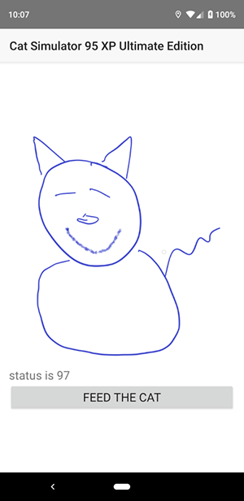
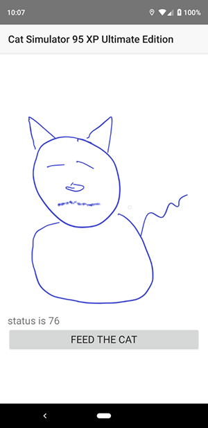
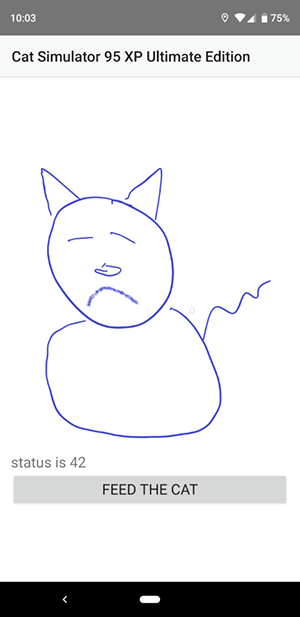

# Working with Vuex in Your NativeScript-Vue Application - Now with Cats!

In my [previous article](https://www.nativescript.org/blog/working-with-vuex-in-your-nativescript-vue-application), I discussed how to use [Vuex](https://vuex.vuejs.org/) in your NativeScript application. Vuex is a pretty complex topic and I only covered a small part of it in the last demo, so this article will add a bit more detail and also correct the glaring mistake of not including any cats. I'm sorry - I honestly don't know what I was thinking.

## The App

Before we get into the code, let's take a quick look at the application. This is a rather simple one page application that simulates taking care of a cat. For those of you old enough to remember you can consider it a Tamagotchi for your phone. On opening the application, your cat is nice and happy.

Of course, over time, your cat becomes generally less satisfied with life.

And then eventually falls into the pit of despair as you - once again - let it down.

As you can see, the app is divided into three sections. On top is a picture that represents the general state of the cat (and the epitome of my artistic talent), and more direct numerical status (which was mainly used for testing and would be removed in a "real" game of this sort) and a button allowing you to feed the cat. 

As you feed the cat, it will slowly become happier but at the same time it will also grow more hungry and therefore less happy. Anyone who has owned a cat will immediately understand this contradiction as a simple fact of (cat) life. So let's take a look at how this was built.

## Defining the Cat Store

My application is split into two parts - the main component to display and interact with the cat and the Vuex store that represents the data about the virtual cat and allows for interactions. This particular Vuex demo will show two features missing from the previous one - **Getters** and **Actions**.

Getters work much like computed Vuex properties. They allow you to define data that needs some kind of logic you want to encapsulate. Let's begin by looking at the data for the cat:

	state: {
		hungriness: 0
	},

Yep, that's it. The entirety of the virtual cat is defined by one property - how hungry it is. However, we want to expose out to the application how happy the cat is, and as you can imagine, this is a function of how hungry the cat is. Getters are defined in a `getters` block:

	getters: {
		happiness(state) {
			// the more hungry, the less happy
			return 100 - state.hungriness;
		}
	},

Getters are passed the state of the store and will automatically update when the state has changed. On the application side this is addressed via `store.getters.happiness`. Let's look at an example of this - the image and text status message. 

	<Image :src="catImage" />
	<Label textWrap="true" :text="status" />

These are both connected to computed properties:

	computed: {
		catImage() {
			// get the status, which is a % from 0 to 100
			let status = this.$store.getters.happiness;
			if (status > 90) {
				return "~/images/cat_happy.png";
			} else if (status > 60) {
				return "~/images/cat_medium.png";
			} else return "~/images/cat_sad.png";
		},
		status() {
			return "status is " + this.$store.getters.happiness;
		}
	}

While the getter being used is pretty trivial, what's nice here is that as the Cat becomes more complex the logic behind how happy it is can be updated as well. This is Encapsulation 101 and not anything new per se, but once again you can see how Vuex really makes this easy to use. Now let's look at another feature of Vuex - Actions.

In the previous article I demonstrated how **Mutations** are the interface for components to make changes to a store. Mutations must be synchronous which should then beg the question - how are asynchronous changes made. This is where Actions come in to play.

Actions do not directly change state in the store - instead they use mutations as well. In order to support this a `context` object is passed to them to support making changes. Actions can also take arbitrary arguments as well. Our cat has two actions defined. 

The first is a "heartbeat" action that simply simulates the passing of time. This is what allows the cat to get hungrier (and less happy) over time. 

	actions: {
		// more stuff here...
		heartbeat(context) {
			console.log('heartbeat started');
			setInterval(() => {
				console.log('heartbeat running');
				context.commit('hunger');
			}, HB_SPEED * 1000);
		}
	}

I'm using `setInterval` to initialize a timed repetition of the cat's life. `HB_SPEED` is a constant variable defining how often it should run and I tweaked that while testing to find a "good feel" for how annoying the cat should be. Make note of this line:

	context.commit('hunger');

This is how the action handles requesting a change via a mutation. In this case it simply makes the cat more hungry:

	mutations: {
		// more stuff here...
		hunger(state) {
			state.hungriness++;
			if (state.hungriness > 100) state.hungriness = 100;
		}
	}

The heartbeat call is fired off from the main Vue component using the `mounted` event:

	mounted() {
		this.$store.dispatch("heartbeat");
	},

The name of the action is passed as the first argument to the store and any additional arguments would simply follow later. Now let's look at the other action - feeding the cat.

	feed(context) {
		console.log('feed started');
		setTimeout(() => {
			context.commit('feed');
		}, FEED_SPEED * 1000);
	},

The `feed` action simply wraps a `setTimeout` before doing a commit call to a mutation called feed. Why the `setTimeout`? Simply to simulate the cat not being immediately satisfied when you feed it. If this seems arbitrary and mean, well then you may be new to cats. The `feed` mutation is also a bit random:

	feed(state) {
		let satisfaction = getRandomInt(1, 10);
		console.log('statisfaction was set to ' + satisfaction);
		state.hungriness -= satisfaction;
		if (state.hungriness < 0) state.hungriness = 0;
	},

In this case I figured that even though you're feeding the cat the same thing every time, it doesn't necessarily mean the cat responds the same every time. Also note a bit of logic here to ensure hungriness never goes below 0. 

That's basically it, so let's take a moment to look at the store as a whole:

	import Vue from 'nativescript-vue';
	import Vuex from '../vuex';
	Vue.use(Vuex);
	
	//number of seconds for updating
	const HB_SPEED = 2;
	// when you feed the cat, it takes a while for it to be satisfied from it. cuz cats
	const FEED_SPEED = 8;
	
	const catStore = new Vuex.Store({
	    state: {
	        hungriness: 0
	    },
	    getters: {
	        happiness(state) {
	            // the more hungry, the less happy
	            return 100 - state.hungriness;
	        }
	    },
	    mutations: {
	        feed(state) {
	            let satisfaction = getRandomInt(1, 10);
	            console.log('statisfaction was set to ' + satisfaction);
	            state.hungriness -= satisfaction;
	            if (state.hungriness < 0) state.hungriness = 0;
	        },
	        hunger(state) {
	            state.hungriness++;
	            if (state.hungriness > 100) state.hungriness = 100;
	        }
	    },
	    actions: {
	        feed(context) {
	            console.log('feed started');
	            setTimeout(() => {
	                context.commit('feed');
	            }, FEED_SPEED * 1000);
	        },
	        heartbeat(context) {
	            console.log('heartbeat started');
	            setInterval(() => {
	                console.log('heartbeat running');
	                context.commit('hunger');
	            }, HB_SPEED * 1000);
	        }
	    }
	});
	
	// Credit: https://stackoverflow.com/a/1527820/52160
	function getRandomInt(min, max) {
	    min = Math.ceil(min);
	    max = Math.floor(max);
	    return Math.floor(Math.random() * (max - min + 1)) + min;
	}
	
	module.exports = catStore;

In essence, the store represents the cat as a whole and defines integrations, both things that will change state and ways to read state, so that any component can make use of it. Our application only has the one main component, but could easily scale to more. Here's the main component:

	<template>
	    <Page class="page">
	        <ActionBar title="Cat Simulator 95 XP Ultimate Edition" class="action-bar" />
	        <ScrollView>
	            <StackLayout class="home-panel">
	                <Image :src="catImage" />
	                <Label textWrap="true" :text="status" />
	                <Button text="Feed the Cat" @tap="feedCat" />
	            </StackLayout>
	        </ScrollView>
	    </Page>
	</template>
	
	
	
	

If you want to give this a shot yourself, the entire code base is [up on the NativeScript Playground](https://play.nativescript.org/?template=play-vue&id=JsB06Q&v=5). Enjoy trying to make the cat happy. You will fail, but have fun anyway!
