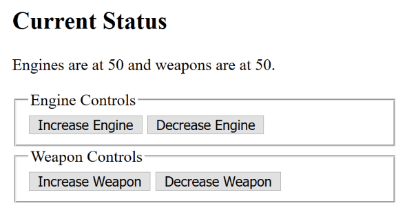
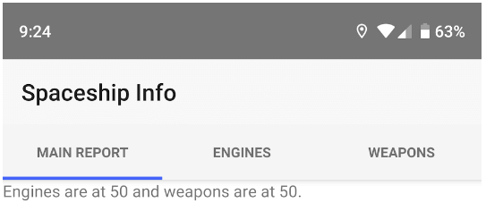
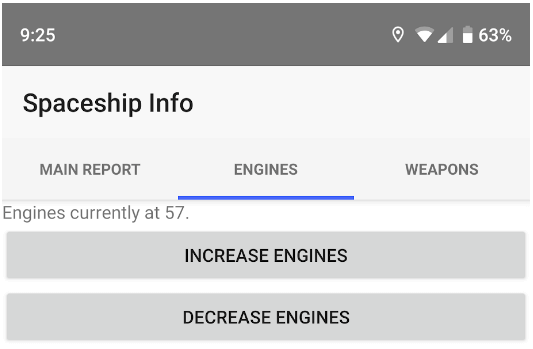
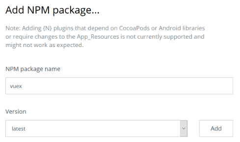

# Working with Vuex in Your NativeScript-Vue Application

Congratulations - you've decided to start building native mobile applications and want to use [Vue.js](https://vuejs.org/) as your framework. Great! Now you may be wondering - what aspects of "vanilla web-based" Vue development carry over to your NativeScript process? While it isn't necessarily a one to one translation, one of the aspects that absolutely does carry over is the need (normally) for tools like [Vuex](https://vuex.vuejs.org/).

In this article I'm going to demonstrate adding Vuex to a [NativeScript-Vue](https://www.nativescript.org/vue) application, but even better, I'll give a basic introduction to Vuex and describe why you may use it. When I first started learning Vue this "when do I need it" was especially confusing so I'm going to do my best to make it clear (as somewhat clean mud!) when you would want to employ it in your application. Ready? Let's get started!

## What the Heck is Vuex?

[Vuex](https://vuex.vuejs.org/) defines itself as such:

> "Vuex is a state management pattern + library for Vue.js applications. It serves as a centralized store for all the components in an application, with rules ensuring that the state can only be mutated in a predictable fashion."

This may not make sense at first, especially if your use of Vue prior to NativeScript-Vue was in simpler applications where Vue was used to add simple interactivity and other updates to a simple web page. (Sometimes I think of Vue as a super-charged jQuery build for modern developers.) 

However, as soon as you begin to build slightly more complex applications, or applications with multiple components (which is surely what you will encounter with NativeScript-Vue), you begin to discover an issue with keeping data in sync across multiple components. A user record may be something used throughout an application, and having each component, perhaps each Page, consistently reflect the right information about that user is made much easier through Vuex.

Yes, using Vuex requires a bit more work, but you'll see that the functionality it provides really shines with NativeScript-Vue. Let's get started by building a simple example and show how Vuex can come into play.

Before we get into this first demo - I want to point out that I'm going to skip NativeScript. Whenever I'm learning something I try to make my test case as simple as possible. So for this first example I'll just use CodePen. The next example will integrate it properly into a real NativeScript mobile application.

## Building a Spaceship in Vue!

Let's build a spaceship in Vue! Ok, I'm trying to keep this to somewhere below two thousand words, so instead of a spaceship, how about the controls of a very, very limited spaceship that has two systems - engines and weapons. The ship as a whole has a certain amount of energy. I'm going to create a panel made of various components that allow you to increase or decrease energy to one system at a time. Increasing energy to one, engines for example, must therefore decrease energy to weapons. Here's a screenshot of the control panel in action.

In this screenshot, there is one main Vue application and two sub components, one for each control. Here's the code for layout.

	

	 
	  <h2>Current Status</h2>
	  

		Engines are at {{engines}} and weapons are at {{weapons}}.
	  

	
	  <engine-control></engine-control>  
	  <weapon-control></weapon-control>
	
	

Not terribly complex, right? So let's create a store.

	const shipStore = new Vuex.Store({
	  state: {
		engines:50,
		weapons:50
	  },
	  mutations: {
	 
		increaseEngines(state) {
	  		if(state.engines < 100) {
	    			state.engines++;
	    			state.weapons--;
	  		}
		},
		decreaseEngines(state) {
	  		if(state.engines > 0) {
	    			state.engines--;
	    			state.weapons++;
	  		}
		},
		increaseWeapons(state) {
	  		if(state.weapons < 100) {
	    			state.weapons++;
	    			state.engines--;
	  		}
		},
		decreaseWeapons(state) {
	  		if(state.weapons > 0) {
	    			state.weapons--;
	    			state.engines++;
	  		}
		}
	  }
	});

A Vuex store can contain many different things but I'm going to start simple here with just two main aspects. The `state` value works much like the `data` part of a Vue application. It represents the information your store is keeping track of. In my case it's just an energy count for engines and weapons. I set both values initially to 50 to represent a total of 100 "units" (of what it doesn't matter) for the ship. A more advanced example could store the total value and then determine the two systems programatically.

`Mutatations` are how you change value in a store. Your Vue application can directly access state values but generally you want to avoid that. Here's a good reason why. We don't want the total energy for a system to go below 0 or above 100. The mutations handle that. Mutations are passed the current state values by default but can also be passed additional arguments. Mutations must be synchronous but stores also support asynchronous operations via `actions`. Again though - let's keep it simple.

So to recap - I defined the initial state of my store as well as ways for external applications to manipulate that data.

	const app = new Vue({
	  el:'#app',
	  store:shipStore,
	  computed:{
		engines() {
	  		return this.$store.state.engines;
		},
		weapons() {
	  		return this.$store.state.weapons;
		},
	  }
	})

So there's two things to note here. The store is passed into the Vue constructor. I don't need to do that but doing so makes it available to child components automatically via `this.$store`. Now note the two methods in `computed`. Both access `this.$store.state` to return the values for each component. If you remember from the layout, this is how this part works:

	<h2>Current Status</h2>
	

		Engines are at {{engines}} and weapons are at {{weapons}}.
	

If you don't want to directly access the state, or if you want to do something like `computed` within a store itself, you're in luck. Vuex stores support a `getters` property that works just like `computed`. Let's look at one of the components now (just one as they are virtually identical). Here is the engine component.

	Vue.component('engine-control', {
	  template:`
	  <form>
		<fieldset>
	  	<legend>Engine Controls</legend>
	  	<button @click.prevent="increaseEngine">Increase Engine</button>
	  	<button @click.prevent="decreaseEngine">Decrease Engine</button>
		</fieldset>
	  </form>
	`,
	  methods:{
		increaseEngine() {
	  	this.$store.commit('increaseEngines');
		},
		decreaseEngine() {
	  		this.$store.commit('decreaseEngines');
		}
	  }
	});

The layout isn't too important here but look at the two methods. In both cases, we access the store mutations by using `this.$store.commit`. Note that I'm only passing the name of the mutation. I could also pass additional data as well. For example, I may want to add a "Full Energy!" option that diverts all energy to a system.

You can see all the code, and run a full example, at this CodePen:

INSERT CODEPEN HERE

Obviously this is a trivial example and a store may be overkill, but as the application becomes more and more complex (since it rarely goes the other way), the store becomes the central location of "truth" for data related to the ship. My Vue application can focus more on UI issues (on button click do so and so) and the store focuses on centralizing the "logic" of the application.

## NativeScript, Vue, and Vuex 

Now let's look at a NativeScript version of the application we just built. For this demo I'll be using the [NativeScript Playground](https://play.nativescript.com/) so you can run this sample yourself using the NativeScript Playground Preview applications. Let's look at the finished result, and then we can dig into the code. Here's the initial page. I'm using a `TabView` to create three views.

The initial view has the basic status of both systems. Clicking on an individual tab provides a report for just that system and controls to modify the power.

So how did I build this? I began by creating a new Playground app using the Vue template. In order to add Vuex support, I used the **+** symbol in the **Explorer** and selected the **NPM** option.

I then typed in "vuex" in the search field and selected the latest version.

If you are using the CLI, you will be prompted when creating the project if you want to add support for Vuex. If you decide to add support for Vuex later, you will want to use `npm install vuex --save` in your terminal. This is discussed more in depth at the [docs](https://nativescript-vue.org/en/docs/getting-started/vue-plugins/). If you're familiar with the Vue CLI you know it supports adding plugins as well, but you do not want to use that option with a NativeScript Vue application. Now let's look at the code. The first thing I did was to create my store. Unlike the CodePen example, this one is in it's own file. I created a folder called `store` and then `shipStore.js`. Here's the contents.

	import Vue from 'nativescript-vue';
	import Vuex from '../vuex';
	Vue.use(Vuex);
	
	const shipStore = new Vuex.Store({
		state: {
	    		engines: 50,
	    		weapons: 50
		},
		mutations: {
	    	increaseEngines(state) {
	        	if (state.engines < 100) {
	            	state.engines++;
	            	state.weapons--;
	        	}
	    	},
	    	decreaseEngines(state) {
	        	if (state.engines > 0) {
	            	state.engines--;
	            	state.weapons++;
	        	}
	    	},
	    	increaseWeapons(state) {
	        	if (state.weapons < 100) {
	            	state.weapons++;
	            	state.engines--;
	        	}
	    	},
	    	decreaseWeapons(state) {
	        	if (state.weapons > 0) {
	            	state.weapons--;
	            	state.engines++;
	        	}
	    	}
		}
	});
	
	module.exports = shipStore;

For the most part this isn't too different, but note that I've imported Vuex and specified that Vue's going to use it. To be honest I would have had no idea to do that until I found [this great example](https://play.nativescript.org/?template=play-vue&id=vbL0WB&v=16).

My next modification was to my core `app.js` file to include and register the store:

	import Vue from 'nativescript-vue';
	import Vuex from './vuex';
	Vue.use(Vuex);
	
	import SpaceShip from './components/SpaceShip';
	
	import shipStore from './store/shipstore';
	
	// Uncommment the following to see NativeScript-Vue output logs
	// Vue.config.silent = false;
	
	new Vue({
	
		render: h => h('frame', [h(SpaceShip)]),
		store:shipStore
	
	}).$start();

Again, this is fairly similar to the earlier example. By passing in the store to my Vue component, my root application and all the children components will have it. Let's look at that root component now.

	<template>
		<Page class="page">
	    	<ActionBar title="Spaceship Info" class="action-bar" />
	
	    	<TabView>
	        	<TabViewItem title="Main Report">
	            	<Label :text="status" />
	        	</TabViewItem>
	        	<TabViewItem title="Engines">
	            	<Engines />
	        	</TabViewItem>
	        	<TabViewItem title="Weapons">
	            	<Weapons />
	        	</TabViewItem>
	    	</TabView>
		</Page>
	</template>
	
	

In this example, the main differences are the tags used to generate my layout. Instead of `div` and other HTML tags, I'm using NativeScript layout and UI components. But the use of the store values is exactly the same. Let's now look at the Engine component.

	<template>
	
		<StackLayout>
	    	<Label :text="status" />
	    	<Button text="Increase Engines" @tap="increaseEngine" />
	    	<Button text="Decrease Engines" @tap="decreaseEngine" />
		</StackLayout>
	
	</template>
	
	

As before, the only real change here is in the layout. My use of the store is *exactly the same*, which is awesome. As someone who may know Vue well and be new to NativeScript, this should make you feel a lot safer. I did add some text to this component since the NativeScript version is using tabs to show one view at a time.

> You can find the [full source code here](https://play.nativescript.org/?template=play-vue&id=rBlXCx).

## But Wait - There's More (Yes, a lot...)

This is barely just the beginning of working with Vuex, but hopefully you're beginning to see some of the advantages you get when adopting this approach. In the next article, I'm going to demonstrate even more features of Vuex and build something a bit closer to a real world application.