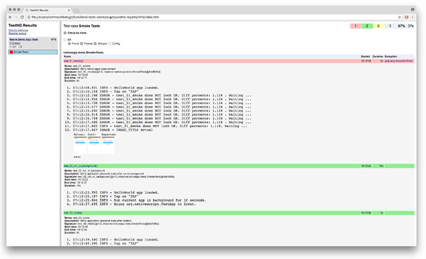

# NativeScript's Open Source Functional Testing Framework

The [2.5 release of NativeScript](https://www.nativescript.org/blog/nativescript-25-is-now-available) brought to light the [functional testing framework](https://github.com/NativeScript/functional-tests-core) behind the open source project as well as all of the [tests](https://github.com/NativeScript/functional-tests) of sample and demo apps we utilize. These have been in use for more than two years and have been rewritten a few times to improve and reflect changes in Android and iOS platforms and tools. Let’s start by answering the basic questions and then go deeper.

## UI Testing Framework

### Why do we need one?

As NativeScript is a framework for building native mobile apps, we needed to make sure the apps created with NativeScript work and perform as expected. In order to address this need, we decided to build an end-to-end testing framework based on [Appium](http://appium.io/) and [TestNG](http://testng.org/doc/index.html) while providing the ability to:

- manage emulators, simulators, and real devices;
- verify images in a flexible way;
- test results, logs, and screenshots;
- as well as locate elements via images when accessibility is not available.

### What is the NativeScript Testing Framework?

It is a general purpose cross-platform mobile automation framework for any kind of Android and iOS mobile apps: native, hybrid, or even games.

The framework is **general purpose**, as it could serve for native, whether they are developed with NativeScript or not, and hybrid apps. It also could locate and interact with applications or components with no accessibility via images, such as games or charts for example.

It is **cross-platform** as every single test can execute on both Android and iOS, with no restrictions if it is an emulator, simulator, or a real device. Moreover, it can create and delete emulators and simulators, and manage the applications on them (i.e. to install or uninstall, start or stop, restart or run in background). However, the limitation here is that tests run on iOS can be executed only from a macOS host machine.

The framework also **does not require modifications of the apps** under tests, as it is based on Appium and contains capabilities for image comparisons of particular elements or the whole screen, settings for tolerance, logs per test from all types of devices, server and test execution logs, screenshots and predefined report template.

## Easy to Get Started

The easiest way to get started with the testing framework is to [download its official demo](https://github.com/NativeScript/functional-tests-demo).

	git clone https://github.com/NativeScript/functional-tests-demo.git
	cd functional-tests-demo

> Note: Please have in mind the [prerequisites and setup](https://github.com/NativeScript/functional-tests-core#prerequisites-and-setup) of the framework. Also [Maven](https://maven.apache.org/install.html) is needed in order to be able to run the demo tests.

If all prerequisites are satisfied and the appropriate emulator/simulator is available, only two commands separate you from successfully running the demo tests. To do so, open a terminal/command prompt at the root of the demo project and:

Install the testing framework library prepared in the libs folder:

	mvn install:install-file -Dfile=libs/functional.tests.core-0.0.5.jar -DgroupId=functional.tests.core -DartifactId=functional.tests.core -Dversion=0.0.5 -Dpackaging=jar

Execute the native app demo tests on android 6.0 (API 23) emulator:

	mvn clean test -P nativeapp.emu.default.api23

or execute the native app demo tests on iPhone 7 iOS 10.0 simulator:

	mvn clean test -P nativeapp.sim.iphone7.ios10

After execution, the test results can be reviewed through a detailed report in HTML format. This report  contains a pie chart diagram summarizing the percent of passed, skipped, and failed tests, a list of all test classes included in the TestNG suite (as a navigation pane at the left side) and the test methods of the selected class are shown at right. Each test method name is colored in green for passed, red for failed, or yellow for skipped - and if expanded shows the log of the test, brief information about time of start/end and duration. In case of image verification failure, a result template shows in thumbnails the actual, differences and expected images.

The report is located at: `functional-tests-demo/target/surefire-reports/html/index.html`, logs from Appium, device, and tests themselves at: `functional-tests-demo/target/surefire-reports/logs/` and screenshot images at: `functional-tests-demo/target/surefire-reports/screenshots/`.

## Demo Details

### Structure

The demo represents a [Maven](https://maven.apache.org/) project and its [pom.xml](https://maven.apache.org/pom.html) file contains information about its dependencies, how to build it and available profiles to execute. It could be imported into an IDE such as [IntelliJ IDEA](https://www.jetbrains.com/idea/) Community Edition.

The `testapp` folder is the place to put application under test. In the demo there are:

- native android application nativeapp.apk,
- hybrid android application hybridapp.apk,
- native iOS application, built for simulator and archived as .tgz nativeapp.tgz,
- hybrid iOS application, built for simulator and archived as .tgz hybridapp.tgz.

The `resources` folder contains a few subfolders:

- **config** - here are the .properties files grouped per application and containing basic information for every configuration of application and device we want to execute our tests. There are mandatory and optional settings, full list of them could be found here,
- **images** - this folder aims to gather all expected images to perform image verification against and images to locate an area of the screen, again grouped per application and device name,
- **report** - here is a .xsl file used to generate the HTML report mentioned earlier,
- **suites** - here are the TestNG suite files describing which tests to execute. These suite files along with the config files are used in describing the Maven profiles to execute command line in the pom.xml file.

In the `libs` folder there is the testing framework as a prebuilt .jar library with all of its dependencies and with no surprise the source code of the tests is positioned in the `src` folder.

**Let's take a look into the native app sample:**

In the `pages` package, there is a `HomePage` class representing the home page of the application under test (in this particular case a single page app). The most important thing for this class is that it inherits the BasePage class from the functional testing framework.

	public class HomePage extends BasePage {
		public HomePage() {
		   super();
		}
	}

This gives you an easy access to fields like *app, client, find, gesture, locators, log, settings* and methods like `navigateTo()`, `navigateBack()`, and `hideKeyboard()`. Then you can  locate an element by simply calling `this.find.byText("TAP");` or `this.find.elementsByLocator(this.locators.textViewLocator());` as shown in the class.

In the `tests` package, there is a SmokeTests class which contains the test methods. The key point here is that it inherits the UIBaseTest class from the functional testing framework.

	public class SmokeTests extends UIBaseTest {
	}

The UIBaseTest class implements hooks by TestNG annotations as @BeforeSuite, @BeforeMethod, @AfterMethod, etc. and takes care of starting the Appium server, starting the emulator/simulator, starting the Appium client and respectively stopping them. In addition, it provides various methods to compare the current screen of the app as simple as: `this.assertScreen();`

The [hybrid app sample](https://github.com/NativeScript/functional-tests-demo/tree/master/src/test/java/hybridapp) follows the same logic.

It aims to demonstrate how to locate and interact with elements via images located at the resources folder. The next few lines shows how to declare and initialize a field of type Sikuli, locate an area of the screen and perform tap gesture on it:

	Sikuli sikuli = this.context.sikuliImageProcessing;
	UIRectangle uiRectangle = sikuli.findImageOnScreen("device_platform", 0.9D);
	uiRectangle.tap();

To execute the hybrid sample tests, open a terminal/command prompt window at the root of the demo project and:

execute the hybrid app demo tests on android 6.0 (API 23) emulator:

	mvn clean test -P hybridapp.emu.default.api23

or execute the hybrid app demo tests on iPhone 7 iOS 10.0 simulator:
	
	mvn clean test -P hybridapp.sim.iphone7.ios10

## How Does the Framework Do All of This?

In the heart of the testing framework are the [java client of Appium](https://github.com/appium/java-client), TestNG framework and [Sikuli library](https://launchpad.net/sikuli) which allowed as to implement the image locating functionality. The testing framework itself [builds](https://github.com/NativeScript/functional-tests-core#build) through [Gradle](https://gradle.org/), however our demo and tests currently use Maven.

It is worth mentioning a few key points in the framework implementation such as the test [Context](https://github.com/NativeScript/functional-tests-core/blob/master/src/main/java/functional/tests/core/basetest/Context.java). This class provides a direct access to fields like *app, client, device, gestures, locators, log, settings* and others. The [Device abstraction](https://github.com/NativeScript/functional-tests-core/tree/master/src/main/java/functional/tests/core/device) allows a single point of managing operations on device, no matter if it is an Android emulator, iOS simulator, or real device - it is handled internally.

A curious fact is that the [image](https://github.com/NativeScript/functional-tests-core/tree/master/src/main/java/functional/tests/core/image) verification feature does not come from a third party source, but the opposite - our very own implementation which compares two images pixel by pixel, paints the differences in red, and provides a diff image out of it. The [Settings](https://github.com/NativeScript/functional-tests-core/tree/master/src/main/java/functional/tests/core/settings) reads the config files of the test suites and serves as an entry station for the execution.

## Framework in Action

This functional testing framework serves successfully in the NativeScript CI by allowing us to execute more than 2000 tests for 20+ applications separated in 600+ builds, covering Android 4.2 to 7.1 and iOS 8 to 10. These are distributed over 10 build machines and involve 15+ real devices.

Now the functional testing framework is open source and we hope it will be useful for NativeScript users as well as all the people who need to automate tests for mobile applications. This is an ongoing effort and a long-term engagement of the NativeScript QA Team in the journey of securing stable releases of NativeScript, so [we would love to hear your thoughts, feedback and contributions](https://github.com/NativeScript/functional-tests-core/issues)!

*Relevant Links:*

- [Functional testing framework](https://github.com/NativeScript/functional-tests-core)
- [Functional testing framework demo](https://github.com/NativeScript/functional-tests-demo)
- [Functional tests of NativeScript sample apps](https://github.com/NativeScript/functional-tests)

