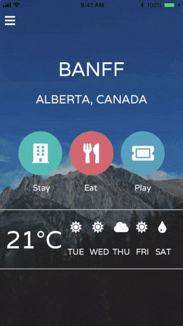

# Open Source Code Samples in the NativeScript Marketplace

I like to think of myself as a fairly accomplished copy-and-paste developer. I've certainly honed my *Google Search --> Stack Overflow --> Copy Code* routine over the years. 🤓

Ok maybe that's a bit of an exaggeration (it's not) but the reality is few of us want to re-create what's already been built. Why not <del>copy</del> <del>steal</del> borrow ideas from others? Whether it's merely for inspiration or straight up copy-and-paste coding, we all want to be more efficient developers.

This is why we've added on to the [NativeScript Marketplace](https://market.nativescript.org/) and created a series of *free* and *open source* [**NativeScript Code Samples**](https://market.nativescript.org/?tab=samples)!

 

The initial release of our code samples includes **34 unique NativeScript apps** that are:

- 🔓 Open source and immediately runnable on the [NativeScript Playground](https://play.nativescript.org/);
- 📱 iOS and Android compatible;
- 🏗️ Built with Angular, Vue.js, and/or JavaScript/TypeScript (most are built for all three!).

The samples include apps that range from **simple building blocks**:

  

...to **fancier-looking** listviews and card layouts:

  

## Contributions Encouraged!

Interested in contributing your own sample app? The data behind the marketplace code samples sits [in this repo on GitHub](https://github.com/nativescript/code-samples).

Just follow our [simple contributor guidelines](https://github.com/NativeScript/code-samples/blob/master/CONTRIBUTING.md) and we'll be happy to include your app!

## Start Copying-and-Pasting

The focus of our free and open source code samples is to provide the examples and building blocks you need to be successful with NativeScript. The [marketplace code samples](https://market.nativescript.org/?tab=samples) are here for you to fork to your heart's content, enjoy! 💖