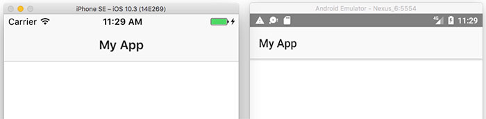
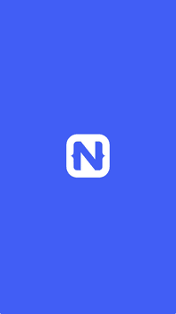
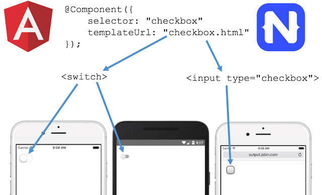

# An Introduction to NativeScript

NativeScript is an open source framework that lets you create native iOS and Android applications from a single codebase. NativeScript’s cross-platform nature can be a huge time-saver, especially if you currently maintain separate Android and iOS applications.

At a high level, NativeScript lets you utilize familiar JavaScript, TypeScript, XML, and CSS concepts, and interprets the code you write into native user interfaces on iOS and Android. For example, the following NativeScript `<ActionBar>` component abstracts away underlying an underlying `UINavigationBar` and `android.support.v7.app.ActionBar` for iOS and Android respectively:

	<ActionBar title="My App"></ActionBar>

As a developer these native APIs are completely transparent - you can run your app with an `<ActionBar>` and let the NativeScript framework translate the control into native user interface components.

While you maintaining separate iOS and Android apps is relatively commonplace, the cost of maintaining two different codebases that use two separate technology stacks can be high. Oftentimes, the two apps need to be maintained by separate teams that have the appropriate set of skills for each platform. Different teams move at different paces, which can make keeping a consistent cross-platform release schedule difficult at best.

## Why NativeScript? Performance.

NativeScript is not the only framework that lets you create Android and iOS apps from a single codebase. One popular alternative is Apache Cordova, and frameworks that build on top of Cordova (like Onsen and Ionic).

The key differentiator of NativeScript from these web-based frameworks is the UI layer. Whereas Cordova-based frameworks use a [WebView](http://developer.telerik.com/featured/what-is-a-webview/) (effectively an embedded web browser) to let you write your UI in HTML, **NativeScript renders truly native iOS and Android controls**. This use of native user interface components allows NativeScript to build compelling UIs, as NativeScript is not hamstrung by the limitations of WebViews.

*An example of a NativeScript app in action. Search for “Examples NativeScript” in Google Play or the iOS App Store to try this app yourself.*

And yes, NativeScript can have a higher learning curve than Cordova-based frameworks that use HTML and the DOM. If you’re building a Cordova app from scratch, you already have an idea of how HTML works and how to construct your UI with it. If you’re building a NativeScript app from scratch, you may have to spend some time getting familiar with how the [NativeScript UI components](https://docs.nativescript.org/ui/components) work.

NativeScript is great for almost every scenario, but it works best for apps that need the rich performance that native user interface controls provide. Do you have an app with smooth transitions or animation requirements? Does your app include any data lists where performance is critical? In those cases you’re often best off going with NativeScript, rather than trying a web-based framework and hitting performance problems that you cannot resolve.

## Why NativeScript? Web Skills. TypeScript. Angular.

Perhaps the biggest thing that divides mobile frameworks is the language you use. For native iOS apps that language is Objective-C or Swift, for native Android apps that language is Java, for Xamarin that language is C#, and for NativeScript that language is JavaScript/TypeScript.

NativeScript uses JavaScript because of the language’s flexibility, and also because of its sheer popularity. Chances are your team or company has a non-trivial number of developers that use JavaScript on a daily basis.

If you’re a fan of [TypeScript](https://www.typescriptlang.org/), a typed superset of JavaScript, NativeScript offers [first-class support for it](https://www.nativescript.org/using-typescript-with-nativescript-when-developing-mobile-apps) directly from the NativeScript CLI. Additionally, NativeScript uses a [subset of CSS](https://docs.nativescript.org/ui/styling) for styling your apps, [npm for package management](https://docs.nativescript.org/tutorial/chapter-5), [webpack for app bundling](https://docs.nativescript.org/tooling/bundling-with-webpack), and many other tools you might be familiar with from web development.

> Are you a .NET developer? Take a look at our article on [NativeScript for the .NET Developer](http://developer.telerik.com/featured/nativescript-for-the-net-developer/)

**Perhaps the biggest feature NativeScript offers for skill reuse is its integration with the [Angular](https://angular.io/) framework.** If you or your company are looking to consolidate technology stacks, the ability to leverage a single framework on both the web and in native apps is a compelling feature. You can even [share code between both platforms](https://www.youtube.com/watch?v=R3nyG2xtzeQ).

Overall, NativeScript is a great fit for any team with existing web development skills. Because of just how many existing skills these developers are able to use, NativeScript can dramatically reduce the amount of time you need to develop native iOS and Android applications.

## Why NativeScript? Access to Native APIs.

Another reason you might need an iOS or Android app is for access to native iOS or Android APIs. NativeScript provides several features out of the box to make this sort of native access simple.

NativeScript allows you to [directly access iOS and Android APIs](https://docs.nativescript.org/core-concepts/accessing-native-apis-with-javascript) in your JavaScript or TypeScript code. That means you can type things like `java.lang.Math.min`, or `UIAlert`, and have those native APIs just work.

If using native APIs directly sounds scary, you’ll be pleased to know that there are [hundreds of NativeScript plugins](http://plugins.nativescript.org/) that abstract away the native details into easy to use APIs. For example, if you need to make use of your device’s flashlight, you could directly use APIs like `AVCaptureDevice` or `android.hardware.Camera`, but you’d be better off using the [NativeScript flashlight plugin](https://github.com/tjvantoll/nativescript-flashlight) instead, as using the plugin is as simple as a few lines of easily readable JavaScript/TypeScript code.

	import * as flashlight from "nativescript-flashlight";
	
	if (flashlight.isAvailable()) {
	  flashlight.on();
	}

NativeScript plugins can do a whole lot more, including [accessing native libraries such as CocoaPods](https://docs.nativescript.org/plugins/cocoapods), and letting you build [native UI plugins](https://docs.nativescript.org/plugins/ui-plugin).

>For a detailed comparison of Cordova and NativeScript plugins, see [How to Write NativeScript Plugins and Why They’re Easier Than Cordova Plugins](http://developer.telerik.com/featured/write-nativescript-plugins-theyre-easier-cordova-plugins/).

These sort of NativeScript plugins can be a huge time saver for your next development project. Go ahead and search the [NativeScript Plugins Repository](http://plugins.nativescript.org/) to see if the NativeScript community has already created the functionality you need.

## Why NativeScript? Free and Open Source.

The entire NativeScript framework is free, open source, and available at <https://github.com/nativescript/>. The NativeScript project has a hundreds of contributors across its core framework, sample projects, and docs.

NativeScript is licensed under the very business-friendly Apache 2.0 software license. You are free to use NativeScript in your projects and the license works in a way that makes sense for any organizational policies.

Furthermore, nearly all of the [community-written NativeScript plugins](http://plugins.nativescript.org/) are free and open source as well. If you need to extend your app with native functionality, you have plenty of existing demos and examples you can utilize.

If it’s important for you to build on an open technology stack that you can easily modify and inspect, NativeScript has you covered.

## Why NativeScript? Corporate Backing.

Finally, in today’s age of JavaScript frameworks that come and go, for many organizations it’s important to pick a framework backed by a major company that won’t disappear as you’re developing your next project. 

NativeScript is backed by [Progress](https://www.progress.com/), a large, publicly traded company with a long history of building software for screens of all shapes and sizes. If you’re looking to adopt NativeScript on a large scale, the NativeScript team offers a variety of [enterprise support agreements](https://www.nativescript.org/enterprise) to suit your needs.

## Wrapping Up

Although you can use NativeScript to build a apps for a virtually any use cases, NativeScript works best for apps that:

* must run natively on both iOS and Android,
* need native UI and performance,
* need native iOS and/or Android APIs.

And apps that are written by teams and companies that want to:

* reuse existing web development skills,
* leverage free and open source tools,
* use a framework with a solid corporate backing.

Want to get started learning NativeScript? Start by checking out NativeScript’s [JavaScript Getting Started Tutorial](http://docs.nativescript.org/tutorial/chapter-0), or the [TypeScript and Angular Getting Started Guide](http://docs.nativescript.org/angular/tutorial/ng-chapter-0).