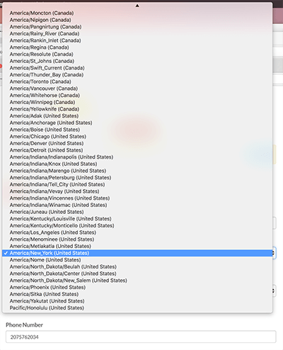
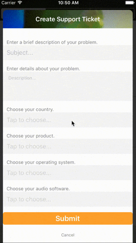
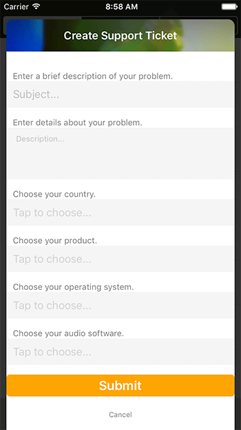
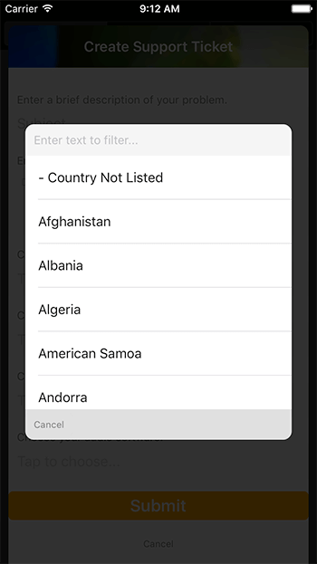

# Filterable List picker in NativeScript

*This is a guest blog post from [Dave Coffin](https://twitter.com/davecoffin).*

When I transitioned to mobile development from web development, there were all these UI questions I hadn't thought thoroughly through before. The web is forgiving, mobile users expect less from it. That's arguably not a good thing considering how far its come, but far less attention to detail is paid to UI and UX on the web when compared to mobile. I believe thats because of the high standard mobile experiences have set, and have conditioned users from the outset to expect a certain experience on mobile.

Anyway, today I found myself addressing one of the UI questions, how to deal with users selecting an option from a very long list. On the web, I have done this. Its not great, actually quite bad, but hey, its the web who cares?

Theres not even the option of considering this on mobile, thanks to the aforementioned standards, its hard to create a UI this unwieldy for the user. It's definitely not impossible to make bad UIs on mobile, don't get me wrong, but I wanted something cleaner and easier to use.

The context here is I integrated Zendesk into this application, and we have a pretty robust Zendesk operation going, and I need to offer the user options to submit with their tickets. So I query zendesk to get `ticket_fields`, which contain fields that user can submit with their tickets, and can have hundreds of options. So instead of making the user scroll forever to find what they're looking for, I wanted to let the user filter the list by typing. Here's how I did it:

> Side note: I am using Angular here, but this is just as easily achievable in regular NativeScript by using an [Observable Array](https://docs.nativescript.org/cookbook/data/observable-array).

    <GridLayout style="background-color: rgba(0,0,0,0.8);" [visibility]="showingCreateTicket ? 'visible' : 'collapsed'">
        <StackLayout row="1" col="1" style="background-color: white; margin: 30 10 -10 10; border-radius: 10;">
            // heres where all my ticket fields live. example field to launch the filterable list picker:
            <StackLayout class="input_group">
                <Label class="label" text="Choose your product."></Label>
                <Label [class]="selectedProduct ? 'input hasData' : 'input'" (tap)="showProducts()" [text]="selectedProduct ? selectedProduct : 'Tap to choose...'"></Label>
            </StackLayout>
        </StackLayout>
        <ActivityIndicator [visibility]="loadingTicketFields ? 'visible' : 'collapsed'" [busy]="loadingTicketFields"></ActivityIndicator>
    </GridLayout>

    <GridLayout [visibility]="showingLongListPicker ? 'visible' : 'collapsed'" rows="*, auto, *" columns="30, *, 30">
        <GridLayout style="background-color: rgba(0,0,0,0.8);" rowSpan="3" colSpan="3" #longListPickerDimmer></GridLayout>
        <StackLayout row="1" col="1" #longListPickerContainer style="background-color: white; border-radius: 10;">
            <StackLayout>
                <TextField hint="Edit text to filter..." [(ngModel)]="filterItem" (ngModelChange)="filterLongList($event)" style="font-size: 14;"></TextField>
                <ListView [items]="itemsToShow" class="list-group" height="300" (itemTap)="chooseLongList($event)">
                    <template let-item="item" let-odd="odd" let-even="even">
                      <StackLayout>
                        <Label [text]="item" class="list-group-item"></Label>
                        
                      </StackLayout>
                    </template>
                </ListView>
            </StackLayout>
            <GridLayout columns="auto, *, auto" style="background-color: #E0E0E0;" paddingTop="5" paddingBottom="5">
                <Button class="transBtn sm" text="Cancel" (tap)="closeLongListPicker()"></Button>
            </GridLayout>
        </StackLayout>    
    </GridLayout>

I really like concise UIs that keep the user in the context of what they are doing, so I chose to display the `ListView` in a little overlay. It sits on top of my other layouts by just stacking `GridLayouts` on top of each other. The main view to add a ticket (which is also an overlay of sorts) looks like this:

You may notice those "Tap to choose..." `TextField` looking things are actually `Labels` (line 6 of the above gist).

	<Label [class]="selectedProduct ? 'input hasData' : 'input'" (tap)="showProducts()" [text]="selectedProduct ? selectedProduct : 'Tap to choose...'"></Label>

Using the input class, I set it to look link its a `hint`, and the `hasData` class looks like a `TextField` with text in it. But the user can't edit it, the value is supplied by the filterable picker.

The `GridLayout` below is set up to have 3 rows and 3 columns, creating a box in the middle basically. There's a margin of 30 on each side (`columns="30, *, 30"`), and a `StackLayout` styled with a white background in the 2nd row and 2nd column, and that contains our picker. The `#longListPickerDimmer` is just a semi opaque black background to sit on top of the other views.

And here's where the magic happens:

	import { Component, ViewChild, ElementRef, EventEmitter, Output } from "@angular/core";
	import { AnimationCurve } from "ui/enums";
	
	@Component({
	    selector: "createticket",
	    moduleId: module.id,
	    templateUrl: "./createticket.component.html",
	    styleUrls: ["./createticket.component.css"],
	})
	export class CreateTicketComponent {
	
	    constructor(private supportService: SupportService) {}
	
	    public showingCreateTicket: any = false;
	    public loadingTicketFields: boolean = false;
	    
	    public showingLongListPicker: any = false;
	    public unfilteredItemsToShow = [];
	    public itemsToShow = [];
	
	    public selectedProduct = '';
	    public productMap = {};
	    public listProducts = [];
	
	    public filterItem: string;
	
	    @Output() outputEvent: EventEmitter<any> = new EventEmitter();
	    @ViewChild("longListPickerContainer") longListPickerContainer: ElementRef;
	    @ViewChild("longListPickerDimmer") longListPickerDimmer: ElementRef;
	
	    show() {
	        this.loadingTicketFields = true;
	        this.supportService.getTicketFields().subscribe(result => {
	            console.dir(result);
	            result.ticket_fields.forEach(field => {
	                if (field.title == 'Product') {
	                    field.custom_field_options.forEach(prod => {
	                        let prodParts = prod.name.split('::');
	                        this.productMap[prodParts[prodParts.length-1]] = prod;
	                        this.listProducts.push(prodParts[prodParts.length-1])
	                    })
	                    this.listProducts.sort();
	                }
	            })
	            this.loadingTicketFields = false;
	        })
	        this.showingCreateTicket = true
	    }
	
	    showProducts() {
	        this.animateLongListPicker('products');
	        this.itemsToShow = this.listProducts;
	        this.unfilteredItemsToShow = this.listProducts;
	    }
	
	    filterLongList() {
	        this.itemsToShow = this.unfilteredItemsToShow.filter(item => {
	            return item.toLowerCase().indexOf(this.filterItem.toLowerCase()) !== -1;
	        });
	    }
	
	    animateLongListPicker(type) {
	        this.showingLongListPicker = type;
	        this.longListPickerDimmer.nativeElement.opacity = 0;
	        this.longListPickerDimmer.nativeElement.animate({
	            opacity: 1,
	            duration: 200
	        })
	        this.longListPickerContainer.nativeElement.opacity = 1;
	        this.longListPickerContainer.nativeElement.scaleX = .7;
	        this.longListPickerContainer.nativeElement.scaleY = .7;
	        this.longListPickerContainer.nativeElement.animate({
	            opacity: 1,
	            scale: {x: 1, y: 1},
	            duration: 400,
	            curve: AnimationCurve.cubicBezier(0.1, 0.1, 0.1, 1)
	        })
	    }
	
	    chooseLongList(event) {
	        this.filterItem = '';
	        if (this.showingLongListPicker == 'products') {
	            this.selectedProduct = this.itemsToShow[event.index];
	        }
	        this.closeLongListPicker();
	    }
	
	    closeLongListPicker() {
	        this.longListPickerDimmer.nativeElement.animate({
	            opacity: 0,
	            duration: 200
	        })
	        this.longListPickerContainer.nativeElement.animate({
	            opacity: 0,
	            scale: {x: .7, y: .7},
	            duration: 300,
	            curve: AnimationCurve.cubicBezier(0.1, 0.1, 0.1, 1)
	        }).then(() => {
	            this.showingLongListPicker = false;
	        })
	    }
	
	    doneCreateTicket() {
	        this.closeCreateTicket();
	        this.outputEvent.emit('create ticket finished');
	    }
	
	    closeCreateTicket() {
	        this.showingCreateTicket = false;
	    }
	}

The file is a bit truncated to only show setting up the filterable list picker for the "Products" ticket field that I get back from my call to Zendesk. Lets walk through that file...

## show()

The `show()` function shows the create ticket UI. It calls a method in my support service to get ticket fields from zendesk, then handles the results. Zendesk returns the options for these fields in odd strings that are meant to categorize the options, separating the categories with `::`. The end of the string is the actual product name, so I get the product name (`let prodParts = prod.name.split('::');` then `prodParts[prodParts.length-1]`) and add it to an array of products.

## showProducts()

The `showProducts()` function is called when the user taps the `Label` where the product name should display once picked. That sets the array `itemsToShow` to be the list of products we build in `show()`. `itemsToShow` is the array that supplies the data to the `ListView` in our picker.

## filterItem

`filterItem` is set as the `ngModel` for the `TextField` that's used for filtering the list. So `filterItem` will contain the text the user enters, and we use `ngModelChange` in the `TextField` to call `filterLongList`.

## filterLongList()

`filterLongList` is the function that filters the data in the `ListView`. It's pretty simple, as the model changes, it sets `itemsToShow` to be a filtered version of the full array. We had already set up `unfilteredItemsToShow` to be an array that contains all options so we can use that to filter from. Then we use the awesome TypeScript feature filter to build a new array. We pass a callback that only returns the products that contain the contents of `filterItem`: `return item.toLowerCase().indexOf(this.filterItem.toLowerCase()) !== -1;`. Notice we make both lowercase first, we don't want this filtering mechanism to be case sensitive.

Since `itemsToShow` is an Observable by nature, the UI automatically updates.

## chooseLongList($event)

When the user narrows their search down, they simply tap a `ListView` item which calls `chooseLongList($event)`, and that function grabs the index and sets `this.selectedProduct` (the property that is displayed in the Label), to the product name in `this.itemsToShow`.

You'll also notice I am animating the picker in and out, pretty self explanatory.

When I was setting up the data I got back from my Zendesk call, I also created maps of the entities with the keys being the items that I display in my `ListView`. This makes it super simple to get the full entity back, which I'll need when actually creating my ticket. I need to pass the ticket field ID, which I am not displaying in the `ListView`. Once I have the product name of what they chose, all I need to do to get the full object is `this.productMap[this.selectedProduct]`.

I hope to make this into a cross platform NativeScript plugin in the near future. NativeScript is the absolute best, I love that I can use my TypeScript and JavaScript knowledge to do cool things like this, and create fully fledged mobile apps. If you have any questions, are in the market for a freelance app developer, or just want to say hey, get in touch with me at [davecoffin.com/contact](http://davecoffin.com/contact) or on twitter [@davecoffin](https://twitter.com/davecoffin).