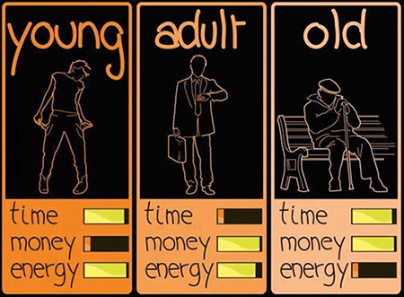
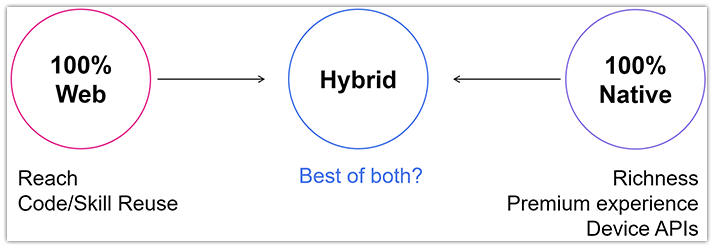
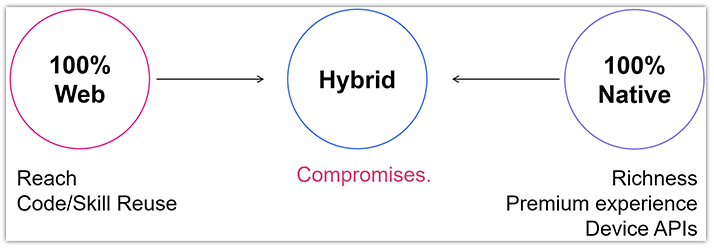
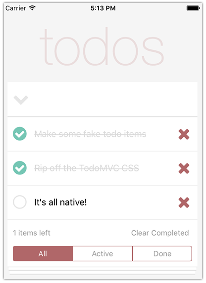
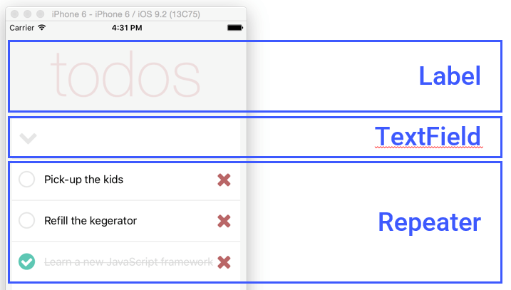
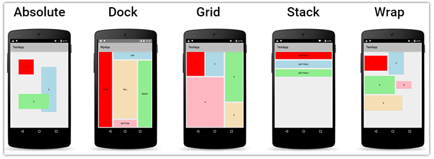

# Migrating from Cordova to NativeScript

Have you ever seen the depressingly true "time/money/energy" diagram? No?

Now you have:

Many of us are actively giving up time (being at work) in exchange for money. (I think the energy meter should be half-full, but that's beside the point ☺️.) We are forced to make compromises to live day-to-day, so why should we expect our mobile development life be any different?

**In lieu of "time/money/energy", mobile developers are balancing "cross-platform/web skills/native performance".** The problem is that we want it all, and we want it now.

*And what is it exactly we want?*

- Our apps to be performant, so [customers don't abandon ship](https://info.dynatrace.com/rs/compuware/images/Mobile_App_Survey_Report.pdf);
- One codebase to support multiple platforms;
- To re-use our web skills and teams that we've been nurturing for years;
- To leverage existing libraries so we don't have to re-write proven code.

*And how have we tried to achieve this mobile utopia?*

**We have tried going purely native.** But that meant sacrificing one codebase AND our web skills in favor of performance. This meant "siloed" code, new languages, and new frameworks. 👎

**We have stuck with the web.** This has worked out fairly well for us, as the advent of [Progressive Web Apps](https://developers.google.com/web/progressive-web-apps/) have helped boost mobile web performance. We also see more device features being exposed via new APIs. But we realize the web will always lag behind native when it comes to performance, offline capabilities, and native device features. 🤔

**We have utilized the hybrid model.** Apache Cordova (PhoneGap) started to bring these worlds together: developing one codebase for multiple platforms, with our web skills, accessing almost any device feature we could want.

**Sounds great right?** And hybrid can be good. But hybrid apps run in performance-limited [WebViews](http://developer.telerik.com/featured/what-is-a-webview/). Hybrid frameworks render UI that can be made to look native, but not necessarily feel native (i.e. list view scrolling, animations, and general Android molasses speeds).

So when we get down to it, hybrid is great for leveraging our web skills to develop cross-platform apps, but loses momentum when we start digging into performance, robust animations, and platform-specific WebView quirks. 🤷

**So here we are, still stuck in our world of compromises.** 😐

## Behold NativeScript!

[NativeScript](https://www.nativescript.org/) was introduced more than two years ago as an evolution of the hybrid model. NativeScript lets you build truly native mobile apps for iOS and Android from one codebase, using the web skills you know and love.

Remember our four "wants" from the beginning of this article? NativeScript delivers on all of them:

- **Performance?** NativeScript apps are truly native, meaning native UI, native performance;
- **One codebase?** NativeScript leads with one shared codebase for iOS and Android (allowing for [platform-specific capabilities](http://developer.telerik.com/products/nativescript/platform-specific-development-nativescript/) when needed);
- **Re-use skills/teams?** NativeScript apps are built on the foundations of the web with an HTML-like syntax for UI, JavaScript powering the app, and styling with CSS;
- **Using existing code?** NativeScript supports [Angular](https://angular.io/), existing JavaScript libraries, [CocoaPods](https://docs.nativescript.org/plugins/cocoapods) for iOS, and Android JARs (not to mention loads of [plugins](http://plugins.nativescript.org/)).

If NativeScript sounds like it is worth checking out, your next stop should be one of the two getting started tutorials:

- [Getting Started with NativeScript and JavaScript](http://docs.nativescript.org/tutorial/chapter-0)
- [Getting Started with NativeScript and Angular + TypeScript](http://docs.nativescript.org/angular/tutorial/ng-chapter-0)

## Already Have a Cordova App?

What if you already have a hybrid app and you want to migrate to NativeScript?

Let's look at some concepts and techniques to leverage as much as we can to move from hybrid to native. We will cover three high level topics:

- [Native UI and Layouts](#native-ui)
- [JavaScript-Powered Business Logic](#javascript)
- [Styling with CSS](#css)

> It just so happens there is an expansive guide on [Upgrading Hybrid Apps to Native with NativeScript](http://www.hybridtonative.com/) for the Angular developer that goes far beyond what we will be covering today.

As we go through these sections, let's pretend we have an existing hybrid app that helps to manage a todo list. Said hybrid app that we want to convert to NativeScript might look something like this:

## Native UI and Layouts

Constructing your user interface with a hybrid app is relatively easy, since you're just using HTML. The downside is that you are using non-native UI and losing out on the performance and user experience of a truly native UI.

So how do we migrate from HTML to NativeScript's markup? Let's take a look an HTML snippet that helps power our todo app:

	<header class="header">
		<h1>todos</h1>
		<input class="new-todo" placeholder="What needs to be done?">
	</header>
	<section class="main">
		<ul class="todo-list">
			<!-- item template goes here -->
		</ul>
	</section>

 NativeScript offers a variety of options for UI elements. [A full list is available here](https://docs.nativescript.org/ui/components), but to replace the above HTML snippet we just need the following elements:

- `<Label>`
- `<TextField>`
- `<Repeater>`

We can translate this snippet into truly native UI with a combination of our UI elements and layouts:

	<StackLayout>
	    <Label text="todos" class="title" />
	    <TextField class="new-item" text="{{ newTodo }}" returnKeyType="done" returnPress="add" />
        <Repeater items="{{ todos }}">
			<!-- item template goes here -->
        </Repeater>
	</StackLayout>

Sweet. 🍭

**But what is that `<StackLayout>` tag all about?** It's one thing to render UI elements on a screen, but its another to arrange them in a way that is appealing to your users. This is where [NativeScript layouts](http://developer.telerik.com/featured/demystifying-nativescript-layouts/) come in.

There are five "traditional" NativeScript layouts you can choose from:

- [Absolute](https://docs.nativescript.org/cookbook/ui/layouts/absolute-layout)
- [Dock](https://docs.nativescript.org/cookbook/ui/layouts/dock-layout)
- [Grid](https://docs.nativescript.org/cookbook/ui/layouts/grid-layout)
- [Stack](https://docs.nativescript.org/cookbook/ui/layouts/stack-layout)
- [Wrap](https://docs.nativescript.org/cookbook/ui/layouts/wrap-layout)

While they are all fairly intuitive, the power of NativeScript layouts come from the fact that they can be nested. There is nothing wrong with nesting a `GridLayout` inside of a `StackLayout` if that is what your UI requires.

> If flexbox is more your style, NativeScript fully supports the [flexbox layout model](https://docs.nativescript.org/cookbook/ui/layouts/flexbox-layout).

And while there is no `
` element in NativeScript, you can leverage layouts to perform similar functions. For example, you can use a `<GridLayout>` to [fill in empty space](https://www.thepolyglotdeveloper.com/2016/01/fill-empty-space-with-ui-elements-using-the-nativescript-gridlayout/) not used by your UI, or even an empty `<StackLayout>` element to provide needed spacing or act as an `
` element:

	<StackLayout class="hr-light"></StackLayout>

> The `hr-light` class referenced above is part of the [NativeScript Core Theme](https://docs.nativescript.org/ui/theme) that ships with the NativeScript framework.

## JavaScript-Powered Business Logic

The beauty of leveraging web-based technologies is at the end of the day, we're all just writing JavaScript. This doesn't change with NativeScript.

**It's. Just. JavaScript.**

For example, a basic function supporting our hybrid todo list app might look something like this:

    function add() {
        if (this.newTodo.trim().length > 0) {
            this.todos.push(new Todo(this.newTodo.trim()));
            this.set('newTodo', '');
        }
    }

That same code, supporting a truly native iOS/Android app in NativeScript, is going to look like this:

    function add() {
        if (this.newTodo.trim().length > 0) {
            this.todos.push(new Todo(this.newTodo.trim()));
            this.set('newTodo', '');
        }
    }

See any differences? Trick question! There are no differences! 😂

Now, this isn't to say you can literally copy and paste all of your code and have it "just work" with NativeScript. This isn't Python after all.

NativeScript doesn't have a concept of a DOM (remember, it's native UI, not a WebView). This means libraries like jQuery that rely on the DOM will not work. However, other popular libraries like moment.js, crypto, underscore, handlebars, and many more, work just fine.

**If your existing JavaScript code isn't directly interacting with the DOM, you can probably copy and paste it into a NativeScript app!**

Likewise, if you're familiar with the [MVVM pattern](https://docs.nativescript.org/tutorial/chapter-3), you will be at home with NativeScript. You also may be glad to hear that [TypeScript is supported](https://www.nativescript.org/using-typescript-with-nativescript-when-developing-mobile-apps) out-of-the-box.

Finally, **Angular is a first class citizen in NativeScript**. In fact, if you have an app built with Angular 2+, you'll find the transition from hybrid to native to be incredibly simple as your UI is already decoupled from your business logic.

> If you're interested in a true code-sharing experience across web and native iOS/Android with Angular, check out this [Angular NativeScript Seed](https://github.com/TeamMaestro/angular-native-seed).

## Styling with CSS

When you're building a hybrid app, you are using CSS to style your app, mimic native UI, tweak positioning of elements, and so on. Luckily, NativeScript [supports a subset of CSS properties](https://docs.nativescript.org/ui/styling) so you can utilize your mighty CSS skills as well.

Here is a CSS class from our hybrid todo app:

	.title {
	    color: #EAD7D7;
	    font-size: 100px;
	    horizontal-align: center;
	    font-family: 'HelveticaNeue-Thin';
	    margin-bottom: 10px;
	    opacity: .8;
	}

We can see that this snippet is used to style our big "todos" heading. The same styling for a NativeScript app would look like this:

	.title {
	    color: #EAD7D7;
	    font-size: 100;
	    horizontal-align: center;
	    font-family: 'HelveticaNeue-Thin';
	    margin-bottom: 10;
	    opacity: .8;
	}

**What changed? Not much!** Instead of using pixels, NativeScript uses device independent units. This just means instead of adding a "px" to your size definition, you leave it as an integer. Easy.

NativeScript supports a variety of ways to apply your CSS. By default, you'll be provided with an `app.css` file. This is where you insert styles you want applied globally to your app. If you want to apply certain classes to just one view/page, you simply name a CSS file the same as the corresponding view/page. For example, `main-page.css` will only be visible on `main-page.xml`. Finally, you can apply CSS inline the same you way you do on the web:

	<Button text="Tap Me!" style="background-color: green;" />

**What about CSS selectors?** Same as the web!

- Select by Type: `button { background-color: blue }`
- Select by Class: `.big-button { font-size: 28 }`
- Select by ID: `#some-button { font-weight: bold }`
- Select by Hierarchical Combinations: `GridLayout Button` and `GridLayout > Button` for example
- Select by Attribute: `button[someAttribute]{ background-color: orange; }`
- Select by State: `button:highlighted { background-color: red; }`

> If you are a [SASS](https://github.com/toddanglin/nativescript-dev-sass) or [LESS](https://github.com/NativeScript/nativescript-dev-less) person, you can install the appropriate plugins to use those pre-processors in NativeScript as well!

**And custom fonts?** Well of course you can use any font you want, provided you have the .ttf or .otf font file available. To use a custom font, drop the .ttf/.otf file in your `app/fonts` directory and reference it with some familiar CSS. In this example, we can specify that every `<Label>` element should have the `Roboto` font applied:

	Label {
		font-family: "Roboto";
	}

## Next Steps

This article is just a small taste of how easy it is to migrate from Apache Cordova/PhoneGap to NativeScript. For a more in-depth look, be sure to read the guide provided at [hybridtonative.com](http://www.hybridtonative.com/).

If you're new to NativeScript and would like to learn more about the framework itself, look no further than our [getting started tutorials](http://docs.nativescript.org/). Enjoy! 🎉