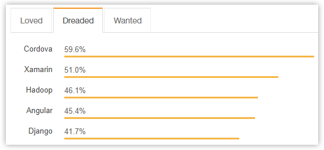
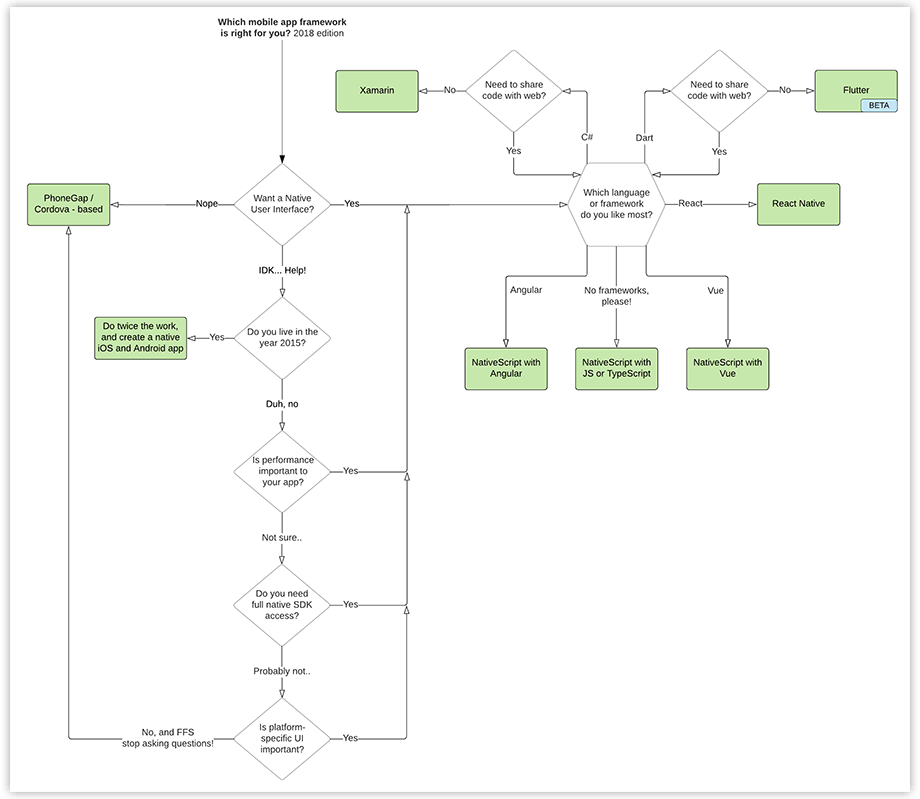

# What's Next for Cordova and PhoneGap Developers?

You may have noticed that activity around Cordova on GitHub has [slowed down significantly](https://github.com/apache/cordova-ios/releases) over the [past few months](https://github.com/apache/cordova-cli/releases). It's clear that Adobe is pulling back some resources and slowing down their investment to a certain extent. What this means for the future of Cordova/PhoneGap is unclear, but if you are a hybrid mobile developer, you may be wondering what the future holds.

Let's be real here. You're on the NativeScript blog. Chances are you are prepared to get a hard sell on the advantages of using NativeScript. And yeah, that is part of my message! But you should know **there is life after Cordova** and many valid paths forward (without having to touch a line of Objective-C 🤮).

*Let's start with a bit of history.*

## PhoneGap 1.0

It may seem hard to believe, but PhoneGap was first released back in 2009!

*Ok, not ten years. But nine. If you're reading this in 2019 this gif will make more sense.* 😀

Two years later, Adobe did what big (and smart) companies do, they acquired Nitobi (the company behind PhoneGap) and subsequently turned PhoneGap into official Adobe products: PhoneGap (the framework) and PhoneGap Build (a cloud build service), while also contributing the source to the Apache Software Foundation and renaming it Apache Cordova.

Fast forward to today. Hybrid apps (supported by such UI frameworks as Ionic, Onsen UI, and Framework 7) have matured dramatically. In fact, Cordova has become so popular as to reach the top of [most dreaded frameworks](https://insights.stackoverflow.com/survey/2018/#technology-most-loved-dreaded-and-wanted-frameworks-libraries-and-tools) according to Stack Overflow 😝.

As a former hybrid app developer (I used Cordova with [Kendo UI](https://www.telerik.com/kendo-ui) for years), I'm here to tell you this isn't necessarily a bad thing. The more popular something gets, the more haters it brings out!

And the truth is while hybrid development works with many use cases, it's often not ideal. We all know that hybrid apps are subject to the performance ceiling of WebViews.

> Read Jen Looper's article on [What is a WebView?](https://developer.telerik.com/featured/what-is-a-webview/)

It can also be difficult to trust Cordova plugins are kept up to date, or even *find* plugins that access a particular native API you want to access. Implementing platform-specific UI can be a struggle with hybrid apps as well. **We already know that hybrid is not without its faults.**

But one thing stands out with today's announcement. And that's to remember: [The ultimate purpose of PhoneGap is to cease to exist.](https://phonegap.com/blog/2012/05/09/phonegap-beliefs-goals-and-philosophy/)

## Mission Accomplished...?

The mobile development landscape has evolved dramatically over the past few years, and in hindsight, Cordova was becoming irrelevant for a variety of reasons:

- Web browsers are baking in more [native device APIs](https://caniuse.com/);
- [Progressive Web Apps](https://www.telerik.com/blogs/a-gentle-and-practical-introduction-to-progressive-web-apps) are a way to avoid the app stores for apps that don't have strict performance or native device feature requirements;
- JavaScript-native frameworks (like NativeScript and [React Native](https://facebook.github.io/react-native/)) provide hybrid-like development with truly native performance;
- C# developers have an option in [Xamarin.Forms](https://docs.microsoft.com/en-us/xamarin/xamarin-forms/) to scratch that cross-platform itch.

So it makes sense that Adobe would slow down investment in a framework that many see becoming obsolete.

But that doesn't help many of you today! **You still have existing Cordova-based apps that need to be supported, and need a direction.**

*Let's take a look at some of our options.*

## Options for Cordova Apps

One of my favorite people in the Netherlands (ok, my #1 favorite) is [Eddy Verbruggen](https://github.com/EddyVerbruggen). He is a prolific Cordova and NativeScript plugin author, and for [a recent talk](https://www.youtube.com/watch?v=IBTcogYuqyU&feature=youtu.be&t=1h54m5s) he prepared a flow chart for those of us considering cross-platform app development methodologies:

Let me take off my NativeScript hat for a bit and boil down this flow chart into what I truly think are the best options for you, the hybrid developer.

### Option 1: Keep Using Cordova

Just because Adobe is ramping down their support of Cordova today doesn't mean the wheels are going to fall off tomorrow. Your app will continue to function as-is, at least until the next round of major iOS and Android updates (hey, maybe even longer!). While Cordova might not a viable option in the long run, you have time to figure out your next steps.

- **Ease of Adoption:** 😎 - nothing is easier than doing nothing!
- **Viability:** 🙅‍♀️ - unclear, but there might not be a future for Cordova

### Option 2: Switch from Cordova to Capacitor

The Ionic team has been putting a lot of effort into [Capacitor](https://github.com/ionic-team/capacitor), a Cordova replacement. Currently in alpha, Capacitor is effectively a re-write and modernization effort of Cordova (but focused on iOS and Android only). Intriguing! Expect to have some growing pains with Capacitor as there is no backwards compatibility with Cordova plugins (though that is being worked on) and by their own words it is [not quite ready for use](https://github.com/ionic-team/capacitor).

- **Ease of Adoption:** 🤷‍♂️ - it's new, so expect some migration headaches and in-progress features
- **Viability:** 🤔 - TBD! Stay tuned...

### Option 3: Using React? Try React Native

As NativeScript's biggest competitor, why on earth am I featuring React Native!? Well it's obvious: if you're already a React developer, I'm probably not going to talk you into using NativeScript! You can argue the merits of each framework's tooling and development experience, but at the end of the day framework integration is very important, and it's hard to beat React for React Native or Angular/Vue.js for NativeScript.

- **Ease of Adoption:** 👨‍💻 - if you're already using React, you should be able to get up and running quickly
- **Viability:** 🤨 - Facebook's OSS track record is mixed, but the assumption is that React Native is here to stay

*But if you're NOT into React...*

### Option 4: Upgrade to NativeScript!

Like Cordova, NativeScript lets you use your web skills (JavaScript, CSS, HTML-like syntax for native UI markup). Like React Native, NativeScript is a free and open source framework that lets you generate truly native apps for both iOS and Android.

> [Contact us](https://www.nativescript.org/hybrid-to-native/contact) for more information on upgrading your hybrid apps.

- **Ease of Adoption:** 👌 - like with React Native, there is a learning curve, but we got your back 🤚 and support both Angular and Vue.js frameworks
- **Viability:** 😍 - NativeScript is here to stay, backed by [Progress](https://www.progress.com/nativescript) and a key component of the [Progress mobility strategy](https://www.progress.com/solutions/mobility)

**Looking for some reasons to choose NativeScript over React Native?**

1. You can expect nearly 100% code sharing between iOS and Android from one codebase;
2. NativeScript supports Angular, Vue.js, or no framework at all;
3. You can share existing Angular or Vue.js web code with NativeScript;
4. If needed, NativeScript offers paid [enterprise support](https://www.nativescript.org/enterprise).

**[Try NativeScript Today](https://docs.nativescript.org/)** (make a button)
