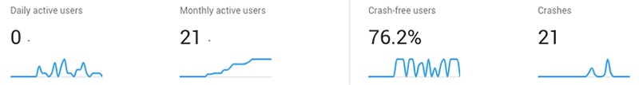

# Adding Crash Reporting to Your NativeScript App

While I've personally never written a buggy line of code in my life, odds are *some* of you out there have. And what's the golden rule of open source?

*Identify and fix errors before your users have a chance to create a GitHub issue!*

We've collectively taken many approaches to logging errors with our apps (be they web or mobile). In my past as a .NET web developer, I often took a rudimentary approach by leveraging the global `Application_Error` event to have my app send a simple email with the error details. Meh 😐. It works, but doesn't provide the consolidated reporting required by enterprise-grade apps.

Times have changed and numerous, far more robust, "crash reporting" services have emerged. Some of the more popular ones being [CrashProbe](http://www.crashprobe.com/), [Sentry.io](https://sentry.io/welcome/), and [Firebase Crashlytics](https://firebase.google.com/docs/crashlytics/).

Now if you're not using *any* error-reporting mechanism, my instinct is to shame you, but in reality I want to give you a hug and let you know it's going to be ok.

Today we are going to learn how to leverage Crashlytics (part of Firebase) to log and report on errors in our NativeScript apps for both iOS and Android.

## The Firebase Plugin

Quick history lesson: Crashlytics has been around since 2011. They were acquired by Twitter a couple of years later, and most recently acquired by Google for inclusion in their Firebase offering.

> Not to get all marketingy on you, but if you're looking for a competitive, NativeScript-optimized serverless backend, take a look at [Progress Kinvey](https://devcenter.kinvey.com/nativescript/guides/getting-started).

While Firebase contains numerous services, the only one we care about today is Crashlytics. And what better way to utilize these services than via the [NativeScript Firebase plugin](https://market.nativescript.org/plugins/nativescript-plugin-firebase)!

To get started with Firebase, all you need to do is head over to the [Firebase console](https://console.firebase.google.com/) and set up a new (free) account.

From here I would have you follow the [simple instructions](https://github.com/EddyVerbruggen/nativescript-plugin-firebase#prerequisites) to get your first Firebase project set up and properly configured with your NativeScript app.

> **TIP:** During plugin installation, the setup script will prompt you to activate one or more Firebase services. It's kinda important at this point to make sure you mark the `Crashlytics` services with a big `Y` when prompted. Worst case scenario, you can always reconfigure the plugin by going to the `node_modules/nativescript-plugin-firebase` directory and running `npm run config`.

Before you ask, note that the instructions provided allow for usage with NativeScript Core (i.e. plain JavaScript), Angular, or Vue.js!

## Working with Crashlytics

With the Firebase plugin installed and Firebase initialized in your app, it's time to look more closely at Crashlytics.

> **NOTE:** At this time, make sure your `firebase.nativescript.json` file has `"crashlytics": true` and `"crash_reporting": false` noted. This enables Crashlytics and disables the older Firebase crash reporting service. If you have to make a change to this file, remove the `platforms` folder in your app (it'll come back at the next build!).

Now at this point you can say, "I'M DONE!"...and you wouldn't be wrong. Crashlytics *will* start tracking app crashes and display them in your Firebase console:

**But we can do better!** It's a far better practice to catch errors *before* they crash your app and provide a meaningful error message to your users. Sometimes we can't predict error-prone spots, but when we have external dependencies that can change on us (like remote APIs for instance), we should play it safe, check for errors, and log them.

## Capturing an Error

Anytime you want to explicitly log an error, you just need to plug in some tiny code snippets. You first need to import Firebase:

	import * as firebase from 'nativescript-plugin-firebase';
	
Next, call the Firebase `sendCrashLog` method to send a customized error log to your Firebase project:

    firebase.sendCrashLog({
      message: 'You screwed up! Here is the error: ' + error,
      showInConsole: true
    });
    
> Not only can you compose a custom `message` to be logged in Firebase, but you can also optionally show the same message in your console.

A good example of this in practice is the `fetch` module. Since `fetch` can be configured to `catch` an error response, we can log any errors quite easily:

	fetch("https://httpbin.org/get")
		.then((response) => response.json())
		.then((r) => {
			// do something with the data!
		})
		.catch((error) => {
		    // oh no!
		    firebase.sendCrashLog({
		      message: 'Error with that one API: ' + error,
		      showInConsole: true
		    });
		}
	);
	
It gets better though. Since `sendCrashLog` returns a promise, we can also alert our users to a problem with some friendlier UI (in this case a native alert):

	firebase.sendCrashLog({
	  message: "Error!",
	  showInConsole: true
	}).then(
	    () => {
	      alert({
	        title: "Sorry!",
	        message: "Hey, we screwed up. Just thought you should know.",
	        okButtonText: "OK"
	      });
	    }
	);

## Faking an Error

It's all fine and good to implement error logging in your apps, but how do we know it's working? Luckily it's pretty easy to fake a crash on both iOS and Android:

	import { isIOS, isAndroid } from 'tns-core-modules/platform';
	declare const Crashlytics: any;
		
	public forceCrash(): void {
		if (isIOS) {
			Crashlytics.sharedInstance().crash();
		} else {
			throw new java.lang.Exception("Forced an exception.");
		}
	}
	
## Crashlytics Reporting

With some crashes logged, it's time to head over to your handy Firebase console and check on your report!

IMAGE FROM EDDY?
	
**Happy 🐛 squashing!**

