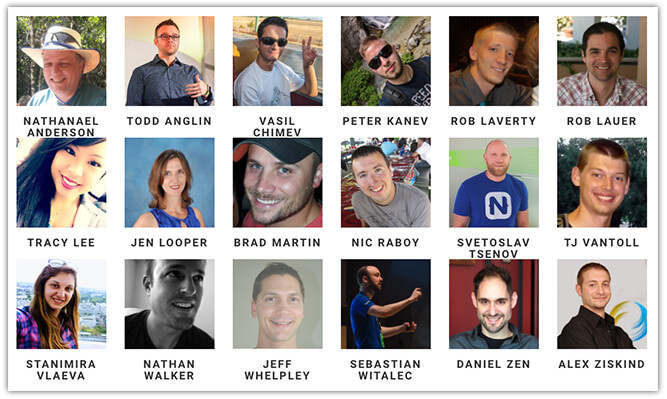
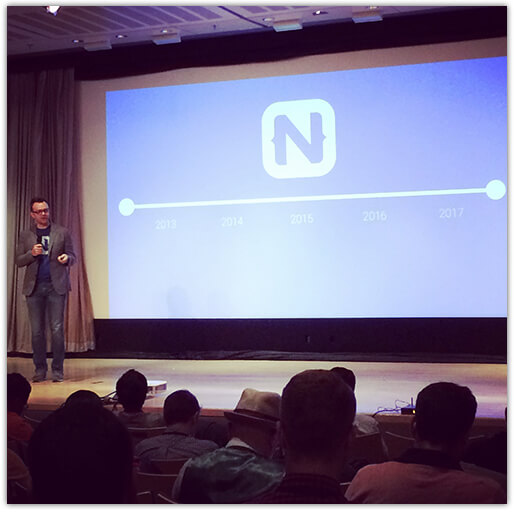
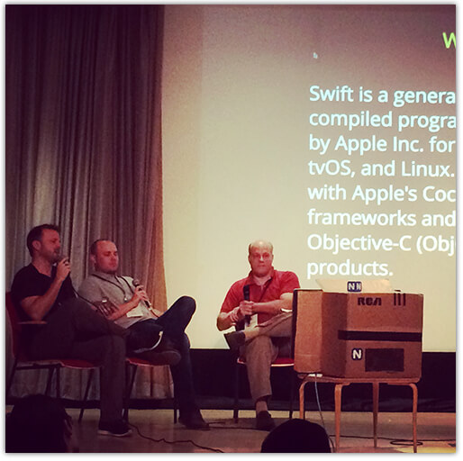
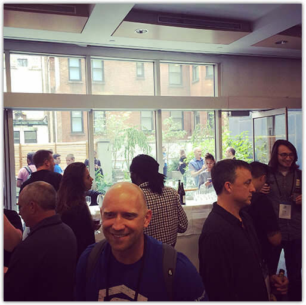
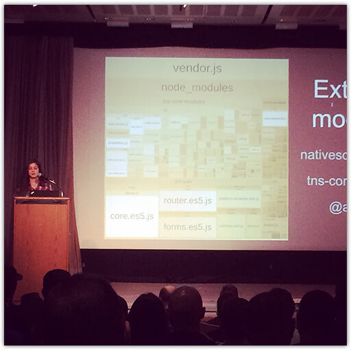
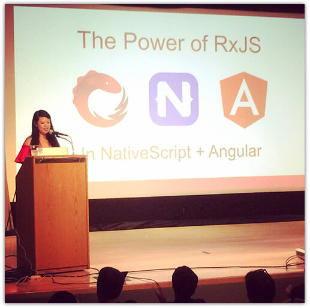
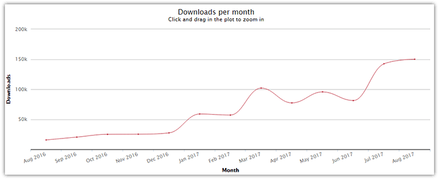
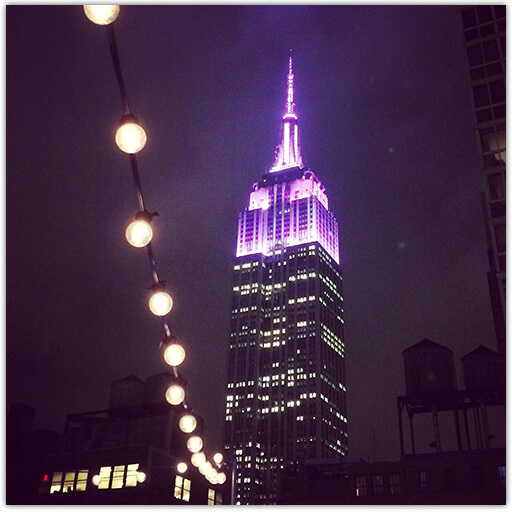

# NativeScript Developer Day 2017 Recap

Earlier this week, Progress hosted the second-ever [NativeScript Developer Day](http://developerday.nativescript.org/). This two-day NativeScript-focused conference took place on September 18th and 19th at Scandinavia House in the heart of Manhattan. Space was limited, yet we had over 150 community members join us from 25 states and 8 countries (not to mention 18 fantastic speakers)!

## Day One

To kick things off on Monday, [Todd Anglin](https://twitter.com/toddanglin) presented a keynote full of announcements:

- **NativeScript UI is now 100% free!** Previously only the ListView and SideDrawer components were free, but now the Chart, DataForm, Calendar, AutoComplete, and Gauge widgets are included under the same free license. [Try it out today!](https://www.nativescript.org/ui-for-nativescript)
- **NativeScript Playground.** A new browser-based tool for playing with NativeScript! Available now at [play.nativescript.org](https://play.nativescript.org/), the Playground allows you to edit code, drag and drop components, and deploy an app to your physical device in seconds.
- **NativeScript Marketplace.** Not just another plugins repository, the new [NativeScript Marketplace](http://market.nativescript.org/) is also your home for *verified* {N} plugins! Looking forward, you'll not only find plugins, but soon app templates, page templates, and themes for your app.
- **Not one, but TWO brand new NativeScript books.** ["The NativeScript Book"](https://www.nativescript.org/get-the-nativescript-book) is being made available for free from nativescript.org, and ["NativeScript for Angular Mobile Development"](https://www.packtpub.com/web-development/nativescript-angular-mobile-development) is a great option for you Angular developers out there.
- **Augmented Reality Support.** Coinciding with the release of iOS 11 and Android Oreo, we are happy to announce a [preview of AR support in NativeScript](https://www.nativescript.org/blog/preview-of-augmented-reality-in-nativescript). Over the coming weeks and months we will show you how to extend your apps and create true cross-platform AR experiences.
- **NativeScript Sidekick Preview 2.** Now offering iOS provisioning profile/certificate generation, improved LiveSync, and (soon) a preview of Visual Studio support, [NativeScript Sidekick](https://www.nativescript.org/nativescript-sidekick) is establishing itself as THE companion for your NativeScript development experience.

> Be sure to check the NativeScript blog in the coming weeks as we dive into these announcements in more detail!

Todd's keynote was followed by a day full of deep dive sessions in two separate tracks with plenty of options for both beginners and more seasoned {N} developers. Just a few of the highlights included:

- A unique 📺-side chat on plugins with [Nathan Walker](https://twitter.com/wwwalkerrun), [Nathanael Anderson](https://twitter.com/CongoCart), and [Brad Martin](https://twitter.com/BradWayneMartin) (the [nStudio](http://nstudio.io/) team);
- [Jeff Whelpley](https://twitter.com/jeffwhelpley) and [Rob Laverty](https://twitter.com/roblav976) provided an Angular deep dive;
- [Daniel Zen](https://twitter.com/danielzen) showed us how to master TypeScript and ES6 development.

At the end of day one we all got to meet each other (and enjoy a variety of adult beverages) on the gorgeous roof top of Scandinavia House:

## Day Two

Day two included engaging talks from the NativeScript engineering team (including [Stanimira Vlaeva's](https://twitter.com/StanimiraVlaeva) awesome talk on improving Angular start up time) and other prominent community members:

There were too many other great talks to single out any individual highlights (seriously!). Ok, fine, [Tracy Lee](https://twitter.com/ladyleet) provided a fantastic overview of RxJS that I can't *not* mention!

You can also get a taste of what you may have missed on day two from the [NativeScript Developer Day schedule](http://developerday.nativescript.org/).

## ICYMI

For those of you who attended NativeScript Developer Day: **THANK YOU!** You helped make it a wonderful event for all of us! 🤗

But if you weren't able to attend, no worries, we did record all of the sessions and will be announcing the availability of those talks shortly.

## NativeScript 📈

NativeScript continues to grow immensely. As of the end of August, our downloads on npm are up almost 900% year-over-year! This is due to all of you, our valued community members and contributors.

Hosting an event like this was a great way for us all to continue to put faces to names, share best practices, and provide essential feedback. We couldn't be happier with the way this Developer Day turned out and we look forward to what the coming year brings us!

