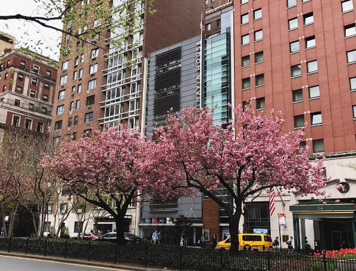

# Save the Date: NativeScript Developer Day 2017 in NYC

NativeScript Developer Day is happening (again)!

**This year our one-of-a-kind event will take place at the gorgeous [Scandinavia House](http://www.scandinaviahouse.org/) in New York City.**

On what is sure to be a perfect fall day in the Big 🍎, we invite you to come collaborate with the growing community of NativeScript developers, Progress's own Developer Relations team, and core members of the NativeScript engineering team.

*When is it happening you ask?*

**NativeScript Developer Day will take place on September 18-19, 2017.**

Both seasoned and novice mobile developers alike will find a lot to ❤️ at NativeScript Developer Day. While we don't have specific details to share *quite* yet, we know there will be:

- NativeScript workshops;
- Sessions from leading community members;
- Insight from the team behind NativeScript;
- Serious networking opportunities;
- ...and maybe a surprise or two 😉.

More information will be available soon on the [official NativeScript Developer Day website](http://developerday.nativescript.org/). Until all of the details are available though, we wanted YOU to save the date for a great chance to learn more about NativeScript in the city so nice they named it twice!