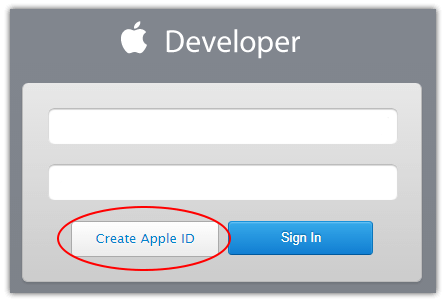
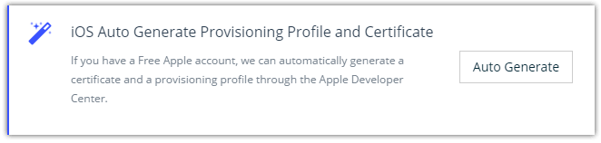
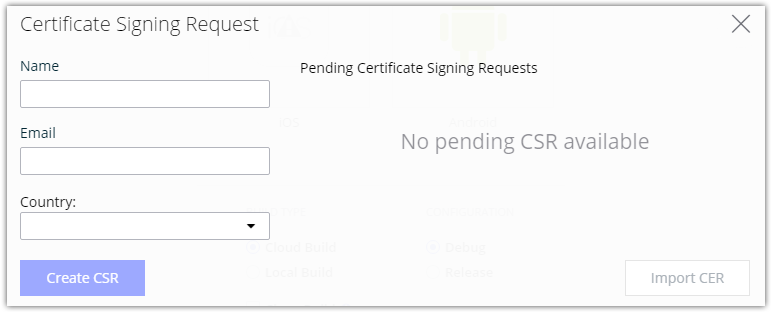
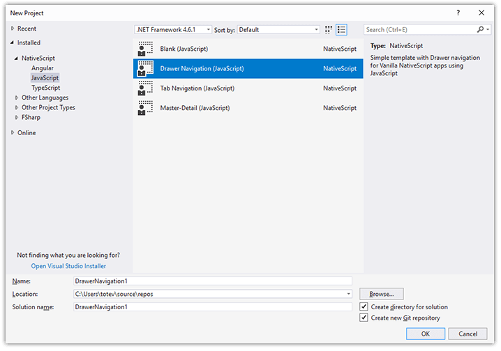
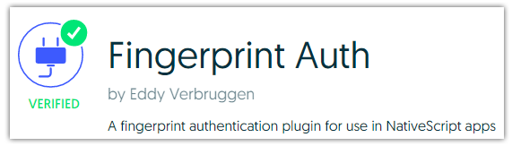

# Updates to NativeScript Sidekick Announced at Developer Day

Did you make it to [NativeScript Developer Day](http://developerday.nativescript.org/) in the Big 🍎 last week? If not, you missed some fantastic sessions on the NativeScript framework along with numerous NativeScript tooling announcements. Luckily for you, we will be blogging about these updates this week and next! First up today is every NativeScript superhero's favorite companion: [NativeScript Sidekick](https://www.nativescript.org/nativescript-sidekick).

**Let's jump right into the big updates!**

- Auto Generate iOS Provisioning Profiles and Certificates
- Create iOS CSR on Windows
- Deploy, Debug, and LiveSync
- Preview of Visual Studio Extension
- NativeScript Marketplace Integration
- What's Next from Sidekick

## Auto Generate iOS Provisioning Profiles and Certificates

The bane of iOS development, Apple's $99/year developer accounts are a sure-fire way to discourage hobbyist developers from experimenting with iOS development. However, did you know you can create a **free** Apple developer account and use that for sideloading apps on iOS devices?

Simply [create an Apple ID](https://appleid.apple.com/account#!&page=create) and Apple will automatically provide you with a free (albeit limited, see below) Apple developer account.

If having access to a free iOS developer account isn't enough, how about handling the pain of iOS device provisioning and certificate generation for you? Now in Sidekick you can request iOS development certificates and provisioning profiles be created when you deploy your app to a connected device. With an iOS device connected, simply choose **Run on Device** from the **Run** menu:

Behind the scenes, Sidekick pulls your connected device id and associates that id with a provisioning profile for you!

Note that due to Apple restrictions, this workflow only works for the free Apple developer accounts. See the next section if you already have a paid developer account.

> While the free Apple developer accounts allow you to develop/sideload an iOS app locally, you will need to purchase a $99 account to publish an app to the App Store.

## Create iOS CSR on Windows

Windows developers rejoice! With this update to Sidekick you no longer need access to a Mac to generate your development certificates!

From the **Tools** menu, choose **Certificate Signing Request**. From here you can generate a CSR and use that in the iOS dev center to create your certificate: 

And soon you literally won't need a Mac for *any* part of your iOS development process! You don't need a Mac for builds (due to Sidekick's cloud builds), you don't need a Mac to generate certificates or profiles, and in a coming release you don't need a Mac for app store publishing. Stay tuned!

## Deploy, Debug, and LiveSync

The Sidekick debugger has been upgraded to function properly with LiveSync enabled;

TBD

## Preview of Visual Studio Extension

While we realize our [Visual Studio Code add-on](https://www.nativescript.org/nativescript-for-visual-studio-code) is wildly popular, our classic Visual Studio developers were feeling left out in the cold. That's why we are pleased to announce a preview version of our NativeScript extension for Visual Studio 2015 and 2017!

Using this Visual Studio extension, you can leverage Sidekick features within your beloved IDE. Perform cloud builds, local builds, access the debugger, and LiveSync your way to a cross-platform mobile app in no time.

We will provide a preview of the Visual Studio extension some time next month!

## NativeScript Marketplace Integration

At NativeScript Developer Day, we announced the creation of the [NativeScript Marketplace](http://market.nativescript.org/). Is this just another plugin repository? Heck no! The marketplace is not only a source of plugin discovery, but we are also providing assurance and **verifying** plugin functionality. The days are gone of trying to compare plugins that claim to perform the same functions. Going forward our engineering teams will be placing a stamp of approval on certain plugins to help you choose the right plugin for your mission-critical app.

Coming soon in Sidekick is the ability to query the NativeScript Marketplace directly to access new plugins and update existing plugins.

IMAGE

Look forward to a blog post next week that dives deeper into what the marketplace is today and what it will become in the near future!

## What's Next from Sidekick

NativeScript Sidekick is a critical component of the NativeScript ecosystem. Soon we will be releasing support for [Webpack](https://docs.nativescript.org/best-practices/bundling-with-webpack) in cloud builds to make your apps start faster with a smaller package size. We will also be taking the "public beta" label off and releasing Sidekick 1.0 next month.

Thanks for all of your support and, if you haven't already, [grab your own free copy of NativeScript Sidekick](https://www.nativescript.org/nativescript-sidekick) - it works equally well on Windows, Mac, and Linux.
