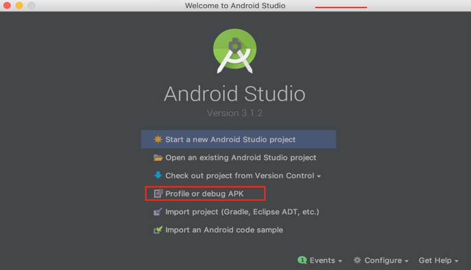
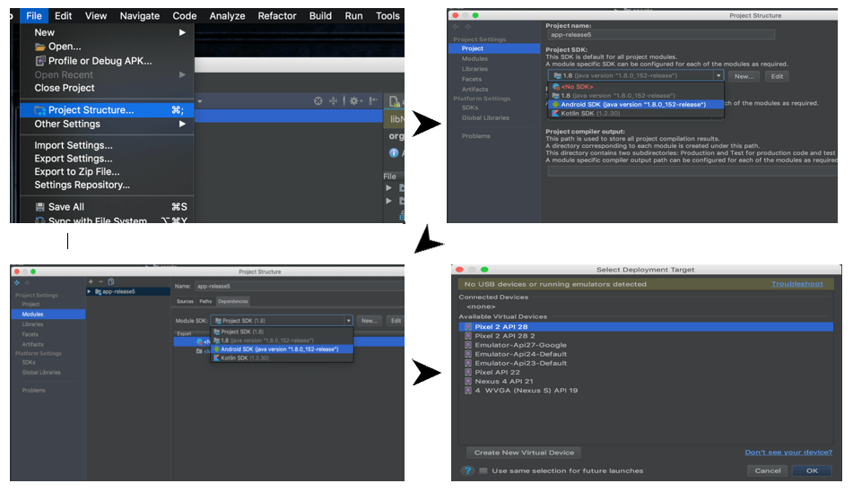
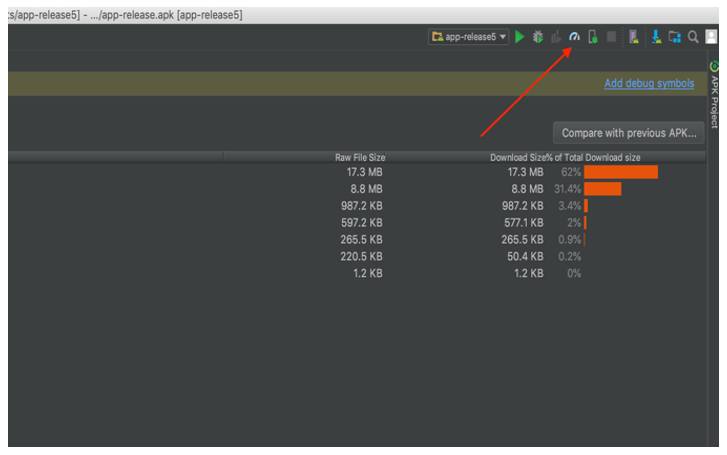
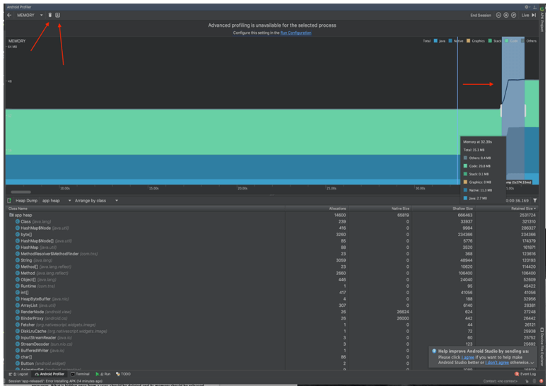
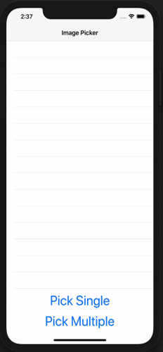
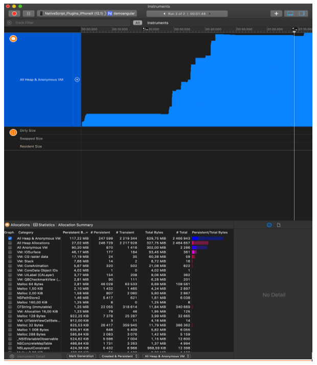
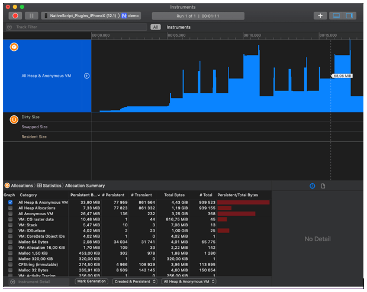
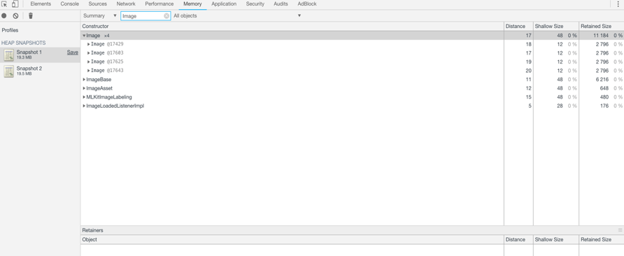
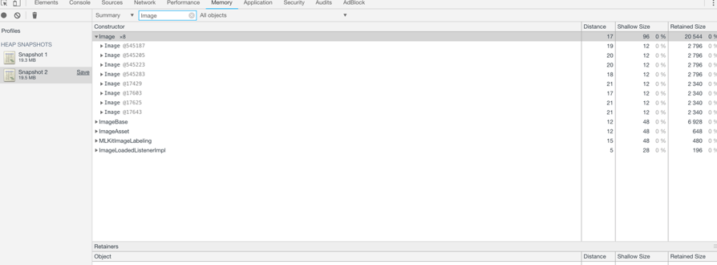
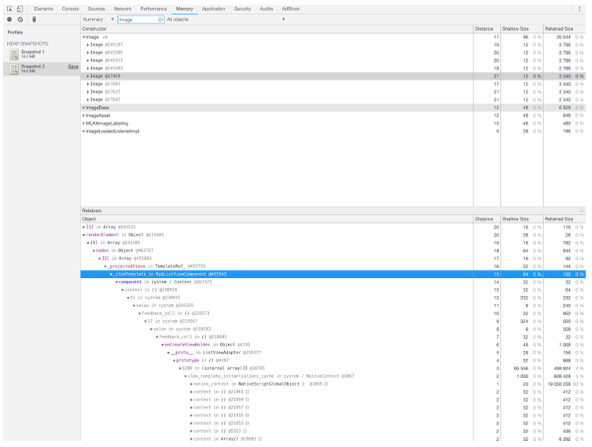

# Hunting Memory Leaks with Android Studio and Xcode

One of the key aspects when it comes to application performance is memory consumption. Testing for memory leaks and prevent them is one of the main tasks that should be performed by every QA and app developer. Memory leaks can lead to poor app performance and even app crash which in terms lowers the satisfaction of the app’s users and can even cause you to lose them. In this post I’ll show you how to chase them, find where most memory leaks are, and how to resolve them.

## Prerequisites

Prerequisites for this task are several tools which help us to dig deep into the application at runtime and analyze its behavior. I’ll show you how to profile a native iOS and native Android application with [Xcode](https://developer.apple.com/xcode/) instruments and [Android Studio](https://developer.android.com/studio/) Profiler. You can download them directly from the macOS App Store and developer.android.com respectively. The tools are used to view resources such as memory, threads and processes, method timings, and network usage.

## Native Memory Leak Hunting

### Android

After building your NativeScript application there are two native apps in the `application/platforms` folder. Starting with android we need to open the Android Studio and select “Profile or debug APK” option and open the .apk file of our app:

When the studio is ready, there is one configuration that we have to set manually. The Android SDK for the project should be configured – open the file menu and select **Project Structure**. In the opened window, choose the **Android SDK** in Project SDK dropdown, then go to **Modules** and again choose **Android SDK** in the Module SDK dropdown. Apply the changes to the project and prepare to launch.

In the ribbon of the Android Studio there is an icon “profile”, click the icon which will open a window with the current available devices, choose one, click the OK button and let the hunting begin. Bear in mind that the app identifier should be unique. If the app is already installed on the device, you should use the `adb install -r` command.

In the window you can see the metrics for CPU, Memory and Network, clicking on the Memory metric will expand the content and show more-detailed chart where we can monitor memory usage of the running application.

The main memory consumption components are those that work with data – lists, galleries, grids, charts, etc. Hunting memory leaks should be directed to such components. In our example we have an `Image` area component which shows an image from gallery. Every time an image is selected, the used memory size is expected to go up. But selecting another image or showing the same image once again should not increase the used memory. The developer should properly select a technology and should carry off for the releasing of unused memory and objects.

In our example we see that there are no leaks, after selecting images one after another the memory for the first image is released. We see the rise and fall of the series for memory usage. 

### iOS

Let’s try the same example for iOS and see what happens.

The procedure here is the same as in Android with some specifics related to the iOS app development and debugging procedures.

Again, we start by opening the native application’s project or workspace in XCode (located in `platforms/ios` folder). Then, go to **Product -> Profile** menu and select **Profile** option. After the app is built and deployed to the device a window with options is shown. For this test we will choose the *Allocations* option. When the profiling instrument is shown we can simply press the red *Record* button in the top left of the window and start watching the charts. Initially the app uses 16-17 MB memory. When we start to select images in the application, we see that the chart goes up a bit, but once we start to select second, third etc. images the consumption of memory grows linearly which is something we do not expect to happen.

*This looks like a memory leak in our application:*

After some further investigation, however, it turns out that at some moments, though rarely, the overall memory usage drops, then starts to rise again upon image picks. So, this is not exactly a leak because, eventually, it seems that the **ARC** (automatic reference counting, the alternative to Garbage Collection in iOS) mechanism manages to free up memory by releasing unneeded objects. The issue is just a high usage of memory, which can become fatal to the app execution in the cases when the ARC does not release these big objects.

But why does this happen? What stops ARC from freeing up memory? Let's give a step-by-step explanation:

- When picking images, the [nativescript-imagepicker](https://github.com/NativeScript/nativescript-imagepicker) plugin API returns JS object representations of images to the app.
- Each of these JS objects have their native counterparts, in our case – images (big objects in size) using significant amount of memory.
- On their own, the JS objects are so small that the memory usage in the JavaScript VM never reaches a point where it would trigger garbage collection. 
- Thus, many small JS objects result in high memory usage on the native side in the JS world. It is only when the memory pressure in JS raises, GC in JS is triggered and all native counterparts are freed.

So how do we resolve this issue? Maybe you've just guessed - trigger garbage collection in JavaScript! Though it does not sound like the best solution, it seems to be the only one for now. And let’s see what our graphic looks like:

Working indeed – the native objects are freed as soon as the garbage collected JS objects have released their references.

> Some of the advances for such tasks are to inspect components which hold data (e.g. charts, grids, calendars, data forms, drop down lists, menus etc.). Look for additional loaded resources. Look for “pull to refresh” functionality which refreshes your app’s views, loading items on demand when scrolling, navigating through the app pages should be handled strictly and carefully. Leaks of memory can hide everywhere so we should be well prepared to pursue them. What is hidden once from a user, should be deleted and its memory should be released properly.

### Virtual Memory Leaks

The virtual memory leaks are those who occur in the UI part of the application. Multiplying UI components like labels, buttons etc. when navigating through pages. Views are not deleted from lists, multiplying them in grids after refresh, and many more are examples of leaks in memory aspect. Let’s look at an example using a `ListView` with the “pull to refresh” functionality.

The NativeScript CLI has a built-in functionality to debug iOS and Android apps, and inspect the UI elements in Google Chrome’s developer tools window.

Today we are going to play with the `ListView` component in the [master-detail application template](https://github.com/NativeScript/template-master-detail):

Create an app from the template:

	tns create masterDetailApp --tns-template-master-detail

...then run the `tns debug android` command and wait for the app to build. Then open the Chrome browser and visit the link printed by the CLI in the console.

In the **Memory tab** of the browser dev tools we see a button for creating a snapshot of the JavaScript heap. Take an initial snapshot of the app for reference and see the elements listed. Filter the elements in the search bar by typing “image”. As we see the template has four images loaded from the `ListView`:

We can also see their IDs. By triggering the “pull to refresh” we expect that the source of the `ListView` is refreshed and items remains with the same count, but if we filter the images again after taking a new snapshot, we see that their count is doubled, and they are now eight!

Obviously, there is a bug with the `ListView` component - its items/views should be deleted by the garbage collector, once they are no longer being used (i.e. visible to the user).

Let’s take a look at how we found that leak. The four elements from the first snapshot should not be present in the second one, but if we see the tree they are still there. When we inspect them, we see that the first occurrence of the `RadListView` in the `renderElement` retainer is in `_itemTemplate` which is created by the `ViewContainerRef`.

А common scenario when creating views in Angular is to do it by using the `ViewContainerRef`. It is most used by developers and is one of the common approaches for creating embedded views in your Pages. It hides vulnerabilities since the container should be cleared at the end of using it. If the `clear` method is not called, all the views will remain uncleared even if the garbage collector is triggered. The reason is because the `ViewContainerRef` itself is holding a reference to the created embedded views, so they cannot be marked for garbage collection.  

Now when we know what creates the views, we should find a way to clean them. Searching in Angular documentation we find that the `ViewContainerRef` has a `clear()` method which  destroys all views in this container. After a discussion and debugging session with the developer, a fix was introduced and the leak in our template was removed!

## Conclusion

Performance analysis of an application’s workflow is a key part of the testing process. Ensuring that an app performs strong should be the goal of every application development team. Memory usage is a critical part of an application's lifecycle, using excessive memory could end up with a crash, loss of data, and dissatisfied customers (which is not a desired scenario!). Performing memory analysis is easy, fast, enjoyable, and the result of it could and will lead to better performing apps and more happy customers.