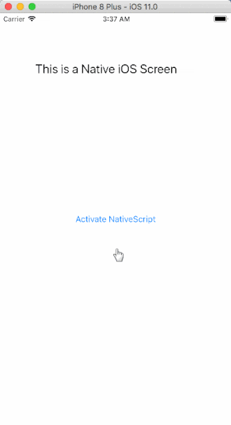

# Embedding NativeScript in an Existing iOS App

These days, the concept of a [greenfield project](https://en.wikipedia.org/wiki/Greenfield_project) is pretty foreign to most of us. We are maintaining legacy web and mobile apps, and new development is often left to our free time. This can make adoption of new frameworks more difficult, because we simply don't have the opportunity to leverage new technology with old projects.

Take NativeScript for instance. What better way to develop a native, cross-platform, mobile app than to use the web skills you have been honing for years? Well, many of us are dealing with traditional (Objective-C, Swift, Java) apps and don't have the option of using NativeScript for app development. Until now that is.

**We've recently updated the NativeScript docs and introduced a [new article with step-by-step instructions](https://github.com/NativeScript/sample-ios-embedded/blob/master/HOWTO.md) on embedding NativeScript in an existing iOS app!**

> If you're curious about embedding NativeScript in an Android app, [view our Android integration docs](https://docs.nativescript.org/integration-with-existing-ios-and-android-apps/extend-existing-android-app).

## Requirements

Before you dive into this, you should know that we do have a couple basic requirements for you:

- You'll need a Mac with Xcode 9+ installed;
- You'll also need the NativeScript CLI installed and configured with Cocoapod support.

Our step-by-step instructions include two demo apps pre-configured for this scenario. *CoolApp* is an Xcode project (your native iOS app) and *nsapp* is a basic NativeScript app.

**Enough talk: [read the article](https://github.com/NativeScript/sample-ios-embedded/blob/master/HOWTO.md) and try it for yourself!**

## ⚠️Alert!⚠️

While the instructions are clearly documented, this process is not for the faint of heart! 😲

*This integration is still very new and in an experimental state.* Feel free to report any issues you find in the [appropriate Github repository](https://github.com/NativeScript/sample-ios-embedded/issues).