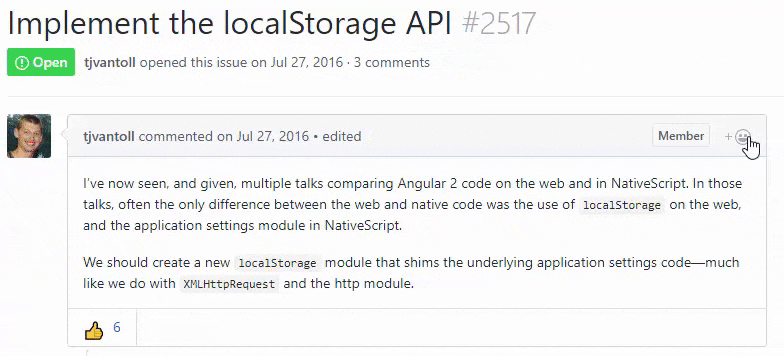

# Submitting a NativeScript Feature Request

While managing a free and open source project, the NativeScript team has strived to be as open as possible about the [framework's roadmap](https://www.nativescript.org/roadmap). Allowing the community to suggest features, comment on them, and vote them up 👍 or down 👎 is a critical element of this process. We combine this direct input with community surveys, one-on-one interviews, and market research to develop a complete roadmap.

Up until now, we admit that we've been a little scattered in terms of exactly *how* we have received this input from you. While we read your blog post comments, forum posts, support tickets, Github issues, and our ideas portal, we have not been as upfront as to *how* you should directly provide feedback.

**This changes now as we transition to utilizing Github for all feature requests!** With the introduction of [reactions](https://github.com/blog/2119-add-reactions-to-pull-requests-issues-and-comments) on issues, Github allows us to not only track issues and feature requests, but to also allow the community at-large to effectively vote issues up or down with a 👍 or 👎 (not to mention provide more context in the comments).

👍👎😄😕❤️🎉 let you tell us what you really think!

**We do ask that you use the `feature` label to tag your feature requests in the [NativeScript repo](https://github.com/NativeScript/NativeScript/issues).**

> [Here is a handy link](https://github.com/NativeScript/NativeScript/issues?q=is%3Aopen+label%3Afeature+sort%3Areactions-%2B1-desc) that acts as a mini ideas portal for you.

**This does mean that the [old ideas portal](https://nativescript.ideas.aha.io/) is being deprecated.** But don't worry, we are transferring over all of the most popular items to Github that haven't already been added.

And yes, we will *still* keep listening to you here on the NativeScript blog, forum posts, and support tickets. It is you, the community, who helps drive the direction of NativeScript, so your input is truly invaluable.