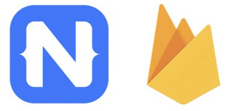

# Webinar: NativeScript on Fire(base) 🔥

While NativeScript is a proven option for creating an engaging frontend of your iOS and Android app, what about the backend?

Over the years you’ve shown us that [Google Firebase](https://firebase.google.com/) is THE preferred mobile Backend-as-a-Service (mBaaS) of NativeScript developers. With enticing features, reliability, and low pricing for small/medium sized apps, Firebase can be an easy choice. Combine it with a [robust NativeScript plugin](https://market.nativescript.org/plugins/nativescript-plugin-firebase), and, well, it doesn’t get much more simple!

From machine learning with ML Kit, to crash metrics with Crashlytics, to performance monitoring, to analytics, and on and on, Firebase has a lot to offer the NativeScript developer.

🚨 **Webinar Alert!** 🚨

[Join us on Thursday, November 21st](https://attendee.gotowebinar.com/register/1269693340074344450?source=blog) as the NativeScript team dives into Firebase and explores many of the relevant capabilities it offers when it comes to mobile app development, such as:

- Machine Learning capabilities provided via ML Kit
- Using Cloud Functions for Firebase
- Auth & Analytics
- Cloud Firestore
- In-app Messaging
- and more!

> **NOTE:** We'll also provide a sneak peek at some new tools we are working on to help NativeScript developers quickly create apps!

[Register for the Webinar](https://attendee.gotowebinar.com/register/1269693340074344450?source=blog)