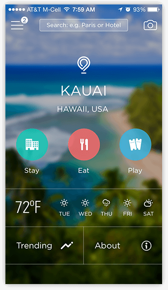
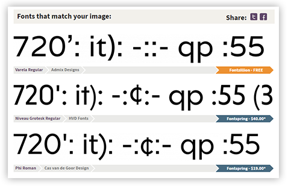
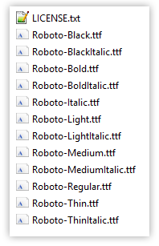
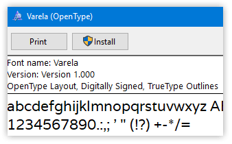
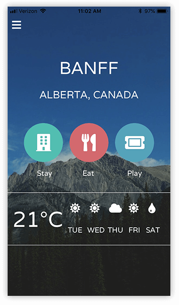
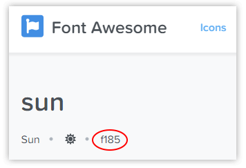
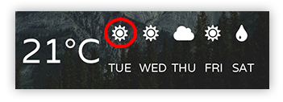

# Using Custom Fonts in a NativeScript App

Seasoned web and mobile developers know that an easy way to add some pizzazz to an app is to switch to a custom font face. Heck, I've been around long enough to remember the Verdana renaissance back in the late '90s!

While the waves and pastels of the '90s are long past us (RIP! ⚰️), the desire to create engaging user interfaces has not changed. **So let's make this happen with NativeScript.** 

The question of *how* to use a custom font is mostly handled in the [NativeScript docs](https://docs.nativescript.org/ui/styling#using-fonts). However, there are some extra tips that you may need to help smooth your journey to Comic Sans glory.

## Finding a Font

> Do you already have the font you want to use in-hand? If so, skip to the [TTF, OTF, WTF?](#ttf) section below. The rest of you, read on!

If you're looking for some ideas for a mobile-friendly font, you've come to the right place. There are a few options you have when deciding on your next great mobile app font.

### System Fonts

Both iOS and Android come with a set of fonts pre-installed. The problem is the venn diagram of iOS/Android fonts doesn't overlap much. So if you're picking a system font, it's likely you'll have different choices for iOS vs Android (not to mention the fact that each iteration of Android can have wildly different fonts installed).

**BUT system fonts are a great way to experiment!** There is nothing to download and copy to your app. You just pick a font, and [update your CSS](#css).

- 🍎 Find a list of iOS system fonts at [iosfonts.com](http://iosfonts.com/);
- 🤖 Find a list of Android system fonts in [this extensive thread on Stack Overflow](https://stackoverflow.com/questions/19691530/valid-values-for-androidfontfamily-and-what-they-map-to).

### Identify Font from an Image

My discovery of new custom fonts regulary comes from existing web or mobile UIs. Maybe I'm not a creative person, but when I see something I like, I'm pretty good at copying it 😅.

Luckily for me, our friends at Font Squirrel provide a [Font Matcherator](https://www.fontsquirrel.com/matcherator) service that is usually up to the task of identifying a font from an image!

*Let's start with the following image:*

I love this unique font. So I head over to the [Font Matcherator](https://www.fontsquirrel.com/matcherator).

...which spits out a variety of suggestions (both free and paid):

In this case I went cheap and picked the [Varela font](https://fonts.google.com/specimen/Varela), as it's close enough to the original for me.

### Other Font Resources

Using the power of the Google you might just be able to find another free (or paid) font that you want. My favorite font sites are [Google Fonts](https://fonts.google.com/) (because those are all free and I am cheap!) and [Font Squirrel](https://www.fontsquirrel.com/) (because they have everything else, for when I'm actually willing to open the pocket book 💸).

## TTF, OTF, WTF?

Ok, you've found the font you want, you've downloaded it, and unzipped it. And sometimes (e.g. Roboto) you end up with this:

**BUT I JUST WANT ROBOTO!**

So, sometimes it takes a little picking-and-choosing to determine the *exact* font files you need. If you're just starting out with a font, it's best to just include all of the files with **either the .ttf or .otf file extension**. There is no difference for NativeScript, so just pick one, and delete the other files.

Now that we are down to just .ttf (in this case), we can further narrow down the fonts we need by *variant*. For instance, if I *know for a fact* that I only need a `Regular` and `Bold` variant (and not `Italics`), I only need those font files, which in the Roboto case is:

- `Roboto-Regular.ttf`
- `Roboto-Bold.ttf`

**Now that I have limited the font files I need, they can simply be copied to the `app/fonts` directory in my NativeScript project.**

> If you are using the [NativeScript Playground](https://play.nativescript.org/), simply create a `fonts` directory and use the `Upload resources` contextual menu option to upload your font files.

## Which Font-Family?

So let's switch over to the app I'm working on. Remember that I chose the `Varela` font for this app...but *how* exactly do I use the font? **With CSS of course!**

	.some-class {
	    font-size: 40;
	    font-family: "Varela";
	    color: white;
	    text-transform: uppercase;
	}

While this seems pretty straightforward, there are differences in what iOS and Android expect in the `font-family` property:

**iOS requires the `font-family` to be the *exact name* of the font.** The only reliable way I've been able to do this is with the **Font Book** app on macOS or by double-clicking the font in Windows:

You'll notice the font name is clearly displayed for us as Varela. Easy! It's not always as simple though, so it's good to make sure you always do this step.

For Android it's generally a bit simpler. You can count on Android to look at the *file name* of the font. So in this case that is `varela-regular`.

Our CSS is starting to come together!

	font-family: "Varela", "varela-regular";

### Font Variants

But what about our variants? Ah, this is where we find a wrinkle! With iOS we simply have to specify the variant in CSS, like so:

	font-weight: bold;
	
...but if you have a separate font file with a separate variant (like our `Roboto-Bold.ttf` mentioned above), with Android you have to explicitly reference the bold variant of the font file, making an iOS- and Android-compatible class like so:

	font-family: "Roboto", "Roboto-Bold";
	font-weight: bold;
	
Now in my markup I can simply reference the above class:

	<Label text="{{ city }}" class="some-class" />
	
**Done!** 🎉

> **TIP:** You can [try out this app](https://play.nativescript.org/?template=play-tsc&id=Y4fVGt&v=16) in the NativeScript Playground!

## Bonus Guide: Icon Fonts

Another very common use of custom fonts is for **icons**. The most popular image icon set out there is probably [Font Awesome](https://fontawesome.com/), but there are plenty more out there that you can use.

**In the case of icon fonts, the instructions are *exactly* the same as above!** The only difference is with the text output. There are a couple of ways to tackle this:

- Use a [NativeScript plugin](https://market.nativescript.org/plugins/nativescript-fonticon) created to make using icon fonts easy.
- Look up the unicode value that you want to display.

In the case of Font Awesome, we can look up an icon from the [master list](https://fontawesome.com/icons) and grab the unicode value:

Copy that value and paste it into the `text` property of your NativeScript UI element, with the associated CSS class name, like so:

	.fa {
	    font-family: "Font Awesome 5 Free", "fa-solid-900";
	}

	<Label text="&#xf185;" class="fa" />
	
...which will render a nice little icon as requested:

> Check out this guide from Nic Raboy???

## Wrapping Up

Hopefully this guide has been helpful for you to get up and running with custom fonts in NativeScript. Be sure to [consult our docs](https://docs.nativescript.org/ui/styling#using-fonts) and the [community forum](https://discourse.nativescript.org/) if you run into any trouble - or sound off in the comments if you have any tips of your own!

**Happy NativeScripting! 😀**