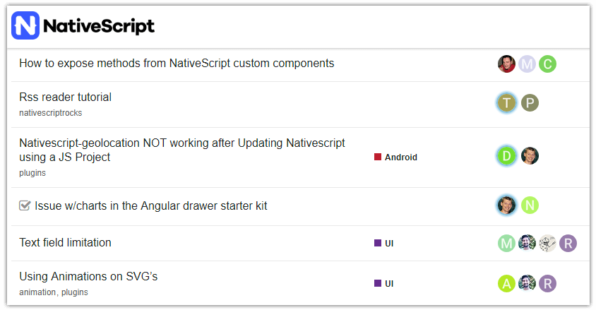
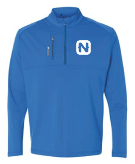

# Announcing NativeScript Forum Rewards

It's no secret that open source projects depend heavily on their communities to help organically grow adoption. A big part of that is "support", and while there are options for paid [enterprise-level support](https://www.nativescript.org/enterprise) from the NativeScript team, scaling free community support is critical for nurturing a healthy ecosystem.

NativeScript community support started with [our Slack channel](http://tinyurl.com/nativescriptslack). And Slack has been great! We have over 4,600 developers on our various channels. But Slack conversations can get lost in the shuffle, which is why we introduced the [NativeScript Forum](https://discourse.nativescript.org/) (running on the Discourse platform) some time ago.

**We are incredibly appreciative of our community members who step up to answer questions on the forum.** So, to thank those of you who put your valuable time into responding to queries, solving problems, or even finding other resources to help, we'd like to reward you.

**Today I'm happy to announce NativeScript Forum Rewards! 🎁 🎉**

## How Does it Work?

On or about the first of every month, we will offer gifts to the top three individuals who have received the most "likes" (represented by a ♥️ in forum posts) in the previous month. Likewise, we will offer *premium* NativeScript swag every quarter (i.e. January 1st, April 1st, July 1st, October 1st) for the person who received the most "likes" in the previous quarter.

> To be as accurate as possible, this system relies on all of us to make sure we are handing out likes when someone has helped answer a question!

<iframe src='https://gfycat.com/ifr/FirsthandActualAmphiuma' frameborder='0' scrolling='no' width='100%' height='100%' style='position:absolute;top:0;left:0' allowfullscreen></iframe>

## What are the Rewards?

Glad you asked! The **monthly rewards** will be:

- **1st:** $150 Gift Card
- **2nd:** $100 Gift Card
- **3rd:** $50 Gift Card

> Gift cards will likely be a choice of Amazon, Apple, Microsoft, Google, or Starbucks.

The **quarterly reward** will be a choice of premium NativeScript swag. This is way better than what we hand out at conferences 😀. For example, our premium NativeScript jacket!

*Note: In the event that international shipping is untenable, we reserve the right to deliver an electronic gift card in lieu of physical merchandise.*

Of course, gifts will only be available for non-Progress employees. Sorry to the active Progress forum crew of Peter, Jen, TJ, and Sebastian ☹️.

*And yes, in the event of a tie in any given month/quarter, we will happily give out multiple prizes!*

## Leaderboards

You'll be able to follow along (mostly) using the reports provided by Discourse:

- [Monthly Leaders](https://discourse.nativescript.org/u?period=monthly)
- [Quarterly Leaders](https://discourse.nativescript.org/u?period=quarterly)

> I say "mostly" because Discourse always shows the last month/quarter from *today's date*, not the last calendar month/quarter.

## When Does it Start?

Next week! As of **November 1st, 2017** we will start tracking likes and will send out monthly gifts on December 1st. We will also maintain a sticky forum post with information about the program (along with a list of the previous winners).

THANK YOU to everyone who has helped make NativeScript a successful open source project and please continue to help out others on the [NativeScript Forum](https://discourse.nativescript.org/) 🤗.