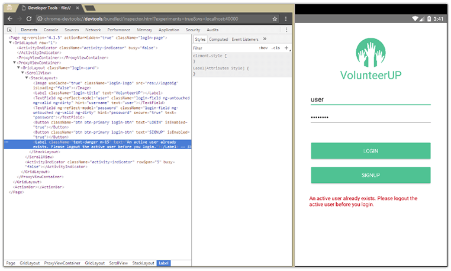

# NativeScript 3.1 Just Released

We are extremely excited to announce the immediate availability of the [NativeScript 3.1 release](https://www.npmjs.com/package/nativescript). During the past six weeks we've been busy taking full advantage of all the important changes that we introduced with the 3.0 release, and continue delivering new and valuable functionality. Not only does this new release brings even more stability to the framework, but it also adds fundamental missing pieces that bring NativeScript to a new level of maturity and usability.

On to the highlights!

- [Chrome DevTools Elements Tab](#chromedevtools)
- [Local Snapshot Builds](#snapshot)
- [Performance Profiling](#performance)
- [NativeScript CLI Changes](#cli)

## Chrome DevTools Elements Tab Integration in Android

The 3.1 release adds another feature to the Chrome DevTools arsenal - the Elements Tab. You will now be able to [fire up the debugger](http://docs.nativescript.org/tooling/debugging#debugger-commands) and inspect, as well as modify, the current view tree of your NativeScript app.

This is a much anticipated feature that we believe will dramatically improve the entire UI-related development process of our users, as well as provide much easier understanding of the UI abstraction of the core modules. Initially this feature will be available for the Android platform, and will land for iOS in a later release - most likely in 3.2.

## Local V8 Heap Snapshots for Android on Mac and Linux

[Webpack](https://webpack.js.org/) is one of the most valuable tools in our tool belt when it comes to app startup time optimization. The 0.7.1 version of our [nativescript-dev-webpack](https://github.com/NativeScript/nativescript-dev-webpack) plugin comes with support for generating a [V8 heap snapshot](https://v8project.blogspot.bg/2015/09/custom-startup-snapshots.html) from an arbitrary bundle.

The snapshot generator comes into play at the end of the bundling step. It loads and executes a single script in an empty JavaScript context and produces a serialized version of the V8 heap just after its execution. The Android runtime [is capable of injecting the serialized heap](https://docs.nativescript.org/runtimes/android/advanced-topics/V8-heap-snapshots) directly into the JavaScript context on app startup. This obviates the need to fetch, parse, and execute the file at runtime - which significantly decreases app startup time.

In the context of a brand new Angular application, our measurements show that snapshotting the largest bundle improves the app startup time by 10-50%, depending on the device. Adding more code in the snapshotted bundle gives even better results. Snapshot generation is disabled by default. To enable it, pass `--snapshot` flag to the Android bundling command. Currently, the feature is limited to the macOS and Linux platforms. A deep dive post on the topic is coming soon, so stay tuned!

## Performance Profiling

Native performance has been one of the key pillars of the NativeScript vision since the early days of the framework. That's why we are continuously spending significant development time on analysis, optimization, and advanced techniques that help us achieve the desired outcome of maximum performance.

Figuring out how an application performs requires a good overview of how the C++, Objective-C/Java, and JavaScript layers mix together on the system stack. Internally we have developed a means to enable performance tracing of some key methods and have used them to profile and fine-tune our home-grown applications. We thought that when something helps us do our job then it would potentially benefit the community as well.

With that said, we are happy to expose these internal tools to the public. Starting with this release we introduce a way for our users to enable the {N} profile traces for Android (and with the @next version of the iOS Runtime, for iOS). Adding the...

	{
	    "profiling": "timeline"
	}

...key in your `app/package.json` will enable logging in the console of runtime methods such as startup times, asset extraction, and time spent in a `require` call. When mixed with the rest of the output, these console logs are hard to read and analyze, that's why we've also added a tool to create an interactive web page out of them. To use it run:

	npm i -g timeline-view
	tns run android | timeline-view

When done with application interaction, tap **ctrl + C** to stop collecting information. The `timeline-view` tool will generate an html representation of the collected information that you can inspect in your browser.

**Here are some exciting results of our profiling experiments:**

Jen Looper's [Practice Buddy](https://github.com/jlooper/practicebuddy)

- Before: 3500 ms startup time on iPhone 6
- Now: 900 ms on iPhone 6 **(74% improvement)**

Nick Iliev's [COSMOS Databank](https://github.com/NickIliev/NativeScript-Cosmos-Databank)

- Before: 4961 ms on an old LG Nexus phone
- Now: 2500 ms on LG Nexus, 1300ms on a newer phone like Sony Z5 **(50% improvement)**

Alex Ziskind's [looptidoo](https://github.com/alexziskind1/looptidoo)

- Before: 14000 ms on an old LG Nexus phone
- Now: 3980 ms on an old LG Nexus phone **(72% improvement)**

The bottom line is that using this tool to spot performance-critical areas that might be optimized, utilizing WebPack, and applying local snapshots for Android can have a significant impact over the loading time of your apps. A dedicated blog post that covers our profiling findings in better detail is coming, so stay tuned!

## NativeScript CLI Changes

On the CLI front we were focused on polishing and bug fixing. Some of the issues worth mentioning:

- The `emulate` command is now completely removed. It was previously deprecated in 3.0 and is another step in our effort to simplify and streamline the usage of the CLI;
- We managed to fix several old issues related to using [WebStorm](https://plugins.jetbrains.com/plugin/8588-nativescript).
- The livesync functionality went through a major refactoring, the main purpose being to improve the stability and maintainability of this feature;
- More than 20 resolved [GitHub issues](https://github.com/NativeScript/nativescript-cli/issues).

## And Even More!

Some honorable mentions that don't fall in the above sections:

- We continued our effort to further optimize the framework with an improvement on how CSS properties work in NativeScript modules. With 3.1, property updates that happen before the views are loaded are now batched and applied to the underlying native-view only when the views are loaded (ready to be visualized). Gains are more noticeable on iOS where the native views are created earlier in the view lifecycle and this approach spares some set-native callbacks which are unnecessary;
- More than [60 issues fixed](https://github.com/NativeScript/NativeScript/issues) across the main NativeScript repos since the 3.0 release.

## Share Your Feedback

We really hope that you will find the new 3.1 release valuable! Give it a try and do share your feedback with us. We take community input seriously because at the end of the day it is the adoption that matters most, especially for an open source project like NativeScript.

- Provide [ideas for future NativeScript features](https://nativescript.ideas.aha.io/);
- Find support on the [NativeScript forum](https://discourse.nativescript.org/);
- See what's coming on the [NativeScript roadmap](https://www.nativescript.org/roadmap).
