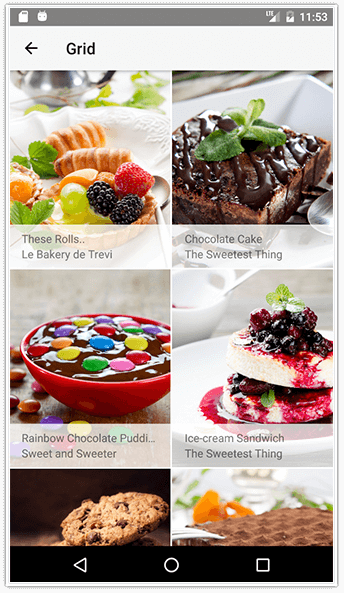
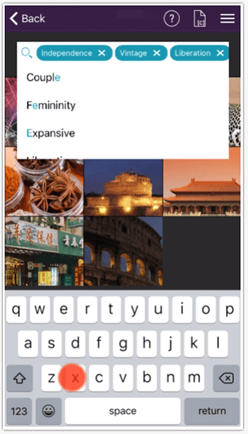
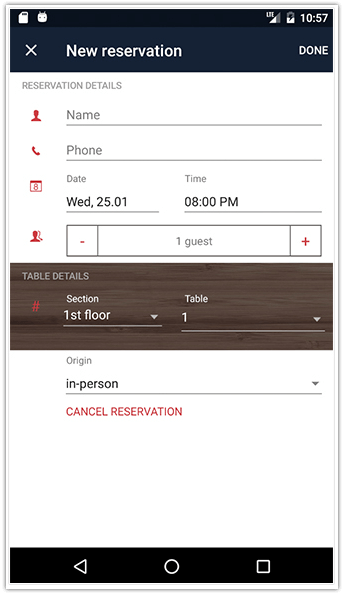

# Progress NativeScript UI 3.0 is Live

[NativeScript UI](http://www.telerik.com/nativescript-ui) version 3.0 is now available and focuses mainly on stability improvements. We have revamped the [AutoCompleteTextView](http://www.telerik.com/nativescript-ui/autocomplete), and also addressed improvements in the [Calendar](http://www.telerik.com/nativescript-ui/calendar), [ListView](http://www.telerik.com/nativescript-ui/listview), and [DataForm](http://www.telerik.com/nativescript-ui/dataform) components. We made sure to focus on the feedback we have been receiving from you and directed our efforts to addressing as much of the feedback as possible.

> For more information on using NativeScript UI, consult our [blog post series](https://www.nativescript.org/blog/a-deep-dive-into-telerik-ui-for-nativescripts-listview).

**What's new in NativeScript UI 3.0?**

## ListView

ListView now supports multiple template selection! You can define a set of different templates dedicated to specific types of data items from your data source by using the `itemTemplates` property. More information on this feature is [available in the docs](http://docs.telerik.com/devtools/nativescript-ui/Controls/NativeScript/ListView/multiple-templates).

We have received several requests to extend the scrolling API of RadListView. Based on your feedback we have added the following new APIs:

- `getScrollOffset()` method that returns the current list offset in pixels;
- `scrollWithAmount()` method that allows you to scroll the list in either direction with a specified amount of pixels.

There are also three new events that allow you to track the scrolling state of the list:

- `scrollStartedEvent`
- `scrolledEvent`
- `scrollEndedEvent`

For more information on these APIs you can take a [look at our online docs](https://docs.telerik.com/devtools/nativescript-ui).

## AutoCompleteTextView

NativeScript UI 3.0 brings A LOT of improvements to the AutoCompleteTextView. We have polished the component by addressing many UI glitches, extending the API, and aligning the features across the iOS and Android platforms. Highlights from this release are:

**New events:**

- `tokenDeselectedEvent`
- `didAutoCompleteEvent`
- `SuggestionViewBecameVisibleEvent`

**New APIs:**

- The `AutoCompleteEventData` class now exposes information about the **token** and its **text**

Additionally, many issues have been addressed, from which the most important are:

- The `showCloseButton` and `closeButtonImageSrc` properties had inconsistent behavior across platforms;
- The `completionMode` property could not be changed at runtime;
- The Suggestion View had layout issues causing it to stay open or stay over the keyboard.

## DataForm

Another well deserved update comes with the DataForm component of NativeScript UI. We have some new APIs:

- The `PropertyGroup` class now has a collapsed property to control whether the group is visible or not;
- The `EntityProperty` class now has support for custom objects with keys and values. You can [read more about this feature here](http://docs.telerik.com/devtools/nativescript-ui/Controls/NativeScript/DataForm/dataform-value-providers).

On top of the new APIs, there are multiple stability improvements and issue fixes that are reflected in the [release notes](http://docs.telerik.com/devtools/nativescript-ui/release-notes#release-notes-300).

## Calendar

The Calendar component contains improvements in the way the Selection Indicator is styled. You may now define:

- Selection indicator shape;
- Selection shape color;
- Selection shape size.

## Check the Release Notes

Since we are not going to cover all of the improvements and new APIs here, we suggest you [review our release notes](http://docs.telerik.com/devtools/nativescript-ui/release-notes#release-notes-300). **Also note that there are some breaking changes which need your attention!**

Go ahead and experiment with NativeScript UI 3.0 and do not hesitate to [share your thoughts with us in the Github issues section](https://github.com/telerik/nativescript-ui-feedback).