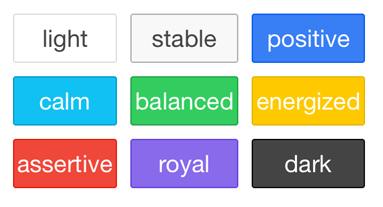
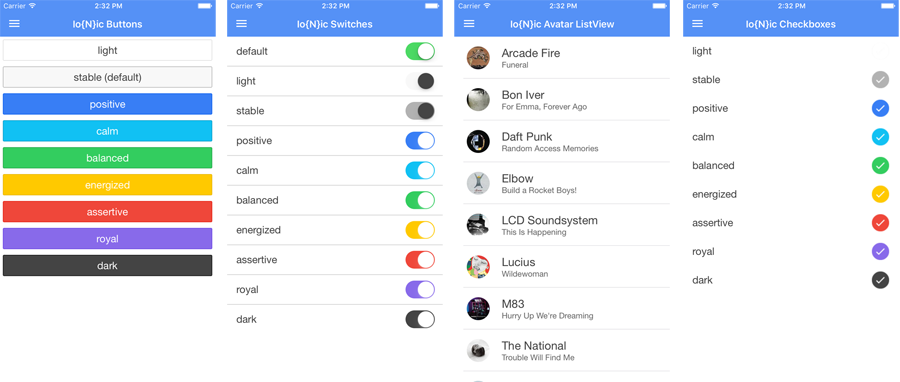

## Creating an Ionic Theme for NativeScript

Hybrid app developers around the world know full well the power and beauty the [Ionic Framework](http://ionicframework.com/) provides. By leveraging the best of Angular, Ionic makes it easy to create hybrid mobile apps that have a mostly native look and feel. However, for many scenarios there is an increasing need to provide a native solution. Therefore it seems obvious to leverage the best of Ionic's CSS components to add some style to [NativeScript](https://www.nativescript.org/), Telerik's open source framework for developing truly native cross-platform apps with JavaScript.

### But Isn't CSS Built for the Web?

Who doesn't miss the days of `Hello World!`? What's that? Nobody? Many years back, CSS introduced a new paradigm of providing a (relatively) easy way to develop and maintain consistent styles for our web properties. While it's not without its detractors - hence the rise of [SASS](http://sass-lang.com/) and [LESS](http://lesscss.org/) - CSS is still how we style websites and hybrid mobile apps.

That's why when the NativeScript team needed to implement a way to style apps, CSS was a clear choice. For developers who wear many hats, there is nothing like being able to re-use an existing skillset when learning a new technology. By implementing a subset of CSS, NativeScript developers can use such CSS selectors as types, classes, and ids - and also use CSS properties like `margin`, `padding`, `color`, `border-width`, and so on.

> Take a look at the NativeScript docs for a list of supported CSS [selectors](https://docs.nativescript.org/ui/styling#supported-selectors) and [properties](https://docs.nativescript.org/ui/styling#supported-properties).

By default, NativeScript generates real native UI elements for iOS and Android. No offense to Apple and Google, but out of the box, native apps just aren't all that pretty! But thanks to the NativeScript CSS implementation, there is a lot we can do about that.

### The Beauty of Ionic and The Power of NativeScript

While best known as a hybrid app framework, Ionic is just as well known for its CSS components and gorgeous color palette:

Combine this with a JavaScript framework based on Angular, and well, it's easy to see why Ionic and other frameworks like [Kendo UI](http://www.telerik.com/kendo-ui) are popular for hybrid app development. Except that:

- Hybrid app performance can be sketchy
- Non-native UI can lead to an [uncanny valley](https://en.wikipedia.org/wiki/Uncanny_valley) effect
- Background processing can be difficult, if not impossible
- Native API access relies on plugins (which we are [doing our best to improve](http://plugins.telerik.com/cordova))
- Cutting edge graphics/gaming is not really an option

While I'm personally a **huge** [Apache Cordova](https://cordova.apache.org/) fan, even I see the advantages of going native, so often our best bet is to utilize a framework that lets us leverage the skills we already have to create native apps. Enter NativeScript:

NativeScript is a powerful JavaScript framework that lets you build apps with the skills you already know (JavaScript/TypeScript, CSS, XML for markup, and optionally Angular 2).

> Looking to get started with NativeScript? Check out the [getting started guide](http://docs.nativescript.org/start/getting-started) or get a free 30-day trial to [Telerik Platform](http://www.telerik.com/platform) and access an instantly-available development environment.

**It doesn't have to be a this-or-that situation though, when we can combine the best of Ionic and NativeScript!**

### Ionic + NativeScript = Io{N}ic

Inspired by Burke Holland's [Nova theme for NativeScript](https://github.com/burkeholland/nativescript-nova) and a recent "innovation day" (a day in which we skip meetings/email and work on a pet project), I wanted to help enable existing web and hybrid developers to see how easy it can be to migrate to native technologies. What better way to do so than to merge the beauty of Ionic with the power of NativeScript! Hence an [Ionic-inspired CSS theme for NativeScript](https://github.com/rdlauer/nativescript-ionic) was born!

For example, by simply using simple CSS class definitions like these:

	.slider-balanced {
	    background-color: #33cd5f;
	}

	.tns-ionicon-large {
	    font-family: "Ionicons";
	    font-size: 26;
	}

...and applying them to a NativeScript UI elements like these:

    <label text="balanced" class="input-label" />
    <grid-layout columns="24, *, 30" rows="auto">
        <label text="&#xf272;" col="0" class="tns-ionicon-large" />
        <slider value="50" maxValue="100" minValue="0" col="1" class="slider-balanced"/>
        <label text="&#xf26a;" col="2" class="tns-ionicon-large right" />
    </grid-layout>

...we get a fully styled native UI element on the device PLUS usage of Ionic's font icons:

### The Bits

**You can find the [complete repo on GitHub](https://github.com/rdlauer/nativescript-ionic).** It's open source of course, so feel free to download, complain, and/or contribute!

And while you'll find the included `app.css` file to be purposefully verbose, you may be surprised by how much you can style a native app with very little code, using the CSS techniques you already know today. Enjoy!

