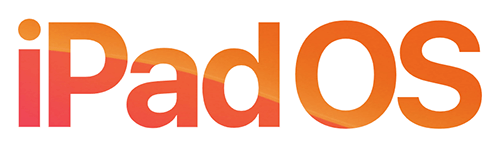
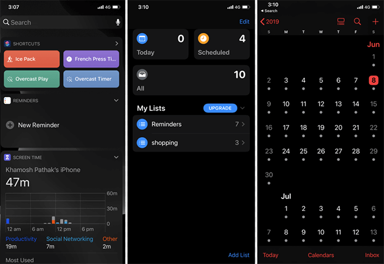
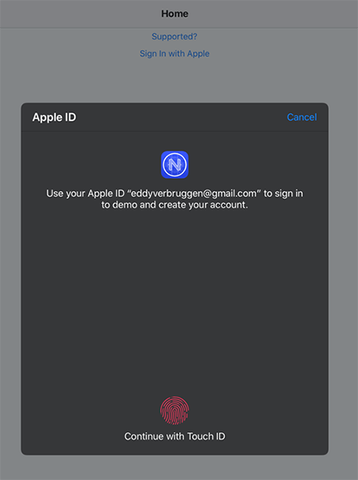
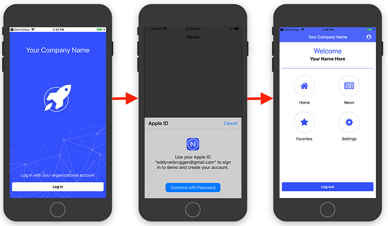

# iOS 13, Sign in with Apple, iPadOS, and ARKit 3 - All on NativeScript

Last week's [Apple Worldwide Developers Conference](https://developer.apple.com/wwdc19/) (a.k.a. WWDC19, or "Dub Dub" for the cool kids 😎) brought an onslaught of product releases and announcements to Apple's ever-expanding mobility product line. While virtually all of us agree the $999 monitor stand was a low point of the event 😬, it was exciting to see Apple's future-focused mobility strategy in action.

<blockquote class="twitter-tweet" data-lang="en">
We don’t have to do this. We could all just not do this. <a href="https://t.co/04Y5UHykLE">pic.twitter.com/04Y5UHykLE</a>
&mdash; Burke Holland (@burkeholland) <a href="https://twitter.com/burkeholland/status/1136473423788593153?ref_src=twsrc%5Etfw">June 6, 2019</a></blockquote>

After the event, many of us NativeScript developers are now ready and anxious to get our hands on the myriad new APIs released as part of the iOS 13 beta (and iPadOS!). So let's start there - **what is this iPadOS thing all about?**

## iPadOS

As mobile developers, we are keenly aware of the difficulties we experience supporting multiple platforms and multiple form factors. On the Android side we have foldable screens coming(!) and Apple has now introduced a *new* OS called [iPadOS](https://www.apple.com/ipados/ipados-preview/).

So what *exactly* is iPadOS and how does it impact us? What we know today is that iPadOS is **built from the same foundation as iOS**. This is very good news, as apps currently built with iOS should function perfectly normally on iPadOS.

> Our early testing with iPadOS shows that, yes, this is the case. NativeScript apps built today function just fine on iPadOS 😌.

The reason Apple is taking this direction with iPadOS is primarily because the user experience on the iPad has become increasingly different than the iPhone for many reasons:

- The users are dealing with a significantly larger display (larger than ever before);
- There are vastly different multitasking abilities on iPad than iPhone;
- User input with the Apple Pencil provides a completely different set of possible interactions.

We should expect a further divergence in experience between iOS and iPadOS in the coming years, but for now the changes appear to be minimal.

## iOS 13

Apple's predictable release schedule for iOS updates led to the least surprising announcement of them all: [iOS 13](https://developer.apple.com/ios/) is headed our way this fall.

From the NativeScript perspective, there aren't too many earth-shattering changes coming with iOS 13, but a couple are worth noting:

### Dark Mode

Starting with iOS 13, end users can opt-in to a system-wide setting called [Dark Mode](https://developer.apple.com/design/human-interface-guidelines/ios/visual-design/dark-mode/). In Dark Mode, iOS will use a dark color palette for all UI elements when available.

For most UI components, Dark Mode will work out-of-the-box, no changes required. Assuming you have made some color-related customizations to your UI though, you'll need a way to either automatically switch elements to a dark color scheme or be allowed to programmatically make those changes.

The NativeScript team will likely approach this in a couple of different ways:

1. The [core theme](https://docs.nativescript.org/ui/theme) that ships with all NativeScript apps will be updated to support Dark Mode. ([Track this GitHub issue](https://github.com/NativeScript/NativeScript/issues/7313) if you are curious about this and other planned improvements.)
2. Either as part of a plugin or as part of the core {N} framework, an API will be exposed allowing you to identify which display mode the user is in. This will allow you to present UI elements in one color scheme or another.

[Here is an early look](https://github.com/EddyVerbruggen/nativescript-dark-mode) at a possible simple API for the latter implementation:

	import { isDarkModeEnabled } from "nativescript-dark-mode";
	
	const darkModeEnabled: boolean = isDarkModeEnabled();

### ARKit 3

The [nativescript-ar plugin](https://market.nativescript.org/plugins/nativescript-ar) has been popular amongst NativeScript developers looking to develop immersive app experiences. This will only improve with the release of [ARKit 3](https://developer.apple.com/augmented-reality/arkit/).

From the developer's perspective, possibly the most significant improvement with ARKit 3 is the new "People Occlusion" feature. This allows your AR objects to pass in front of and behind people in the real world. You'll also be able to leverage the front and back cameras simultaneously, allowing for more unique experiences.

> Read more about [Getting Started with Augmented Reality in NativeScript](https://www.nativescript.org/blog/getting-started-with-augmented-reality-in-nativescript).

Look for these (and other) enhancements to show up in the nativescript-ar plugin later this year (including what we hope is the introduction of the ARCore APIs as well 🤞).

## Sign in with Apple

Arguably the most contentious update for developers, Apple is bringing the Apple ID sign in experience to iOS apps. But note, they are making it a *required* option if your app already uses a third-party authentication provider:

> From the updated [App Store Review Guidelines](https://developer.apple.com/news/?id=06032019j): "Sign In with Apple will be available for beta testing this summer. It will be required as an option for users in apps that support third-party sign-in when it is commercially available later this year."

While this may be an annoyance for developers, it is a very welcome addition for end users. The vast majority of iPhone/iPad users already have an Apple ID, and this feature allows them to use their Apple ID to sign into both apps and websites. Apple ID accounts are protected by two-factor authentication by default, and Apple is making making it clear that they aren't tracking your activity within any apps or on any websites.

What differentiates "Sign in with Apple" from other similar services (like Facebook, Google, Microsoft, Twitter, GitHub, etc.)? With Apple's auth service, the consuming app **won't be able to view the end user's email address**. How does this work? Apple is instead providing a "proxy" email address for each app/user combination. Apps will have to send emails to the proxy addresses which Apple then will forward on to the real address. This provides an extra layer of privacy by not allowing app developers to cross-reference users between their apps (and an easy way to shut down unlawful usage of the email).

It shouldn't be a surprise that "Sign in with Apple" appears to be based on OAuth 2. While the documentation doesn't explicitly state this yet, the API calls you make are the same. So if you're already using OAuth 2, adding "Sign in with Apple" *should be* a relatively simple process.

Of course NativeScript developers will be able to add Apple ID authentication to their apps as well later this fall. Just kidding, you can do it now! The [nativescript-apple-sign-in](https://github.com/EddyVerbruggen/nativescript-apple-sign-in) plugin is already available for folks who would like to test it out:

	import { signInWithApple } from "nativescript-apple-sign-in";

	signInWithApple({
        // note that 'scopes' don't currently work - it'll probably be fixed in an upcoming iOS 13 beta
        // but this is what you'll be doing in the future if you really need those details
        scopes: ["EMAIL", "FULLNAME"]
    })
    .then(credential => {
        console.log("Signed in, user: " + credential.user);
        // you can remembed the user to check the sign in state later (see 'getSignInWithAppleState' below)
        this.user = credential.user;
    })
    .catch(err => console.log("Error signing in: " + err));

### Progress Kinvey and Apple ID Support

As already mentioned, this mandatory addition to authentication provider options is inevitably going to mean a fair amount of work for app developers. When forced to talk identity management, developers tend to run away and hide. And we can't blame them.

However, this is one problem we believe Progress has already solved, and that's with the [Mobile Identity Connect (MIC)](https://devcenter.kinvey.com/nativescript/guides/mobile-identity-connect) feature of [Progress Kinvey](https://www.progress.com/kinvey/).

Now stay with me here, this isn't just a marketing line 😀 - MIC legitimately makes enterprise authentication far easier than rolling it out on your own (especially when you are dealing with multiple auth providers on multiple platforms, as most of us are).

> Since "Sign in with Apple" is based on OAuth 2, this should mean full support in Mobile Identity Connect will be available this fall!

If you're interested in learning more about how to easily add authentication providers to your NativeScript app, be sure to consult this article on [Enterprise Authentication with Kinvey](https://www.progress.com/blogs/enterprise-authentication-kinvey) or [read the MIC docs in the Kinvey DevCenter](https://devcenter.kinvey.com/nativescript/guides/mobile-identity-connect).

## Summary

Another year, another WWDC full of exciting updates for mobile developers of all types. It's becoming more and more clear how Apple is diversifying the mobility message beyond just the iPhone - focusing instead on expanding and improving complementary devices and experiences.

**What are you waiting for?** Grab that Xcode 11 beta and iOS 13 beta and get to work on the next great NativeScript app!