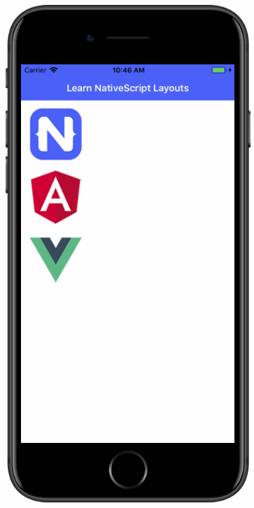
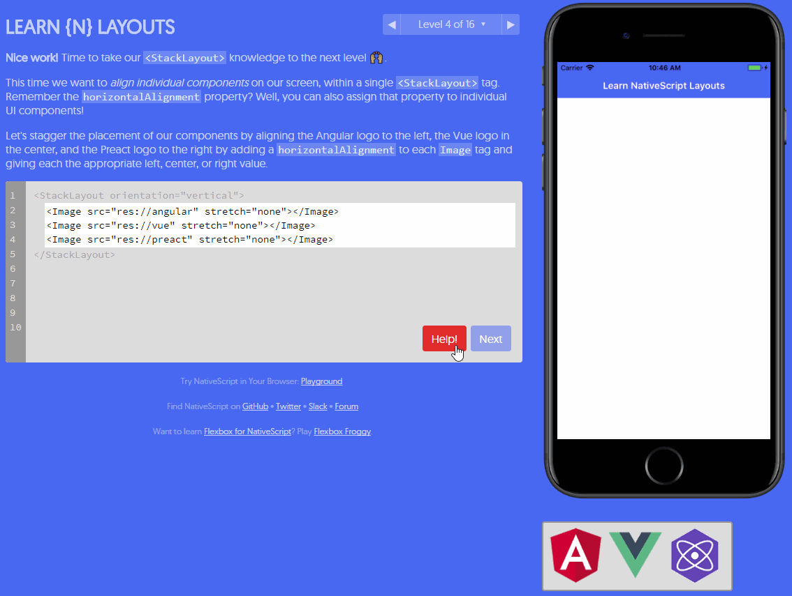
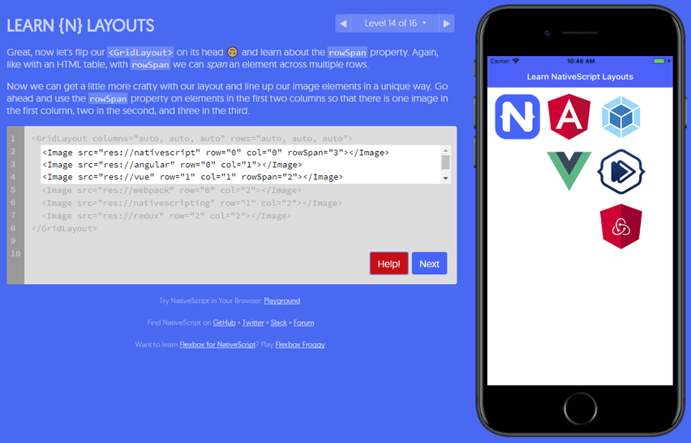

# A New Way to Learn NativeScript Layouts

When you talk about NativeScript with someone who is new to mobile app development, usually the conversation includes a sentence like:

*"You can even use your web skills like JavaScript, CSS, and XML."*

And the person looks at you like, "So...XML is a web skill?" 😕.

Well sure it is, as much as HTML defines a presentation of UI elements, XML (in NativeScript-land) does the same for the presentation of *truly native* UI elements, ala:

	<Page>
	  <StackLayout>
	    <Label text="This is a Label!" />
		<Button text="Tap Me" />
	  </StackLayout>
	</Page>

For the most part, people grok the concept of `<TextField>` == `<input type="text">`, `<Button>` == `<input type="button">`, and such. The confusion sometimes appears when you introduce the concept of [NativeScript layout containers](https://docs.nativescript.org/ui/layout-containers).

> For a great overview of NativeScript layouts, check out Jen Looper's article on [Demystifying NativeScript Layouts](https://developer.telerik.com/featured/demystifying-nativescript-layouts/)

## Layout Containers?

A NativeScript layout container is effectively an HTML `
`, sort of. More than a `
` though, they describe the way in which native UI elements should be presented on the screen. For instance, the `<StackLayout orientation="vertical">` *stacks* elements on top of each other, *vertically*. Easy enough?

But layouts can get complicated, quickly. This is why learning how to construct appropriate and effective layouts is a critical part of learning to code with NativeScript.

## Learn NativeScript Layouts

Enter a new tool I affectionately call, *Learn NativeScript Layouts*. Yeah I know, it took me a while to come up with that name. 😜

**Available at [nslayouts.com](https://www.nslayouts.com/)**, new and experienced NativeScript developers alike can peruse a variety of exercises to learn how to use almost every type of NativeScript layout container.

Based on the same codebase that powers [Flexbox Froggy](http://flexboxfroggy.com/), *Learn NativeScript Layouts* eases you into learning layout containers, starting with the basic `<StackLayout>` and ending with the more complicated (and powerful) `<GridLayout>`.

So what are you waiting for? Try [nslayouts.com](https://www.nslayouts.com/) today and let me know what you think (and be sure to pass it along to any NativeScript noobs out there!). Everything is open source, so you can complain to your heart's content in [the Github repo](https://github.com/rdlauer/nslayouts).