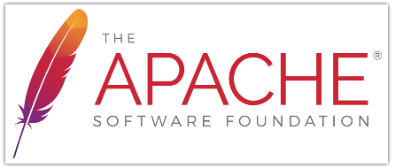
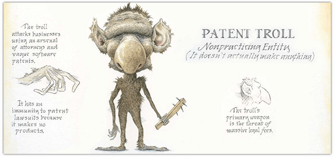
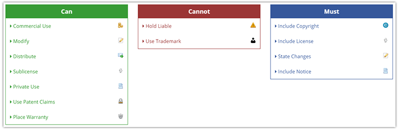

# NativeScript Licensing Explained

Open source software (OSS) licensing is about as sexy as me in a bikini (hint: am a dude with a great farmer's tan). However, the *software projects* that OSS licenses protect are quite literally critical to most of us performing our jobs. These licenses help keep many OSS projects free, customizable, and allow for lawyer-free integration with existing software projects across all platforms and industries.

It wasn't always so easy though. Back in the early 90's, the term "open source" was generally limited to Linux geeks and altruistic developers. Luckily for them, the [GNU General Public License (GPL)](https://en.wikipedia.org/wiki/GNU_General_Public_License) helped provide a basis of liability protection for their work. As the success of these early OSS projects became more widely realized, licensing started to change and evolve as both indie developers and larger organizations crafted strategies to protect themselves and their intellectual property.

**Fast forward to 2014, when work on NativeScript began.** In the 20-ish year ramp-up of open source, many great OSS licensing options emerged and matured, primarily [MIT](https://en.wikipedia.org/wiki/MIT_License), [Apache 2.0 (ALv2)](https://en.wikipedia.org/wiki/Apache_License), and [BSD](https://en.wikipedia.org/wiki/BSD_licenses).

At this time, the NativeScript team had an opportunity to license the software in the most friendly manner possible, while still protecting the IP and the company sponsoring development ([Telerik](http://www.telerik.com/) at that time, [Progress](https://www.progress.com/) now). **Our answer then, as it still is today, is the [Apache 2.0 license](https://www.apache.org/licenses/LICENSE-2.0).**

We aren't here to spread FUD about competing frameworks and their licensing issues (whether legitimate or negligible is up to you and/or your company to decide). We do however want to focus on the ALv2 license and what that means for you.

## First, Why We Chose ALv2

Being a good community citizen in the OSS world means starting with a [permissive license](https://en.wikipedia.org/wiki/Permissive_software_licence) that also allows for a certain amount of legal protection (primary from [patent trolls](https://en.wikipedia.org/wiki/Patent_troll)!).

The ALv2 license provides a nice balance between free/permissive use of the code, while also protecting the NativeScript brand. ALv2 prevents someone from literally cloning NativeScript (including naming/branding) and redistributing it on their own. 

In this way, ALv2 is a lot like the equally popular MIT license. It provides most of the benefits of the MIT license, while still protecting the parent company.

## What are the ALv2 Terms?

> Let me start by stating that I'm no lawyer and you should really consult someone with OSS legal knowledge if you have question!

At a high level, the two key points of ALv2 are:

**Apache 2.0 is a permissive license.** The *permissive* aspect of ALv2 means you may alter/edit/modify/change NativeScript to your heart's content and release said version under any license of your choice. **However, any unmodified parts must retain the original Apache License.**

**Apache 2.0 is business-friendly.** Apache 2 is *not* a [copyleft license](https://en.wikipedia.org/wiki/Copyleft). GNU GPL, which is a copyleft license, requires software that uses any GPL-licensed component to release its full source code and all rights to modify and distribute the code. This is *not* generally a business-friendly way to license your OSS project! If an internal project of yours uses a GPL-licensed component, you are legally required to open source your entire project.

One of my favorite legal websites (oh but there are so many fun ones!), tldrlegal.com, provides a [great summary of ALv2](https://tldrlegal.com/license/apache-license-2.0-(apache-2.0)) (among others):

## What About BSD?

The BSD family of licenses are another set of widely used (and permissible) licenses that allow you to modify and distribute software as you like.

Interestingly, early versions of the Apache license were very similar to the original BSD licenses, but ALv2 differentiates them a bit:

- ALv2 grants explicit patent rights while using/modifying/distributing the licensed software;
- ALv2 is very explicit in the terms/concepts that it uses. There is very little legal ambiguity when compared to BSD;
- ALv2 is convenient in that it can be used by other projects without rewording. You just drop it in and go!

It gets a little more murky when companies add their own clauses. But remember, we aren't going to go there 😅.

## And What About MIT?

The MIT license is probably the most permissive OSS license. It's also one of the most widely used licenses, especially within smaller organizations and by individual developers.

Basically MIT-licensed software let's you do literally anything you want to with that software - just make sure that you add a copy of the original MIT license and copyright notice. The only real restriction is that you can't sue the creator!

The MIT license is very attractive due to its short, easy to comprehend, license agreement (in contrast to ALv2 and BSD, which are a bit more wordy 📓).

> The [ALv2 appendix](https://www.apache.org/licenses/LICENSE-2.0#apply), which explains *how* to apply the license, is longer than the entire MIT license!

## So What Does It All Mean for Me?

**Can I license or sell code created under ALv2?** Yes! ALv2 allows you to release your own software under the Apache license. And yes! You can sell any ALv2-licensed software/code.

In terms of your relationship to Progress and NativeScript, you can use NativeScript for your own purposes or commercially, for whatever you dream up. You even have the ability to modify the framework, redistribute it, and sublicense the framework itself. However, you cannot hold Progress liable for any damages incurred while using the software, nor can you use the NativeScript trademark without explicit permission from Progress. Easy enough!

> Remember to check out [tldrlegal.com](https://tldrlegal.com/license/apache-license-2.0-(apache-2.0)) for a full run-down of the ALv2 license!

## Future Considerations

While NativeScript is available under ALv2 today, that doesn't necessarily mean it won't in the future. But not in a bad way! We may consider other options like a dual license under both MIT and ALv2, if the community requires it. Any other thoughts on NativeScript licensing? Sound off in the comments!