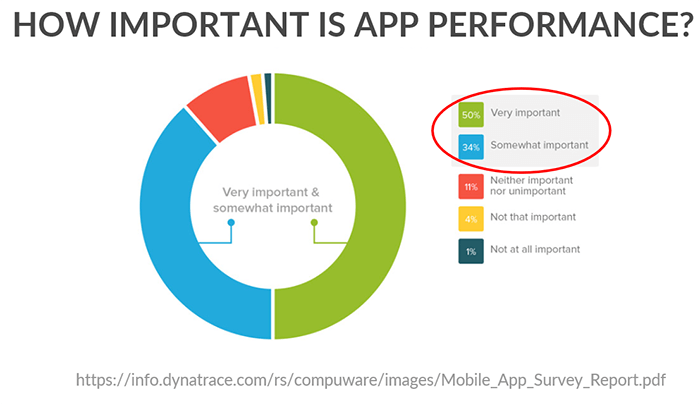
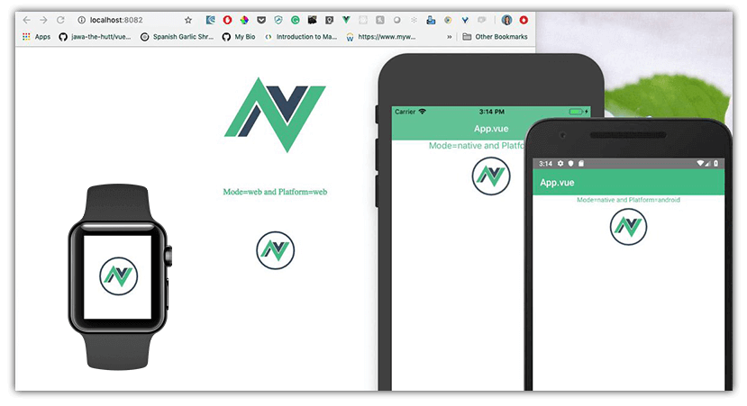
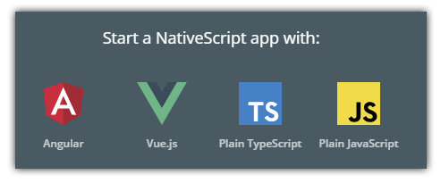
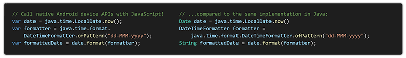
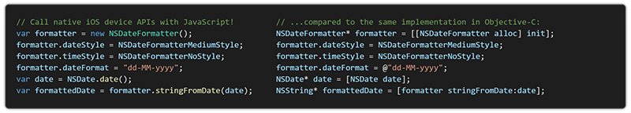
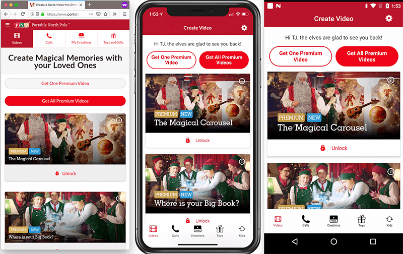

# How to Convince Management to Use NativeScript for Mobile App Development

Have you tried NativeScript at home? Ready to make the push for your company to adopt it as well?

Here are seven reasons that you can share with your management team today:

- [Reason 1: Mobile App Performance](#mobile-app-performance)
- [Reason 2: Open Source and Backed by a Trusted Partner](#open-source)
- [Reason 3: iOS, Android, and Web for the Price of One](#ios-android-web)
- [Reason 4: Web Skill Re-Use](#web-skills)
- [Reason 5: Support for Major JavaScript Frameworks](#javascript-frameworks)
- [Reason 6: A Replacement for Traditional Native Development](#replacement-for-native)
- [Reason 7: Proven in the Real World](#real-world-usage)

## Reason 1: Mobile App Performance

NativeScript apps are **truly native**. This means native UI, native API access, and native rendering on the device.

*Why does this matter?* If an app is laggy in its user interactions (or even *perceived* to be laggy), your end users will abandon the app, and your business.

Even if you're not providing an external-facing consumer solution, you want to keep your employees happy (and productive) with an engaging and performant user experience.

## Reason 2: Open Source and Backed by a Trusted Partner

[Progress](https://www.progress.com/) is the company behind NativeScript. Progress invests millions in the development of NativeScript, yet licenses it with the business-friendly [Apache 2.0 OSS license](https://tldrlegal.com/license/apache-license-2.0-(apache-2.0)). **Why? What's in it for Progress?**

NativeScript isn't just a side project for Progress. NativeScript is a core component of multiple solutions provided by Progress, most notably [Kinvey Studio](https://www.progress.com/kinvey/studio).

Kinvey Studio is enables professional developers to build **cross-platform mobile, web, chat, and wearable apps**, leveraging a secure and performant backend, from a shared JavaScript codebase.

> [Kinvey Chat](https://www.progress.com/kinvey/chat) (a key component of Kinvey Studio) [enabled a hospital to reduce the workload](https://www.progress.com/customers/doctor-shterev-hospital) of their contact center staff by 49%!

This guarantees Progress's investment in NativeScript is not dependent on revenue created directly by NativeScript (although yes, we do offer [paid enterprise-level support](https://www.nativescript.org/enterprise)!), so you can rest assured NativeScript is here to stay.

## Reason 3: iOS, Android, and Web for the Price of One

Management cares about productivity. And today the definition of an "app" has evolved into supporting iOS, Android, and the web. Few companies have the luxury of separate teams for each platform (and when they do, they complain about aligning app features and releases across teams).

This is where NativeScript shines. With our built-in [code sharing strategies for Angular](https://blog.angular.io/apps-that-work-natively-on-the-web-and-mobile-9b26852495e7) (with Vue.js support coming very soon), teams can build for multiple platforms from a single, shared JavaScript codebase.

## Reason 4: Web Skill Re-Use

Developer productivity FTW!

NativeScript was built by web developers, for web developers. Not to say traditional native developers can't use NativeScript (they do!), but when you support technologies like:

- TypeScript
- CSS
- Webpack
- npm libraries

...you're meeting web developers where they are already comfortable.

For IDE support, we also provide a robust [Visual Studio Code extension](https://www.nativescript.org/nativescript-for-visual-studio-code) and there is a popular community-supported [WebStorm plugin](https://plugins.jetbrains.com/plugin/8588-nativescript).

> You can also re-use existing [native CocoaPods](https://docs.nativescript.org/plugins/Use-Native-iOS-Libraries), [Android JARs](https://www.nativescript.org/blog/plugins-and-jars), and tap into our never-ending list of [native plugins](https://market.nativescript.org/) 🔌

## Reason 5: Support for Major JavaScript Frameworks

Since NativeScript is built on JavaScript, it's critical for us to maintain official support for some of the most popular JavaScript frameworks available today.

Case in point: NativeScript provides support for [Angular](https://www.nativescript.org/nativescript-is-how-you-build-native-mobile-apps-with-angular) and [Vue.js](https://www.nativescript.org/vue) out of the box. No third party plugins or installations required.

Not a framework fan? No worries! NativeScript *also* supports framework-free development with plain JavaScript or TypeScript.

## Reason 6: A Replacement for Traditional Native Development

One of the primary reasons NativeScript retains its popularity is its support for [100% of native device APIs](https://www.nativescript.org/native-api-access).

With NativeScript you aren't waiting on a new framework release to access new or obscure device APIs. You can write native expressions directly, with JavaScript or TypeScript. No time is wasted writing boilerplate wrappers around native APIs - allowing you to focus on your business objectives and nothing more.

Don't want to write the code to call device APIs? You don't have to! Check out the [NativeScript Marketplace](https://market.nativescript.org/) and see 1000+ cross-platform plugins that are ready for you to use, for free. Not to mention numerous [pre-built sample apps](https://market.nativescript.org/?tab=samples&framework=all_frameworks&category=all_samples) that can be quickly cloned and re-purposed.

## Reason 7: Proven in the Real World

Did you know that [SAP uses NativeScript](https://blogs.sap.com/2017/05/24/sap-enterprise-app-modeler/) as a core component of their mobility strategy?

How about [Portable North Pole](https://www.nativescript.org/blog/portable-north-pole-your-go-to-nativescript-app-this-holiday-season) and its **millions of app users** over the holiday season? AND a real world example of iOS + Android + Web code sharing!

Take a look at the [numerous NativeScript showcases](https://www.nativescript.org/showcases) that continue to prove this point.

NativeScript has proven itself in the wild, both for consumer-facing apps and for enterprises creating employee-focused productivity apps.