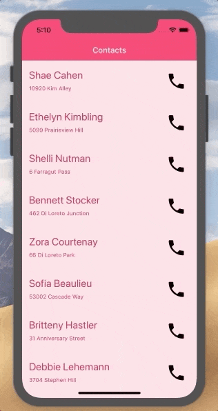
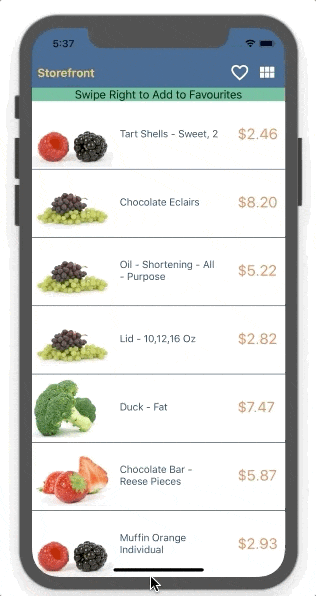
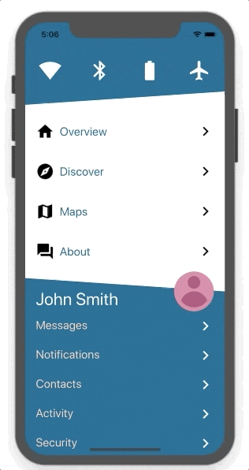

# ListView, RadListView, and Repeater - Why Do I Need Three?

*The Repeater is a widget that is relevant in the NativeScript Core framework. In Angular you have `ngFor` and in Vue there is `v-for`. While they are not exactly the same in implementation, they serve the same purpose.*

NativeScript provides three official ways to create a data bound list. If you come from a web development background and are new to NativeScript, this can be quite confusing. It was one of the two most puzzling things for me back when I first started playing with NativeScript, the other thing being the layout system.

> **TIP:** Check out [nslayouts.com](https://www.nslayouts.com/) for an easy way to learn the NativeScript layout system!

On the web, you would expect to have one basic way of creating a data list coming from the framework and then have a plethora of third party plugins that come bundled with custom features. It’s a clear distinction - you go with the basic implementation and build upon it however you like or you choose one of the "better" ones already built by other developers. In NativeScript however, there are three official widgets. There are a lot of questions that come up here:

*Which one to use? Which one is the best? Is there a best one at all? Why do I need three?*

Right now, nothing in the naming or in the docs helps to provide definitive answers. The only way to figure them out is experience. If you carefully examine the widgets’ APIs and play around with them long enough you will get a feeling when to use which. Even then, there will always be doubt. The idea of this blog post is to provide answers and combine them with practical examples. If you are new to NativeScript, it should guide you in the right direction. If you are already experienced, you might at least confirm your understanding (or your deepest fears).

Before we delve into practical examples, I believe a short introduction of the widgets is in order. All three have their own documentations, so I thought I might provide some alternative ones.

## ListView - The Venerable Gentleman

This is the simple classy widget that lets you create that slick looking list you saw in magazines. With a main motto of "Quality over quantity" it doesn’t care for these new fancy experimental UX features that haven’t really stood the test of time. It has chosen to stick to the classics and does them well. Admittedly, this design decision leads to it feeling a bit outdated and pushes it away from the flash of the best UX. While it’s not the most fashionable, it still has a stable place in every mobile app. Of course being a gentleman at heart, it still maintains high manners so it will play well if you want to extend it (provided you have the skills to do it). This makes it a good base for third party plugins that want to add some fancy stuff to it.

The `ListView` is part of the NativeScript core modules (the `tns-core-modules` package), which means it comes out of the box with the framework. Under the hood it is a thin wrapper of the basic native list controls (`UITableView` on iOS and `ListView` on Android). All its features come from the native implementations. It’s really fast and optimized and therefore it’s the better option if your app targets predominantly low end devices. It has three features:

* UI Virtualization
* Data Virtualization
* Multiple Templates

UI virtualization is the reason this widget provides fast scrolling. Virtualization is the de facto standard for mobile app lists. The downside is the native widgets do not provide a way to turn it off. This creates a necessity that the `ListView` must handle its own scroll and in order for it to work properly, it must be given an explicit available space or size. This means it has some specific requirements in terms of layout, which in the end limit its design options. It is the perfect component for those list-centric pages, that have most of their contents filled with the list.

## RadListView - The Swiss Army Knife Guy

Who doesn’t like a guy who turns up with a solution for every problem you face? Just like the swiss army knife, the `RadListView` provides all your favourite features and more. It even has features that you won’t be able to tell what they are for, but when the need arises, you will be thankful for them. The `RadListView` is really the cool one of the three. It lets you create truly amazing list experiences in no time. It feels like black magic. Sadly, black magic comes at a price. You know the saying, “Jack of All Trades and Master of None” and unfortunately, it kind of rings true for `RadListView` as well, mainly in performance. Still, in this day and age creating an awesome experience often trumps pure efficiency.

`RadListView` is a plugin (the `nativescript-ui-listview` package) which means you have to install it separately in your project. Under the hood it builds upon the native implementations with a ton of custom code. If the `ListView` provides a cross platform API by omitting features that are not present on both platforms, the `RadListView` approach is to fill in the gaps with custom implementations. The result is that it provides a myriad of features, but also becomes much more complex and error prone. Like the `ListView`, it provides UI virtualization that you can’t turn off, so it has the same inherent problem with design flexibility.

It’s really hard to list all the things `RadListView` can do. They range from UX features like swipe actions and pull to refresh, to data operations and templates. I’d advise checking out the [docs](https://docs.nativescript.org/ui/professional-ui-components/ListView/overview) and this [blog post](https://www.nativescript.org/blog/a-deep-dive-into-telerik-ui-for-nativescripts-listview). While the blog post is a bit outdated it’s still very relevant.

It’s worth noting that `RadListView`, along with the rest of the [Professional NativeScript UI plugins](https://www.nativescript.org/ui-for-nativescript), is not open sourced, but there is an NDA that you can sign and get access and contribute to it. Take a look at the instructions [here](https://github.com/telerik/nativescript-ui-feedback#interested-in-contributing-to-the-codebase) to see how you can do this.

## Repeater - The Hard Working Jack

In the end someone has to get the job done. Nobody really likes to talk about the `Repeater` because we are all focused on user experience, but we are just scared to admit it’s actually the backbone of every app. It focuses on the not-so-prestigious work the high rollers above won’t care about - maintainability. If you need something repeated more times that you can healthily copy paste, the `Repeater` is your widget.

The `Repeater` comes with the `tns-core-modules` package and is probably the only widget in there that doesn’t wrap a native SDK widget. It’s actually part of the NativeScript Core framework and its purpose is to provide an equivalent to Angular’s `*ngFor` and Vue’s `v-for` directives. This also means you don’t need it if you are using one of these frameworks. Just use their own implementations. Also, all the things mentioned here also ring true for `*ngFor` and `v-for`.

The main benefit of the `Repeater` is that it’s the only way to create a data list that doesn’t have UI virtualization and therefore, no internal scroll. This means you can easily combine `Repeaters` to achieve much more flexible compositions and designs. A simple rule of thumb is that if you have to show multiple lists on the same page, the `Repeater` is probably the best solution. The downside of the `Repeater` is that it can’t handle large data sets. It’s not virtualized, so it has to measure all of the data items templates and this takes time. There isn’t a concrete number of recommended items you can use as it largely depends on binding and template complexity. Suffice to say, if you encounter performance issues with a `Repeater`, you should probably try using `ListView` or `RadListView` instead.

## Again, Why Three?

To summarize, NativeScript provides three very different widgets that have their own personalities:

* The `Repeater`, similar to `*ngFor` and `v-for` in Angular and Vue, comes from the framework. It’s main advantage is that it isn’t virtualized and can be used safely in a `ScrollView`. The Repeater is perfect for small lists and combining lists.
* The `ListView` comes from the native SDKs and is a simplistic wrapper that provides cross platform API. It’s really performant. It shines in simple classic scenarios. Also, better for low end devices.
* The `RadListView` is a plugin built with lots of custom code. It provides a rich set of features that are hard to implement by yourself. `RadListView` is built for these scenarios where you want to have one list with lots of interactivity.

All three are important and have their place in a mobile app. Let’s observe some practical examples.

## Examples

Sometimes a demonstration is worth a thousand words. Below, you can find some common scenarios along with explanations about which widget is best in which case. Keep in mind, this blog isn’t about how to implement these examples so there are no detailed steps. Instead, I will provide links to samples in the NativeScript Playground where you can deploy and try them on your device. For simplicity, all samples are implemented with the NativeScript Core framework with TypeScript.

## Pick a Thing - Use ListView

This is why mobile devices were made in the first place, remember? Pick a person from your contacts list and make a call. There is no need for fancy distractions. This is perhaps a secondary or tertiary page in your app.

It’s a classic scenario where `ListView` is the perfect choice. `RadListView` would be an overkill here and you don’t have control over how large the data set will be, so the `Repeater` isn’t a good choice. Explore the code and check it out on your phone by visiting this app on the Playground:
[Pick A Thing Playground Sample](https://play.nativescript.org/?template=play-tsc&id=YdOubv)

## Simple Front Page - Use ListView or RadListView

Let’s see how we can do something like a front page news feed.

The core modules `ListView` is still an option here and we can benefit from its performance. It also provides the multiple templates option, so we can provide featured news by having a different, bigger template for them. There is also data virtualization via the “load more items” mechanic, so if the user scrolls a bit down, we can fetch more news. There is no real need for interactivity here. The only thing that is missing is the “pull to refresh” feature and you can get it from a separate plugin like this one - [Pull To Refresh Plugin](https://market.nativescript.org/plugins/nativescript-pulltorefresh) from [Brad Martin](https://market.nativescript.org/author/bradmartin). Check out the sample in the Playground:
[News Feed ListView Playground Sample](https://play.nativescript.org/?template=play-tsc&id=MhOMIY)

Alternatively, you can opt for the `RadListView`. Depending on your template layouts, it might be a bit less performant, but it has the “pull to refresh” built in and if you plan to extend it with more features in the future, it will be much easier. In this case it’s a matter of choice. I’d say - go with `RadListView`, but keep in mind there might be a more performant option. Here is how this looks like on a device. It’s basically the same, but notice that this time we have a pull to refresh feature out of the box.

And here is the sample in the Playground:
[News Feed RadListView Playground Sample](https://play.nativescript.org/?template=play-tsc&id=sNo2fG)

## Interactive List - Use RadListView

Let’s say we want to build an interactive storefront. We want the customer to see as many items as possible on the screen and we want to keep them on this screen as much as possible.

In this example, we have swipe actions, filtering, and different layouts together with different templates. This is a job for the `RadListView`. Implementing this with the other two lists is possible, but it will take you much more time and effort and in the end, the performance might not be that good. There are a lot of features bundled here, so check out the sample:
[Storefront RadListView Playground Sample](https://play.nativescript.org/?template=play-tsc&id=uQmH4X)

## App Menu - Repeater

App menu items are usually defined in the code of the app and you as the developer have full control over them. They are usually not that many - having a menu with a 1000 items wouldn’t be very user friendly. Moreover, menus tend to have more extravagant designs and have them changed more often.

This example displays icons on top with an app menu and a profile menu below. Using `Repeaters`, we can separate the data into three lists in three `Repeaters` and wrap them all in a single `ScrollView`. It’s a straightforward and flexible solution. There are also two different separators here, one of which has the profile information in it. Trust me, it would be very hard to implement this with a `ListView` or a `RadListView`. See the sample here:
[Menu Playground Sample](https://play.nativescript.org/?template=play-tsc&id=rx1XbX)

## Conclusion

Having three options to create a data bound list might seem confusing at first, but they all have their strengths and weaknesses. Using the right option for a given scenario might save you development time and lots of headaches. We can extract some easy rules based on the examples above:

* Many data items - use `ListView` or `RadListView`.
* Fixed reasonable amount of data items - use `Repeater`.
* Interactive features - use `RadListView`.
* Multiple large lists on a single screen - return for UX review.

I hope this blog post helps to set you on the right path. If you have a scenario in mind that isn’t covered here and you are doubting which of the lists to use, drop a comment below. I’ll be happy to discuss it.
