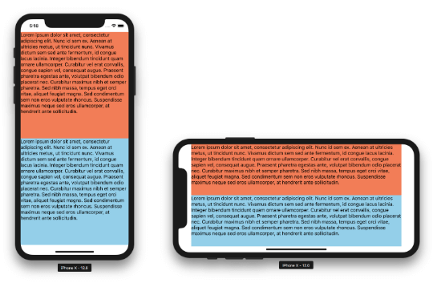
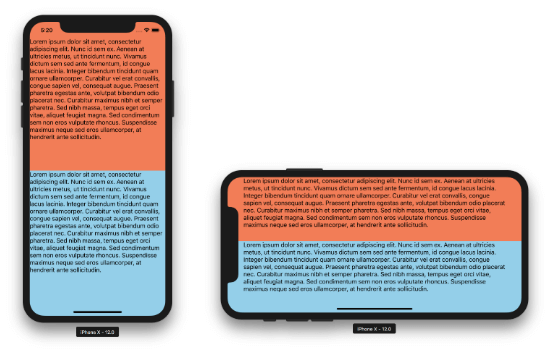
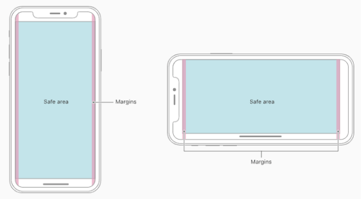
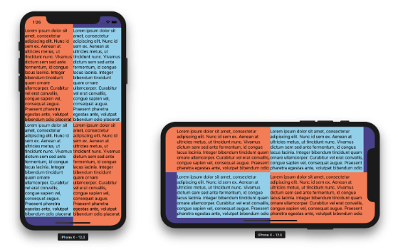
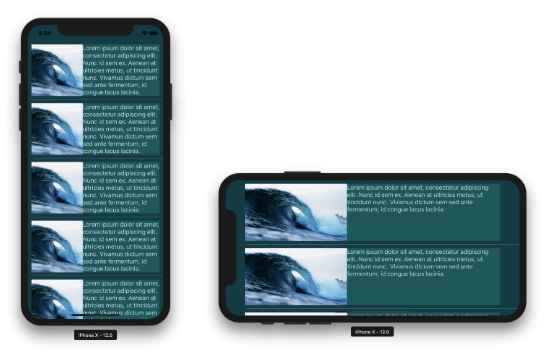
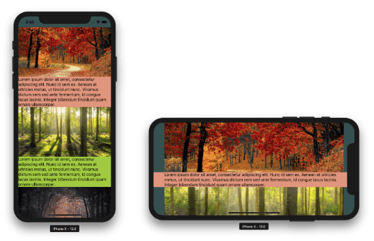
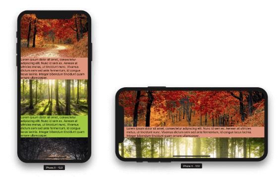
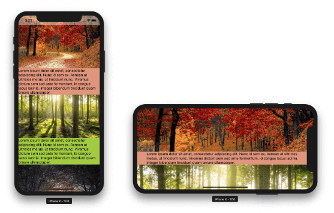

# NativeScript 5.0 iOS Safe Area Support

With the release of the iPhone X and iOS 11 Apple has brought their users a new ultra-immersive user experience where the apps visibly stretch the entire surface of the phone. NativeScript 4.0 provided support for this feature with its core navigation components. The `Page`, `ActionBar` and `TabView` components stretched to the edges of the device. With NativeScript 5.0 we decided to enable this behavior to all components with the addition of a new property that lets you control this behavior.

Let me demonstrate the change with a simple example:

	<GridLayout rows="*, *">
	   <GridLayout row="0" backgroundColor="Coral">
	       <Label verticalAlignment="top" text="Lorem ipsum..." textWrap="true"></Label>
	   </GridLayout>
	   <GridLayout row="1" backgroundColor="SkyBlue">
	       <Label verticalAlignment="top" text="Lorem ipsum..." textWrap="true"></Label>
	   </GridLayout>
	</GridLayout>

*The result on NativeScript 4:*

It doesn’t look quite right, especially in landscape. Until now, the only customization option you had was to set a `backgroundColor` to the `Page` component. Even then, it limited you to having the same color on all sides. To solve this problem and provide more power to the developer, in NativeScript 5.0 all layout components now stretch automatically to the edges of the screen by default.

*Here is the result on NativeScript 5.0:*

Cool, right? Notice the `Label` component actually is inset a bit. This is because it is constrained to what is called the *safe area* by default.

Before we delve in the specifics of the new API, let's provide some background.

## What is the iOS Safe Area?

The iOS safe area is a term that Apple introduced in iOS 11. It is the area of the screen that is free to use and won’t be obstructed by hardware and software parts of the system. The safe area is not a constant. It is affected by the notch, the rounded corners of the screen, the status bar and the home indicator, but also from parts of your application like the action bar and the tab bar.

To accommodate for this, iOS 11 came along with a set of new APIs and a safe area layout guide. The purpose of this layout guide is to help the developer position their app content in such a way, so that the app provides immersive user experience and at the same time displays its content properly. You can check out the information that [Apple provides in their docs](https://developer.apple.com/design/human-interface-guidelines/ios/visual-design/adaptivity-and-layout/).

NativeScript 4.0 handled this in a sort of compatibility mode, where only the important overlay components `ActionBar` and `TabView` respected the new guidelines. The apps looked generally fine, but we quickly became aware that some pretty basic needs and design patterns were too hard to implement. For example, controlling the color of the status bar when a modal view was shown was particularly hard to do.

## The Technical Challenge

It would be beneficial if we first take a bit of time and explain why this new behavior in iOS doesn’t come natural to NativeScript. One of the main takeaways from the Apple docs is that the UIKit components handle this safe area perfectly, and that as long as you use them properly, you would get the best user experience. Most of the components that NativeScript provides have underlying native UIKit views, so we could let them handle the safe area on their own. But there are also a number of components that are unique to NativeScript and don’t exist in the iOS world. These are the layout components (`GridLayout`, `Stacklayout`, etc.) that lie at the base of the layout system.

The iOS Auto Layout system is purely based on coordinates and constraints (in the form of equations), which represent the relative boundaries of views to each other. In such a system, adding a global layout guide that represents a safe area comes pretty natural.

NativeScript’s [more traditional layout system](https://docs.nativescript.org/ui/layouts/layouts#user-interface-layouts) isn’t so lucky. Basically, each layout component needs to handle the safe area layout guide by itself and decide how to measure and layout both itself and its children. This called for a soft rework of the layout system in how components measure and layout. But fret not, as long as you use them correctly, you will get a better user experience 😀.

## The New API

> **Note:** The following explanation requires at least a basic understanding of how the NativeScript layout system works. If you are not familiar with it, take a quick a look at the [Layout Process article](https://docs.nativescript.org/ui/layouts/layouts#user-interface-layouts) in the docs.

At the base of the new layout behavior is the following idea:

1. **All components measure themselves and their children in the safe area** - the idea is that when you define rows or columns, or flex items, you expect the usable safe area (not the fullscreen) to be divided properly.
1. **All components are laid out in fullscreen, but are inset to the safe area boundaries** - this is because we want the origin of the coordinate system for your layout to be the fullscreen area. It is now part of your layout.
1. **If the `iosOverflowSafeArea` property of a component is set to `true` and the component is touching any of the sides of the safe area, it will be overflowed to full screen** - this is the part that makes the layout “immersive”. It does its work in the safe area, but its background is expanded to fullscreen.

The `iosOverflowSafeArea` property is a new boolean property that comes with NativeScript 5.0. It is available on all components that have a visible representation. The key to mastering the safe area is that the property has different default value for different sets of components.

The `iosOverflowSafeArea` property defaults to `true` for all components that can have children. We can call them containers. These are the six layouts, `ScrollView`, `ListView` and `Repeater`. The list is completed with the `WebView` component, which cannot have other NativeScript components as children, but contains web components instead. All these will overflow to the ends of the screen by default to accommodate the user experience designed for iPhone X and the likes.

The `iosOverflowSafeArea` property defaults to `false` for all other components - `Label`, `Button`, `Image`, etc. They are considered app content and by default should be laid out in the safe area, so that the user has an unobstructed access to them. Set the property value to `true` for these controls at your own developer peril :)

Let’s do a set of quick examples that showcase what you can do with this new API. Just as a note, the examples below are intentionally created without margins and padding, so that you can see the default component constraints without styling.

## Nesting Layouts Combined with `iosOverflowSafeArea`

	<GridLayout rows="*, *" columns="*, *" backgroundColor="DarkSlateBlue">
	   <GridLayout row="0" col="0" backgroundColor="Coral">
	       <Label verticalAlignment="top" text="Lorem ipsum..." textWrap="true"></Label>
	   </GridLayout>
	   <GridLayout row="1" col="0" backgroundColor="SkyBlue" iosOverflowSafeArea="false">
	       <Label verticalAlignment="top" text="Lorem ipsum..." textWrap="true"></Label>
	   </GridLayout>
	   <GridLayout row="0" col="1" backgroundColor="SkyBlue" iosOverflowSafeArea="false">
	       <Label verticalAlignment="top" text="Lorem ipsum..." textWrap="true"></Label>
	   </GridLayout>
	   <GridLayout row="1" col="1" backgroundColor="Coral">
	       <Label verticalAlignment="top" text="Lorem ipsum..." textWrap="true"></Label>
	   </GridLayout>
	</GridLayout>

Nested layouts overflow the safe area too. Setting `iosOverflowSafeArea` of a child layout to `false` lets you see the parent underneath. This enables some quirky visual effects.

## Immersive `ListView`

	<ListView items="{{ source }}" backgroundColor="#003B46">
	   <ListView.itemTemplate>
	       <GridLayout columns="2*, 3*" backgroundColor="#07575B" margin="10">
	           <Image col="0" stretch="aspectFill" src="~/images/ocean.jpg"></Image>
	           <Label col="1" verticalAlignment="top" color="#C4DFE6" text="Lorem ipsum dolor sit amet, consectetur adipiscing elit. Nunc id sem ex. Aenean at ultricies metus, ut tincidunt nunc. Vivamus dictum sem sed ante fermentum, id congue lacus lacinia. " textWrap="true"></Label>
	       </GridLayout>
	   </ListView.itemTemplate>
	</ListView>

The `ListView` is also a container and now beautifully overflows the safe area. However, there is an important limitation here - the item template cannot overflow. This is because NativeScript currently exposes only the native content view as template and it is hard-constrained to the safe area. The native control underneath exposes another template called background view that stretches to fullscreen.

## `ScrollView` with Overflowing Images

	<ScrollView backgroundColor="DarkSlateGray">
	   <StackLayout>
	       <Image stretch="aspectFill" height="200" src="~/images/forest1.jpg"></Image>
	       <StackLayout backgroundColor="DarkSalmon">
	           <Label verticalAlignment="top" text="Lorem ipsum..." textWrap="true"></Label>
	       </StackLayout>
	       <Image stretch="aspectFill" height="200" src="~/images/forest2.jpg"></Image>
	       <StackLayout backgroundColor="YellowGreen">
	           <Label verticalAlignment="top" text="Lorem ipsum..." textWrap="true"></Label>
	       </StackLayout>
	       <Image stretch="aspectFill" height="200" src="~/images/forest3.jpg"></Image>
	       <StackLayout backgroundColor="DimGray">
	           <Label verticalAlignment="top" text="Lorem ipsum..." textWrap="true"></Label>
	       </StackLayout>
	   </StackLayout>
	</ScrollView>

The `ScrollView` itself along with the layouts in it overflow the safe area. You can see this in the background colors. The `Image` component is considered content and by default is constrained to the safe area. Somehow, in this particular scenario it doesn’t look right. Let’s see what happens if we force it to overflow by setting the `iosOverflowSafeArea` property to `true`.

	<ScrollView backgroundColor="DarkSlateGray">
	   <StackLayout>
	       <Image stretch="aspectFill" iosOverflowSafeArea="true" height="200" src="~/images/forest1.jpg"></Image>
	       <StackLayout backgroundColor="DarkSalmon">
	           <Label verticalAlignment="top" text="Lorem ipsum..." textWrap="true"></Label>
	       </StackLayout>
	       <Image stretch="aspectFill" iosOverflowSafeArea="true" height="200" src="~/images/forest2.jpg"></Image>
	       <StackLayout backgroundColor="YellowGreen">
	           <Label verticalAlignment="top" text="Lorem ipsum..." textWrap="true"></Label>
	       </StackLayout>
	       <Image stretch="aspectFill" iosOverflowSafeArea="true" height="200" src="~/images/forest3.jpg"></Image>
	       <StackLayout backgroundColor="DimGray">
	           <Label verticalAlignment="top" text="Lorem ipsum..." textWrap="true"></Label>
	       </StackLayout>
	   </StackLayout>
	</ScrollView>

This is much better. But now there is another problem. The app is so immersive that we can’t quite see the status bar. To fix this we will have to put some contrasting layer underneath it that doesn’t move while scrolling. At the same time we don’t want this layer in landscape since there is no status bar there. In the past, we would go for a plugin that controls the color of the status bar and it would be easy. But since iOS 11 the status bar is actually part of your layout. See how the contents of the app go through the status bar on scroll? This is because they are laid out there. So how do we handle this case?

I will share a little secret with you. If a layout borders the safe area, even if it has 0 height, it will overflow. Let’s wrap the `ScrollView` in a `GridLayout` and have a second layout on the same row as the `ScrollView`, but above it.

	<GridLayout rows="*">
	   <ScrollView row="0" backgroundColor="DarkSlateGray">
	      ...
	   </ScrollView>
	
	   <GridLayout row="0" backgroundColor="White" opacity="0.4" height="0" verticalAlignment="top"></GridLayout>
	</GridLayout>

Now we can see the status bar in portrait no matter where we scroll to. You can use this trick to position layouts outside the safe area on all sides.

## A Word About Transformations and Animations

This new iOS Safe Area feature lies at the heart of the NativeScript layout process, so (hopefully for the better) it can affect your UI animations. If you are animating or simply applying a transform to a component that overflows the safe area, there is one important thing to consider:

**Transformations are applied after the safe area overflow!**

This means that if the element touches the edges of the safe area it will effectively be expanded and this new bigger element will be animated. This should work fine in most cases.

For scenarios where you need the animated component to have strict size, simply set its `iosOverflowSafeArea` property to false and it won’t be expanded.

## What About the NativeScript Pro UI Plugins?

If you are not aware, [NativeScript Pro UI](https://docs.nativescript.org/ui/rich-components) is a set of free rich UI plugins provided by the NativeScript team. All of the plugins’ latest versions should work with NativeScript 5.0 with some important notes.

The `RadSideDrawer` plugin got a new major version 5.0 that implements the iOS Safe Area support from NativeScript 5.0. Due to the major internal changes, it isn’t backwards compatible with NativeScript 4.x. This was extremely important, because usually the plugin wraps your whole application UI in its main content container. If it didn’t handle the safe area properly, your whole app wouldn’t handle it. You can see this immediately by creating a new app from the side drawer template.

The `RadListView` plugin currently works with NativeScript 5.0 as before by being laid out in the safe area. We are currently working on a new version that will let it expand and scroll to the edges of the screen, so stay tuned for that.

