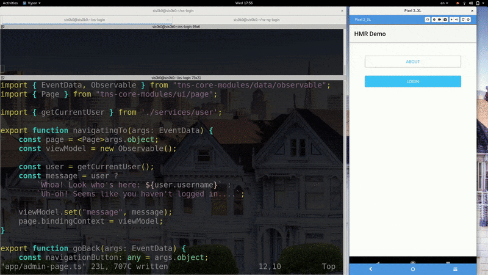
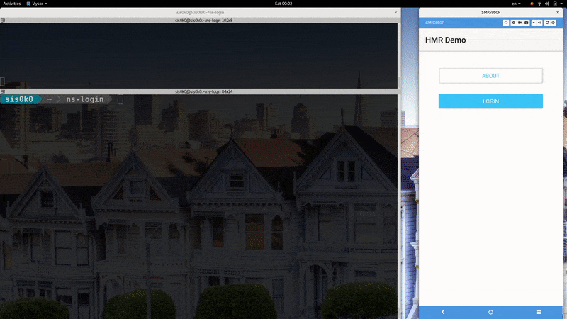

# A Deep Dive into Hot Module Replacement with Webpack (Part One - The Basics)

The following article is part one of a "deep dive" series on Hot Module Replacement with [webpack](https://webpack.js.org/).

- **Part 1: The Basics**
- Part 2: Handling hot updates with the `module.hot` API (coming soon)

## Part 1: The Basics

*Let's imagine for a moment it's still the middle of December and I have finished this blog post on time...*

Christmas is quickly approaching and it's about time you decorate that tree in the living room. You fetch all boxes with the stuffed decoration from last year. First, you get the lights out. Make sure that you're not stressed at all while untangling them. You take a step back, maybe put on some Christmas music, make yourself a cup of tea. After a few hours, you are ready to put them on the tree. Cool, the hardest part is over. Now, you can hang some garlands and cool ornaments. Finally, you place the Star™ on the top of the tree and lit the lights. It's beautiful.

But...was that the right Star™? You decide that you actually want the shiny new rainbow Star™ instead of the conservative old yellow Star™. Do you need to remove everything and start the whole process all over just to replace that piece of decoration? Obviously not! You only need to take down the old Star™ and put the new one.

If you're still reading, you're probably wondering what was all that about. Well, your Christmas tree is just like a JavaScript application. The ornaments, garlands, and lights are the modules of the application. The mechanism that allows you to change pieces of decoration without having to disassemble the tree, is called [Hot Module Replacement](https://webpack.js.org/concepts/hot-module-replacement/). And **HMR** is what we'll be playing with today.

## Why should I care?

Because development with HMR is faster.

I work on the NativeScript framework and sometimes even build apps with it. Let's take a retrospective look at my life as a NativeScript developer *before* Hot Module Replacement:

In the video above, I'm developing an application that has a login screen and an admin screen, accessible only by authorized users. After signing in, I make a change to the admin screen. The reload process starts. We can break it down into four stages:

1. The changed module is transferred to the device.
1. The entire application is torn down and restarted from the login screen.
1. I sign in **again**.
1. I'm redirected to the admin page where I see my change.

Now, let's see how the same process looks with *Hot Module Replacement* in the game:

The reload steps now are:

1. The changed module is transferred to the device.
1. The admin page is reloaded.
1. I see my change.

It is significantly faster because only the current screen is reloaded and the user session is persisted.

## How does it work?

NativeScript uses webpack to process the JavaScript part of the application. Webpack finds all *modules* that your app is using and *bundles* them into a few output files.

> Webpack has three closely related terms - **module**, **chunk**, and **bundle**. A **module** is a piece of JS code that encapsulates data and provides functionality. **Modules** can depend on one another and thus, form a **dependency graph**. In the webpack bundling process, a few modules form a **chunk**. A **bundle** is an output file, produced by the bundling process. In most cases, each **chunk** emits exactly one **bundle**.

Webpack also supports a feature called *hot module replacement* (HMR). HMR exchanges, adds, or removes modules while an application is running, without a full reload.

However, HMR doesn't magically reload your app when you change the code. The application itself must know how to react to the incoming changes. Let's take a closer look at the HMR process.

1. When you make a change, the webpack compiler is responsible for generating a 'diff' (*hot update*) between the old version of the bundle and the new one.
1. The webpack development server handles the transportation logistics for HMR. In other words, it makes sure the *hot update* can be loaded when requested by the application. It's not mandatory to use `webpack-dev-server` for transferring the files. In the NativeScript ecosystem, the [NativeScript CLI](https://github.com/NativeScript/nativescript-cli) plays that role.
1. A special code, injected into your application bundle, fetches the *hot update*. Then, it starts looking for handlers for each *module*, that should be replaced.
1. The *module* is replaced if an appropriate handler is found. If not, the process fails and the *module* is **not** replaced. Obviously, it's good to have a fallback in that case. In the browser, the page is reloaded, and in NativeScript - the application is restarted.

## Summary

*To wrap up, today we learned that:*

- Hot Module Replacement is a feature provided by webpack;
- Hot Module Replacement makes our lives as developers easier by shortening the reload time and preserving the application state;
- You should be prepared to fail when untangling Christmas lights;
- Hot Module Replacement is not magic, but your application should know how to work with it.

In the next blog post in the HMR series, we'll turn our gaze to the last point. We will learn how to handle incoming changes inside our applications.

