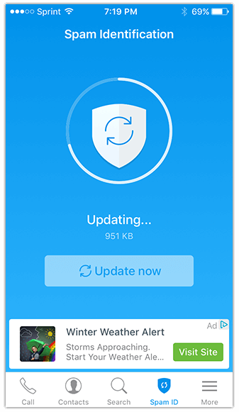
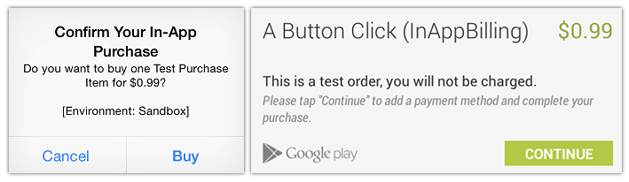
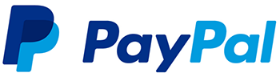
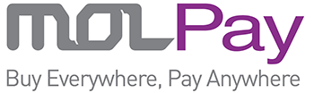

# 5 Plugins to Monetize Your NativeScript App

It's all fun and games to develop a mobile app, but at the end of the day, you gotsta get paid. While many of us are developing apps on a fee basis for clients or as part of our company's strategic mobile initiative, there remains a large segment of developers who are staking out on their own and pursuing a dream of Flappy Bird 2.0.

Aside from charging per download from the app stores, let's take a look at some ways to easily monetize your NativeScript apps with a variety of [NativeScript plugins](http://plugins.nativescript.org/):

## Ads

**I know, I know! Nobody likes ads!** They [threaten to help ruin the mobile web](http://developer.telerik.com/featured/the-webs-cruft-problem/) and are all-too intrusive in some mobile apps. However, I'm here to suggest that there are ways to display embedded advertising without disrupting the user experience.

Take, for example, the [Truecaller](https://itunes.apple.com/us/app/truecaller-spam-identification/id448142450?mt=8) ad experience on iOS:

*The ad is highly visible, yet doesn't disrupt any part of your experience using the app. If you're interested in the ad, you'll tap on it.*

The same can be done on NativeScript of course, by using the [NativeScript AdMob plugin](http://plugins.nativescript.org/plugin/nativescript-admob). 

For example, to install the AdMob plugin, you simply issue the `tns plugin add nativescript-admob` command in your NativeScript project. Creating a banner ad then is as easy as this chunk of code:

	var admob = require("nativescript-admob");
	
	admob.createBanner({
		// if this 'view' property is not set, the banner is overlayed on the current top most view
		// view: ..,
		testing: true, // set to false to get real banners
		size: size, // anything in admob.AD_SIZE, like admob.AD_SIZE.SMART_BANNER
		iosBannerId: "ca-app-pub-XXXXXX/YYYYYY", // add your own
		androidBannerId: "ca-app-pub-AAAAAAAA/BBBBBBB", // add your own
		// Android automatically adds the connected device as test device with testing:true, iOS does not
		iosTestDeviceIds: ["yourTestDeviceUDIDs", "canBeAddedHere"],
		margins: {
			// if both are set, top wins
			//top: 10
			bottom: 50
		}
	}).then(
		function() {
		  console.log("admob createBanner done");
		},
		function(error) {
		  console.log("admob createBanner error: " + error);
		}
	)

> You can find additional code samples in [this clonable GitHub repository](https://github.com/EddyVerbruggen/nativescript-admob-demo).

We've [written extensively](https://www.nativescript.org/blog/monetize-your-nativescript-apps-with-admob-(part-1---ios)) about using AdMob before and there are also guides from Nic Raboy on using AdMob with a [vanilla JavaScript NativeScript app](https://www.thepolyglotdeveloper.com/2016/03/monetize-with-google-admob-in-a-nativescript-mobile-app/) and with an [Angular NativeScript app](https://www.thepolyglotdeveloper.com/2016/11/google-admob-nativescript-angular-2/).

## In-App Purchases

As we see consumers shying away from one-time initial app download fees, we see an increase in the usage of the native in-app purchase platforms. What better way to leverage both Apple's and Google's native platforms than with one [cross-platform in-app purchase plugin](http://plugins.nativescript.org/plugin/nativescript-purchase)!?

Install the `nativescript-purchase` plugin with `tns plugin add nativescript-purchase` and in this code snippet you can see how easy it is to list the "products" you offer as part of your in-app purchase offerings:

	import { Product } from "nativescript-purchase/product";
	
	purchase.getProducts().then((products: Array<Product>) => {
	    products.forEach((product: Product) => {
	        console.log(product.productIdentifier);
	        console.log(product.localizedTitle);
	        console.log(product.priceFormatted);
	    });
	});

...and buy a product with:

	if (purchase.canMakePayments()) {
	    // NOTE: 'product' must be the same instance as the one returned from getProducts()
	    purchase.buyProduct(product);
	}

> Be sure to consult the [plugin documentation](http://plugins.nativescript.org/plugin/nativescript-purchase) for examples on how to complete an in-app purchase.

## Collect Payments

If you have a product or feature to sell, another option is to directly integrate with online payment providers like PayPal, MolPay, or Stripe:

The king of online payments since the late 90's, [PayPal](https://www.paypal.com/) has made it easy to request and receive payments. By using the [PayPal plugin for NativeScript](http://plugins.nativescript.org/plugin/nativescript-paypal), you can add the PayPal experience to your NativeScript app.

Creating a PayPal purchase couldn't be much easier:

	function buyProduct(args) {
	    // configure
	    var payment = PayPal.newPayment()
	        .setDescription('My product')
	        .setAmount(59.79);
	
	    // start checkout / payment
	    payment.start(function(cbResult) {
	        switch (cbResult.code) {
	            case 0:
	                // SUCCESS
	                // pay key is stored in 'cbResult.key'
	                break;
	            case 1:
	                // operation was CANCELLED
	                break;
	            case -1:
	                // checkout FAILED
	                break;
	            case -2:
	                // "unhandled exception"
	                break;
	        }
	    });
	}

> Note that as of this writing, the PayPal plugin is Android-only, but the iOS implementation [is being actively developed](https://github.com/mkloubert/nativescript-paypal/issues/1).

One the (relatively) new payment gateways out there, [Stripe](https://stripe.com/) is a favorite of many due to its unparalleled user experience. And recently a [brand new NativeScript plugin was released for Stripe](https://www.npmjs.com/package/nativescript-stripe)!

This plugin allows you to integrate a credit card component into your NativeScript views with the `<stripe:CreditCardView>` element.

Alternatively, you can use [Stripe's JavaScript API](https://stripe.com/docs/stripe.js?) directly as it has no browser DOM dependencies.

NativeScript developers in Southeast Asia will probably be the most familiar with [MOLPay](http://www.molpay.com/v3/), which is a fast growing payment gateway that makes it easy to accept payments from multiple countries and multiple currencies.

The [MOLPay plugin for NativeScript](http://plugins.nativescript.org/plugin/molpay-mobile-xdk-nativescript) provides an easy way to interface with MOLPay along with very detailed documentation.

## Summary

The [NativeScript plugin ecosystem](http://plugins.nativescript.org/) is growing every day. With plugins like this, you can go from collecting virtual underpants, to ?, to profit in no time!

*Special thanks to the [South Park Gnomes](https://www.youtube.com/watch?v=tO5sxLapAts) for their inspiration to us all :)*

