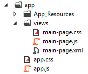

## NativeScript for the .NET Developer

> be me
> be a .net developer with no life outside visual studio
> boss says, "write a mobile app already"
> iamscrewed.jpg
> much research
> look at xamarin
> look at cordova
> mrw i found nativescript

Having lived most of my development life inside of Visual Studio, hacking away at mediocre Web Forms apps, it was a shock to my system when mobile-first became the mantra of web development. Add to that mobile *app* development, and add to that *native* mobile app development, and you had one lonely and confused .NET developer.

And while Xamarin may appear to be the logical choice for many .NET developers, I'm afraid they may not be looking past the almighty C#. No knocks on Xamarin here (heck, we offer [Telerik UI for Xamarin](http://www.telerik.com/xamarin-ui)!), but let's look at how a free and open source framework can maybe, just maybe, be a better option.

### Enter NativeScript

If you've never heard of [NativeScript](https://www.nativescript.org/) before, it is an open source JavaScript framework that lets you create truly native mobile apps. Not only native apps, but *cross-platform* native apps for iOS and Android (with Windows coming in 2017). And did I mention native? The UI layer in NativeScript is comprised of 100% native UI elements (read that: jank-free, fully performant UI).

**"JavaScript? Meh, I'm out!"** Hold on! I know there are a lot of .NET developers out there who still fear JavaScript. And that's fine, I get it. But before you go, have you taken a close look at [TypeScript](https://www.typescriptlang.org/) yet?

TypeScript is a "typed superset of JavaScript" from our friends at Microsoft. In layman's terms, TypeScript is a layer on top of JavaScript that provides strong typing, classes, modules, and much more that you're used to getting with C#. So you write TypeScript and the TypeScript compiler compiles it into plain JavaScript.

So why have I gone off on a TypeScript tangent so early in the article? Because [NativeScript fully supports TypeScript](https://www.nativescript.org/using-typescript-with-nativescript-when-developing-mobile-apps), which makes our migration from C# that much smoother.

### NativeScript 101

If you've gotten this far, you have at least partially accepted TypeScript as your bridge from .NET/C# to native mobile development with NativeScript. For this, I give you your first [Slack taco](https://www.heytaco.chat/): 

Now let's look at how you create a single NativeScript page, or view, of your app building on some of your existing .NET skills. The three basic ingredients are:

- **XML** for your UI markup
- **CSS** for styling your UI
- and **JavaScript/TypeScript** for your app logic

#### XML

While many of us have SOAP-induced nightmares of nasty XML syntax, NativeScript markup is actually quite easy to understand.

It's also very XAML-like, in that much of the NativeScript UI markup is very similar to XAML syntax (and actually leverages some of XAML's better features).

For example, here is some XAML markup:

	<StackPanel>
		<Label Margin="20" Content="Hello!"></Label>
	    <Button Margin="10" HorizontalAlignment="Right">OK</Button>
	</StackPanel>

...and the exact equivalent in NativeScript is:

	<StackLayout>
		<Label text="Hello!" style="margin:20"></Label>
		<Button text="OK" style="margin:10; horizontal-align:right"></Button>
	</StackLayout>

Not only are there [numerous native UI elements](https://docs.nativescript.org/ui/components) to leverage, but you can also arrange your UI elements in countless ways by utilizing a variety of layout options.

You've seen the `<StackLayout>` tag above (which stacks elements vertically or horizontally), but there are also `<AbsoluteLayout>`, `<DockLayout>`, `<GridLayout>` and `<WrapLayout>` options.

<video width="300" height="532" controls>
  <source src="layouts.mp4" type="video/mp4">
</video>

Luckily for us, Jen Looper has provided us with thorough coverage of [NativeScript layouts](http://developer.telerik.com/featured/demystifying-nativescript-layouts/). Definitely bookmark that for future reference.

#### CSS

The beauty of NativeScript is not limited to its usage of TypeScript and native UI. Rather, I would propose a significant amount of developer delight comes from the ability to style your app with CSS. And I'm no designer, so being able to leverage an existing skill like CSS takes a significant amount of pain away.

Let's be clear: this is the same CSS you've used for years with ASP.NET. There is no man behind the curtain here!

Make sense so far? Have a taco, you've earned it: 

There are a few things about using CSS in NativeScript that you should know about:

**1) You can apply styles application-wide, to a specific page, and/or on a specific element.** For instance, in your `app.ts` or `app.js` file (which is where your app initializes), you can load a CSS file for your entire app:

	import application = require("application");
	application.cssFile = "app.css";
	application.start({ moduleName: "main" });

Likewise, if you have a view in your app named "main", you can (optionally) add a `main.css` file, which will automatically apply those styles to only that view!

Finally, even though it's been frowned upon for years, you can cheat and apply styles directly to UI elements, like so:

	<Button text="I (kind of) love CSS!" style="background-color: red" />

**2) You can use the same CSS selectors you know and love.** Case in point, you can select elements by:

- Type: `button { background-color: blue }`
- Class: `.button-large { font-size: 44 }`
- ID: `#cancel-button { border-color: green }`
- Hierarchy: `StackLayout > Button { background-color: orange; }`
- Attribute: `button[someAttribute]{ background-color: yellow; }`

In addition, you can combine the above to create [complex selector scenarios](https://docs.nativescript.org/ui/styling#supported-selectors).

**3) You can use many of the same CSS properties you've been using for years.** For example, properties like `margin`, `border`, `padding`, `color`, `width`, and `height` are all supported, with far more than that available. You can see all of them in [this list of supported properties](https://docs.nativescript.org/ui/styling#supported-css-properties).

#### JavaScript/TypeScript

Just like in ASP.NET, every markup file has an associated code behind file. Instead of C#, it's JavaScript (or TypeScript). And there is nothing special about the JavaScript you are writing, even though you are accessing native platform APIs. This is because you're leveraging NativeScript modules, which are effectively cross-platform abstractions on top of native APIs.

> While it's outside the scope of this article, modules are key to the native cross-platform aspect of NativeScript (the curious may want to [read more](https://docs.nativescript.org/core-concepts/modules)).

So by adding a JavaScript code behind file, the file structure in your project will look something like this:

> Remember that the `main-page.css` file is optional and, in this case, would apply only to the `main-page.xml` view.

#### Pull it all together!

At this point you have a rough idea of how to construct a NativeScript app: **XML** for your native UI markup, **CSS** to style your UI, and **JavaScript/TypeScript** for your app logic. Take a breath, eat a taco: 

Now before you take off to [go through our in-depth tutorials](http://docs.nativescript.org/) (don't click that link yet, don't do it!), you may want to read more about NativeScript patterns and our new Angular 2 support:

### NativeScript Patterns

Now you may be wondering about providing some structure to your code. As a modern .NET developer, you're probably familiar with the MV* line of patterns like MVC or MVVM. Luckily for you, NativeScript has a [fantastic MVVM implementation](http://nativescript.github.io/nativescript-style-guide/#chapter1.0) that allows you to easily bind data to native UI elements.

For example, here are two native UI elements as you would express them with NativeScript:

	<TextField id="first" text="{{ first }}" hint="First Name" />
	<TextField id="last" text="{{ last }}" hint="Last Name" />

...and the supporting code behind invokes the constructor to define a new `awesomeDude` object, which is the page's view model, and sets `awesomeDude` as the binding context:

	var Observable = require("data/observable").Observable;
	
	var awesomeDude = new Observable({
	    first: "Rob",
	    last: "Lauer"
	});
	
	exports.loaded = function(args) {
	    page = args.object;
	    page.bindingContext = awesomeDude;
	};

### Angular 2 Support

Finally, if you have jumped on the [Angular](https://angular.io/) bandwagon, you'll be pleased to know that NativeScript provides [first class support for Angular 2](https://www.nativescript.org/nativescript-is-how-you-build-native-mobile-apps-with-angular).

**Why Angular 2 you ask?** Angular provides structure to your app that you won't get with plain JavaScript or even with TypeScript. From routing to dependency injection to data binding - everything is provided as part of the Angular 2 framework.

Almost more importantly, with Angular 2 you can use the same codebase to not only deliver native iOS and Android apps, but also to deliver a web app. **That's right, one codebase for iOS, Android, and Web.** Amazing.

If you've made it this far, you deserve one more taco: 

### Where To Go Next?

I hope by now I've whet your appetite and you're at least curious to know more about this NativeScript thing. If so, I have some suggestions for further learning:

1) Check out our [NativeScript tutorial](http://docs.nativescript.org/tutorial/chapter-0) and go through the step-by-step instructions to create your first native mobile app.

2) If you're an Angular person (or just want to see what Angular 2 is all about), you can do the same tutorial, but use [Angular and TypeScript](http://docs.nativescript.org/angular/tutorial/ng-chapter-0) instead of vanilla JavaScript.

3) If you want to experience an instantly-available NativeScript development environment, you can get a free 30-day trial of [Telerik Platform](http://www.telerik.com/platform). Not only is your NativeScript development ready to go, but you can also use our [Visual Studio extension](http://www.telerik.com/platform/appbuilder/visual-studio-extension) and create iOS apps from Windows. Enjoy!

