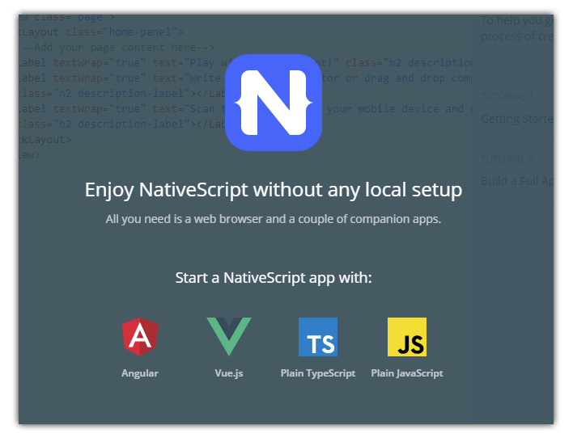
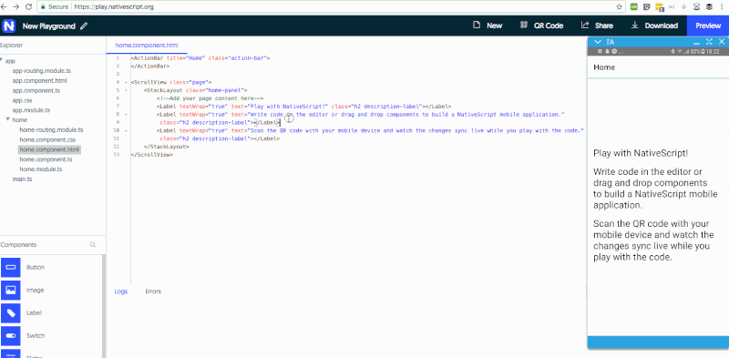
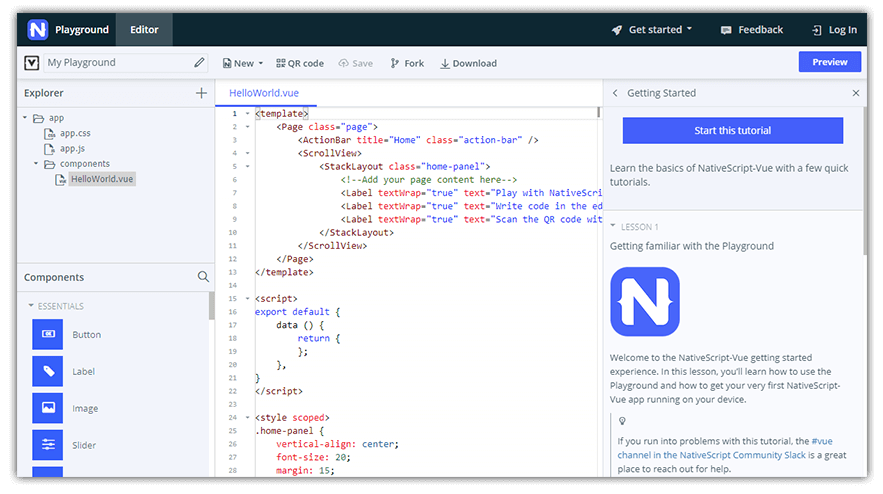

# Learn NativeScript-Vue the Easy Way

While NativeScript launched with the ability to create truly native mobile apps with JavaScript, our public [support for Angular](https://www.nativescript.org/nativescript-is-how-you-build-native-mobile-apps-with-angular) wasn't far behind. Times change, the market evolves, which is why we recently [announced official support](https://www.nativescript.org/blog/nativescript-5.2-comes-with-official-support-for-vue) for the [Vue.js](https://vuejs.org/) framework! 🥳

[NativeScript-Vue](https://www.nativescript.org/vue) has become THE way to create native mobile app experiences for iOS and Android with Vue.js. Not to mention, in coming weeks we will have a comprehensive web + mobile code sharing strategy to share.

> This may sound like a transition of focus towards Vue.js, however, we are **100% committed** to maintaining and improving our Angular integration!

In the meantime, we are happy to announce the unveiling of the easiest way for you to get up and running with NativeScript-Vue.

## NativeScript Playground

Over the past few months, our community has made it clear that their choice for getting started with NativeScript is with the web-based environment provided by the [NativeScript Playground](https://play.nativescript.org/). Requiring no local tools or SDKs to be installed, the NativeScript Playground is an instantly-available environment that runs in any web browser.

Combined with a couple of (free) companion apps (grab them on the [iOS App Store](https://itunes.apple.com/us/app/nativescript-playground/id1263543946?mt=8&ls=1) and [Google Play](https://play.google.com/store/apps/details?id=org.nativescript.play)), you can start creating native mobile apps without the fuss of Xcode or Android Studio.

## Vue.js Tutorial

Part of the NativeScript Playground experience also includes a set of tutorials. We currently offer comprehensive tutorials for plain JavaScript, Angular, and now Vue.js!

The [NativeScript-Vue tutorial](https://play.nativescript.org/?template=play-vue&tutorial=getting-started-vue) uses concepts like single file components (SFCs), drag-and-drop UI building, events, advanced app themes, and more.

> Curious about other Vue-related topics? Start with [Working with Vuex in Your NativeScript-Vue Application](https://www.nativescript.org/blog/working-with-vuex-in-your-nativescript-vue-application)!

**What are you waiting for!?** If you're new to NativeScript, curious about Vue.js, or want to learn more about how the two combine - start the NativeScript-Vue tutorial right now (or check out the [NativeScript-Vue courses](https://nativescripting.com/course/nativescript-vue-introduction) on NativeScripting.com!):

[Start the NativeScript-Vue Tutorial](https://play.nativescript.org/?template=play-vue&tutorial=getting-started-vue)