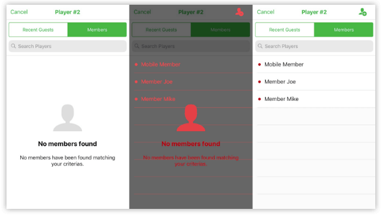
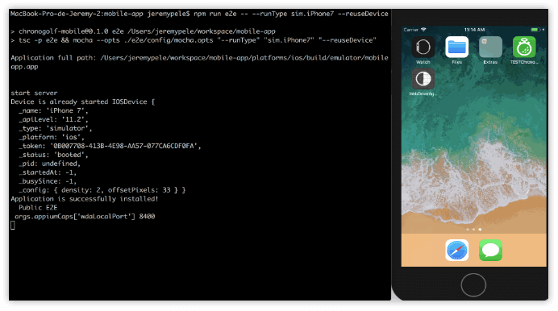

# Start Testing Your NativeScript Apps Properly

*This is a guest post by Jérémy Pelé*

At [Chronogolf](https://www.chronogolf.ca/), we've been using Nativescript for 18 months now and I've always been frustrated with the lack of proper end-to-end testing (e2e) solutions.

As our mobile-app users community grew quickly, testing was becoming a critical point that needed to be addressed properly. Every bug pushed to production needs to be resolved within 2-3 days due to app store restrictions. You better be sure of the code you’re pushing on production! 

We first tried `functional-tests-core`, and it somewhat worked but was heavy on configuration and the specs were painful to write. Then we moved to `nativescript-dev-appium`, it was a good start but not quite ready at the time (we’re talking around the start of summer 2017).

A good thing with the NativeScript ecosystem: everything is quickly evolving! I'll present you a complete workflow for covering your apps with e2e specs.

## Test Your App

I gave the `nativescript-dev-appium` plugin another shot and I was really pleased to see that it is now much more complete than before:

- Typescript syntax is now supported.
- Support of `async` and `await`
- Access to webdriver_io
- Selectors are simplified
- Images comparison

First things first => Install `nativescript-dev-appium` and his dependencies.

**1) Installation**

	npm install -g appium
	npm install -D nativescript-dev-appium

You’ll find a generated `e2e` folder. This folder will contain your very first spec file and the configuration folder that is required by appium.

**2) Configuration**

You’ll need to define the devices you’ll be using to run your suite.

Note that when using images comparison on your tests, each device will need to get its own set of assets (as screen size, padding etc may vary according to the screen resolution). Depending on how you store them it could be a pain to maintain - and overweight your repo).

We’ve chosen to use one simulator (iOS) and one emulator (Android) for simplicity reasons.

Open `e2e/config/appium.capabilities.json` and define your settings.

	{
	  "sim.iPhone7": {
	    "platformName": "iOS",
	    "platformVersion": "11.2",
	    "deviceName": "iPhone 7",
	    "fullReset": true, // Device will be destroyed and fresh install will be made after each suite
	    "app": ""
	  }
	}

To run the suite with the capability configuration above, you’ll use the following command:

	npm run e2e -- --runType sim.iPhone7 --reuseDevice

Now let’s start to write some tests...

### Driver

Each suite will be written over the same pattern: a new `AppiumDriver` singleton on which all your tests will rely on, need to be initialized.

	describe('My Suite', () => {
	  let driver: AppiumDriver
	
	  before(async () => {
	    // Wait for the driver instance to be created
	    driver = await createDriver()
	  })
	
	  after(async () => {
	   // Destroy the driver instance
	   await driver.quit()
	  })
	
	  it('validates something', async () => {
	    // write your test in here
	  })
	})

### Selectors

Given a simple button, I’ll present you how to select it with different selectors types

	<Button automationText="loginFormSubmit"
	    class="submit btn-primary btn-rounded-sm" 
	    text="Submit" (tap)="onSubmit()">
	</Button>

**Xpath** (findElementByXPath, findElementsByXPath)

	let submitBtn
	if (driver.isAndroid) {
	  submitBtn = await driver.findElementByXPath('//android.widget.Button') 
	} else {
	  submitBtn = await driver.findElementByXPath('//XCUIElementTypeButton')  // ios 11
	  submitBtn = await driver.findElementByXPath('//UIAButton') // ios
	}

*Pros:*

- Used by default by a large community

*Cons:*

- Paths differs from iOS to Android. iOS 11 updates his component prefix so you’ll have to deal with that too. 
- Hard to write and to read. Need to potentially update your spec if you update your template or components (as path may change as well)

	// You can also use driver locators that abstract the mapping relative to platforms
	let submitBtn = await driver.findElementByXPath(`//${driver.locators.button}`)

**Text** (findElementByText, findElementsByText) - Contains/Exact Match

	const submitBtn = await driver.findElementByText('Submit', SearchOptions.exact)
	await submitBtn.click()

*Pros:*

- No need to update your app, you can start writing specs directly

*Cons:*

- What if your value change? You usually don’t want your selectors to rely on text.

**Component type** (findElementByClassName, findElementsByClassName) - Target NativeScript components: label, button, gridlayout...

- Cons: Too generic, not scalable as your layout will change over time

	// Using directly the class name type
	const submitBtn = await driver.findElementByClassName('button')
	await submitBtn.click()
	
	// Alternative using driver locators helpers
	const submitBtn = await driver.findElementByClassName(driver.locators.button)
	await submitBtn.click()

> Note: if the driver finds more than one Button on the page, the first one will be selected. You can selects all button on the page as an array of UIElement and then access the one you need based on his index.

	const submitBtns = await driver.findElementsByClassName('button')
	await submitBtns[0].click()

**AccessbilityId** (findElementByAccessibilityId, findElementsByAccessibilityId)

- The best option over time as it’s not dependent on your xml structure or the values/translations.
- Place `automationText="loginPasswordInput"` on a “interactable node“ (as automationText is an accessibility feature, custom component won’t work. You’ll need to pass the option as an input, and will be placed on the root of your custom component template)
- *Pros:*
	- Ability to select an input, label, whole component
	- Easy to maintain and robust against code evolution

	const submitBtn = await driver.findElementByAccessibilityId('loginFormSubmit')
	await submitBtn.click()

### Spec Types

There are two main types of specs:

*Based on images comparisons:*

**Screenshot**

	it('compare screen', async () => {
	  assert.isTrue(await driver.compareScreen('my-whole-screen'))
	})

**Elements**

	it('compare button element', async () => {
	  const submitBtn = await driver.findElementByAccessibilityId('loginFormSubmit')
	  assert.isTrue(await driver.compareElement(submitBtn, 'my-submit-btn'))
	})

*Based on elements:*

**Text value**

	it('compare button element', async () => {
	  const submitBtn = await driver.findElementByAccessibilityId('loginFormSubmit')
	  const submitBtnText = submitBtn.text()
	  assert.isEqual(submitBtnText, 'Submit')
	})

**Component displayed/hidden?**

	it('compare button element', async () => {
	  const submitBtn = await driver.findElementByAccessibilityId('loginFormSubmit') 
	  assert.isTrue(await submitBtn.isDisplayed())
	})

[Full sample spec available here.](https://gist.github.com/jeremypele/1dcb3ad317082351a28d5ac0b293cea8)

Sweet! You can start testing your app locally :)

	npm run e2e -- --runType sim.iPhone7 --reuseDevice

## Automate Your Process

### CircleCI

How can we automate this process? Instead of building and triggering the suite manually, we’ll use a continuous integration tool (here [CircleCI](https://circleci.com/)).

CircleCI offers macOS virtual machines, meaning we’ll be able to use theses to build and test our app in the cloud. You’ll need to connect your git repo to a CircleCi account and the rest is only configuration.

You’ll need to place a `circle.yml` file at the root of your repo. This file will contain the different executions that will need to execute on the VM. In the example below, we wanna configure a new machine with all the dependencies, build the app and run the suite on it.

	machine:
	  xcode:
	    version: 9.0.1
	dependencies:
	  cache_directories:
	    - ~/.npm
	    - ~/Library/Caches/Homebrew
	    - ~/Library/Caches/CocoaPods
	  pre:
	    # Fetch cocoapods specs from S3 instead of github
	    - curl -sS https://cocoapods-specs.circleci.com/fetch-cocoapods-repo-from-s3.sh | bash
	    - npm i -g nativescript --ignore-scripts
	  override:
	    - npm set progress=false && npm install
	  post:
	    # Pre-start emulator you'll use for the specs
	    - xcrun instruments -w "iPhone 7 (11.0.1) [":
	        background: true
	compile:
	  override:
	    # Build Test App
	    - tns prepare ios || echo "ios prepare"
	    - tns build ios
	test:
	  override:
	    # E2E
	    - npm run e2e -- --runType sim.iPhone7
	  post:
	    # Export results as artifacts downloadable
	    - mv e2e/reports/**/* $CIRCLE_ARTIFACTS/ 
	general:
	  branches:
	    only: # list of branches to listen to
	      - master
	      - develop

As you’re always testing from a brand new environment, you are sure to build a clean app from scratch (no old transpiled .js forgotten, no ignored files remaining etc).

If you want to test your app with a local server, you can configure it and start it on the very same VM. Just create your own sequence and add them to the above example.

### Cloud Alternatives

NativeScript recommends using [Travis CI](https://docs.nativescript.org/plugins/ensure-plugins-quality#automate-all-checks-with-travis-ci) for testing your plugins. It could be a good alternative to Circle CI.

I’ve not used it personally but you’ll find a good looking at what [nativescript-facebook](https://github.com/NativeScript/nativescript-facebook/blob/master/.travis.yml) does.

You can also choose a a continuous integration system that doesn’t provide simulator/emulators by coupling it with [Sauce Labs](https://saucelabs.com/) services.

Sauce Labs allows you to upload your apps on their platform and run your test suite using their cloud simulators.

`nativescript-dev-appium` support Sauce Labs using the option `--sauceLab` when running your suite spec.

**1) Configuration**

	{
	  "local.sim.iPhone7": {
	    "platformName": "iOS",
	    "platformVersion": "11.2",
	    "deviceName": "iPhone 7",
	    "fullReset": true,
	    "app": ""
	  },
	  "sauce.sim.iPhone7": {
	    "platformName": "iOS",
	    "platformVersion": "11.2",
	    "deviceName": "iPhone 7 Simulator",
	    "appium-version": "1.7.2",
	    "app": ""
	  }
	}

The capability is prefixed with either `local` or `sauce` to keep clear context or what we’re using. It’s clearly optional, you get to choose the pattern you wanna use here.

> Note the addition of `"appium-version": "1.7.2"`.

As Sauce Labs may use device names that differs to your local machine simulators/emulators, please refer to [Sauce Labs platform configurator](https://wiki.saucelabs.com/display/DOCS/Platform+Configurator#/).

https://wiki.saucelabs.com/display/DOCS/Platform+Configurator#/

Build your app and zip it as an archive:

	tns build ios && zip -r mobileapp.zip platforms/ios/build/emulator/myapp.app

Export it to Sauce Labs storage

	curl -v -u $SAUCE_USER:$SAUCE_KEY -X POST "http://saucelabs.com/rest/v1/storage/$SAUCE_USER/myapp.zip?overwrite=true" -H "Content-Type: application/octet-stream" --data-binary @myapp.zip

Run the suite upon the Sauce Labs archive you’ve just uploaded:

	npm run e2e -- --runType sauce.sim.iPhone7 --sauceLab --appPath myapp.zip

***What if I need to test my app on Sauce Labs with an API server?***

Sauce Labs offers a tool named `Sauce Connect` that creates a tunnel between the machine running the tool and the Sauce Lab VM testing your app. 

Meaning that the Sauce Labs vm will be able to hit `http://localhost:3000` (or any address you use to run your server).

