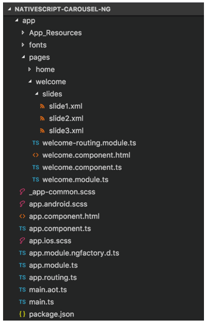
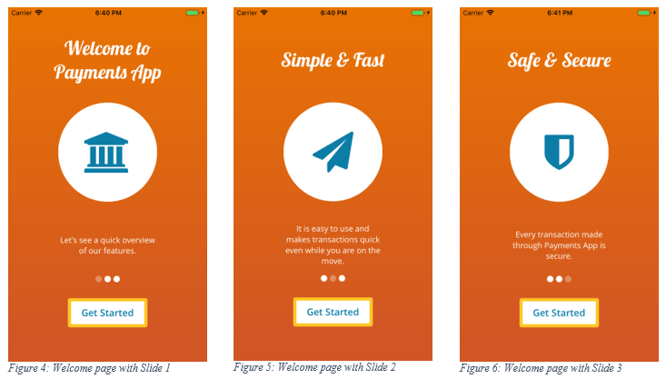

# How to Build a Simple Carousel in NativeScript

Building a great app is not just about building the app’s core features - a great app must provide great user experience. The first step in enhancing users’ experience is by seamlessly socializing your users with the app. This is where Carousels come in handy. When I started building a Carousel for our [Kinvey Microapps](https://console.eloha.io/) container, I realized that this makes for an excellent NativeScript playground sample - and this happens to be the first sample that I contributed to the [marketplace](https://market.nativescript.org/?tab=samples&framework=all_frameworks&category=all_samples) 🙌.

In this article, I’ll walk you through how to build a simple Carousel using NativeScript with the [Angular](https://www.nativescript.org/nativescript-is-how-you-build-native-mobile-apps-with-angular) framework.

The animated GIF here (figure 1) provides a sneak peek at what we are building:

*Figure 1: Carousel / Slideshow*

In this implementation, we have three different (sub)views or slides. We animate two of them with swipe gestures. The gestures and animations are covered in a different section. First, let’s view the structure of our app and build the views.

## App Structure

Figure 2 partially shows the structure of the app:

*Figure 2: App Folder Structure*

Since we are using the Angular framework, the following routes are defined in our sample application.

	import { NgModule } from "@angular/core";
	import { Routes } from "@angular/router";
	
	import { NativeScriptRouterModule } from "nativescript-angular/router";
	
	const routes: Routes = [
	    { path: "", redirectTo: "/welcome", pathMatch: "full" },
	    { path: "welcome", loadChildren: "./pages/welcome/welcome.module#WelcomeModule" },
	    { path: "home", loadChildren: "./pages/home/home.module#HomeModule" }
	];
	
	@NgModule({
	    imports: [NativeScriptRouterModule.forRoot(routes)],
	    exports: [NativeScriptRouterModule]
	})
	export class AppRoutingModule { }

As you can see, `/welcome` is our default route. In the rest of this article, we will focus on building functionality for this route.

## Build the User Interface

For this example, we have three simple views: Slide 1, Slide 2, and Slide 3.

**Slide 1 (app/pages/welcome/slides/slide1.xml)**

	<GridLayout row="0" rows="*, 2*, *">
	    <GridLayout width="57%" row="0" horizontalAlignment="center" verticalAlignment="center">
	        <Label class="lobster-regular carousel-item-head" text="Welcome to Payments App" textWrap="true"></Label>
	    </GridLayout>
	    <GridLayout class="carousel-item-circle" row="1" horizontalAlignment="center" verticalAlignment="center">
	        <Label class="fa carousel-item-icon" text="&#xf19c;" textWrap="true"></Label>
	    </GridLayout>
	    <GridLayout width="49%" row="2" horizontalAlignment="center" verticalAlignment="center">
	        <Label class="opensans-regular carousel-item-desc" text="Let's see a quick overview of our features." textWrap="true"></Label>
	    </GridLayout>
	</GridLayout>

**Slide 2 (app/pages/welcome/slides/slide2.xml)**

	<GridLayout row="0" rows="*, 2*, *">
	    <GridLayout width="56%" row="0" horizontalAlignment="center" verticalAlignment="center">
	        <Label class="lobster-regular carousel-item-head" text="Simple & Fast" textWrap="true"></Label>
	    </GridLayout>
	    <GridLayout class="carousel-item-circle" row="1" horizontalAlignment="center" verticalAlignment="center">
	        <Label class="fa carousel-item-icon" text="&#xf1d8;" textWrap="true"></Label>
	    </GridLayout>
	    <GridLayout width="49%" row="2" horizontalAlignment="center" verticalAlignment="center">
	        <Label class="opensans-regular carousel-item-desc" text="It is easy to use and makes transactions quick even while you are on the move." textWrap="true"></Label>
	    </GridLayout>
	</GridLayout>

**Slide 3 (app/pages/welcome/slides/slide3.xml)**

	<GridLayout row="0" rows="*, 2*, *">
	    <GridLayout width="56%" row="0" horizontalAlignment="center" verticalAlignment="center">
	        <Label class="lobster-regular carousel-item-head" text="Safe & Secure" textWrap="true"></Label>
	    </GridLayout>
	    <GridLayout class="carousel-item-circle" row="1" horizontalAlignment="center" verticalAlignment="center">
	        <Label class="fa carousel-item-icon" text="&#xf132;" textWrap="true"></Label>
	    </GridLayout>
	    <GridLayout width="49%" row="2" horizontalAlignment="center" verticalAlignment="center">
	        <Label class="opensans-regular carousel-item-desc" text="Every transaction made through Payments App is secure." textWrap="true"></Label>
	    </GridLayout>
	</GridLayout>

As you may have noticed, the snippets for the views are structurally similar - a heading at the top, a Font Awesome icon rendered in a circle at the middle, and a summary at the bottom. You can define simpler or more complex views based on your needs.

Each of the above view will be embedded in a parent view. The following is our welcome page and is rendered on the screen when we navigate to the `/welcome` route:

**Welcome Page (app/pages/welcome/welcome.component.html)**

	<GridLayout (swipe)="onSwipe($event)">
	    <GridLayout rows="3*, *">
	        <GridLayout row="0" rows="*" class="m-t-20">
	            <ContentView #slideContent row="0" id="slide-content">
	                <GridLayout row="0" rows="*">
	                    <Label class="opensans-semi-bold carousel-loading" text="Loading..." textWrap="true"></Label>
	                </GridLayout>
	            </ContentView>
	        </GridLayout>
	        <GridLayout row="2" rows="auto, auto">
	            <GridLayout row="0" rows="*" columns="*, auto, *" id="carousel-slider" class="m-b-20">
	                <StackLayout [ngClass]="getSliderItemClass(0)" verticalAlignment="top" col="0" horizontalAlignment="right"></StackLayout>
	                <StackLayout [ngClass]="getSliderItemClass(1)" style="margin: 0 5" verticalAlignment="top" col="1" horizontalAlignment="center"></StackLayout>
	                <StackLayout [ngClass]="getSliderItemClass(2)" verticalAlignment="top" col="2" horizontalAlignment="left"></StackLayout>
	            </GridLayout>
	            <GridLayout row="1" rows="auto" verticalAlignment="bottom" class="m-t-10">
	                <Button text="Get Started" class="opensans-semi-bold skip-intro" (tap)="skipIntro()"></Button>
	            </GridLayout>
	        </GridLayout>
	    </GridLayout>
	</GridLayout>

In Line 4, we declare the reference variable on `ContentView` as `#slideContent`. We further use this reference in our Angular component to dynamically attach one of the views, as follows:

**app/pages/welcome/welcome.component.ts**

	@ViewChild('slideContent') slideElement: ElementRef;
 
We have defined our slides in separate XML files, so we need to initialize these views. NativeScript provides a great way to dynamically load views using UI Builder. Before proceeding to adding gestures and animation, let’s see how we loading and initialize the views as part of our component initialization.

**Welcome Page (app/pages/welcome/welcome.component.ts)**

	ngOnInit() {
		// Other statements
		
		this.slideView = this.slideElement.nativeElement;
		this.loadSlides(this.slideFiles, this.slidesPath).then((slides: any) => {
		  var row = new ItemSpec(1, GridUnitType.STAR);
		  let gridLayout = new GridLayout();
		  slides.forEach((element, i) => {
		    GridLayout.setColumn(element, 0);
		    if (i > 0)
		      element.opacity = 0
		    gridLayout.addChild(element);
		  });
		  gridLayout.addRow(row);
		
		  this.slideView.content = (this.slidesView = gridLayout);
		});
	}
		
	private loadSlides(slideFiles, slidesPath) {
		return new Promise(function (resolve, reject) {
		  const slides = []
		  const currentAppFolder = fs.knownFolders.currentApp();
		  const path = fs.path.normalize(currentAppFolder.path + "/" + slidesPath);
		  slideFiles.forEach((dataFile, i) => {
		    const slidePath = path + "/" + dataFile;
		    slides.push(builder.load(slidePath))
		  });
		
		  resolve(slides);
		});
	}

After loading the views, we attach the first view to the parent, which we previously declared as a reference variable.

Figure 4 shows the initial screen that loads when the app is launched on an emulator or device. When the other views are attached, figures 4 and 5 are add to the app.

## It’s Time to Animate

In this section, we will add the swipe gesture and then animate the views to make so that our implementation matches the animation in the GIF (Figure 1).

For a carousel in a mobile app, the most appropriate gestures are swipe and pan. Let’s add the swipe gesture to the UI. 

Recall that we have the swipe gesture programmed in the implementation of the Welcome page. Here’s reproducing it again for ease of reference:

**app/pages/welcome/welcome.component.html**

	<GridLayout (swipe)="onSwipe($event)">

The following subroutine is invoked when the user swipes on the app:

**Welcome Page (app/pages/welcome/welcome.component.ts)**

	onSwipe(args: SwipeGestureEventData) {
	    let prevSlideNum = this.currentSlideNum;
	    let count = this.slideCount;
	    if (args.direction == 2) {
	      this.currentSlideNum = (this.currentSlideNum + 1) % count;
	    } else if (args.direction == 1) {
	      this.currentSlideNum = (this.currentSlideNum - 1 + count) % count;
	    } else {
	      // We are interested in left and right directions
	      return;
	    }
	
	    const currSlide = this.slidesView.getChildAt(prevSlideNum);
	    const nextSlide = this.slidesView.getChildAt(this.currentSlideNum);
	
	    this.animate(currSlide, nextSlide, args.direction);
	}

In our example, we only use the left and the right swipes. For each swipe, we identify the two slides to be animated based on whether the user swipes left or right. One of the two slides is the current slide, which is identified by the following statement:

	let prevSlideNum = this.currentSlideNum;

The next slide will be identified based on the direction of the swipe, and is the slide that will be attached to the view at the end of animation. If the direction is right to left, then we can calculate the slide number as shown in the following statement:

	this.currentSlideNum = (this.currentSlideNum + 1) % count;

If the direction is from left to right, then we can calculate the slide number as shown here:

	this.currentSlideNum = (this.currentSlideNum - 1 + count) % count;

Note that the logic for identifying the next slide is based on the logic behind implementing a Circular Queue.

Now that we have identified the two slides to be animated, we can identify the two views to be animated.

> Note: The views are already attached to the Welcome page. We only hide them by setting their opacity to 0 when the views are loaded (see the initialization part again).

**Welcome Page (app/pages/welcome/welcome.component.ts)**

    const currSlide = this.slidesView.getChildAt(prevSlideNum);
    const nextSlide = this.slidesView.getChildAt(this.currentSlideNum);

Finally, we need to animate the two slides. NativeScript provides a way to animate more than one view simultaneously. The following subroutine has the logic to animate the two views:

**Welcome Page (app/pages/welcome/welcome.component.ts)**

	animate(currSlide, nextSlide, direction) {
	    nextSlide.translateX = (direction == 2 ? this.screenWidth : -this.screenWidth);
	    nextSlide.opacity = 1;
	    var definitions = new Array<AnimationDefinition>();
	    
	    definitions.push({
	      target: currSlide,
	      translate: { x: (direction == 2 ? -this.screenWidth : this.screenWidth), y: 0 },
	      duration: 500
	    });
	
	    definitions.push({
	      target: nextSlide,
	      translate: { x: 0, y: 0 },
	      duration: 500
	    });
	
	    var animationSet = new Animation(definitions);
	
	    animationSet.play().then(() => {
	      // console.log("Animation finished");
	    })
	      .catch((e) => {
	        console.log(e.message);
	      });
	}

As we know that, if we apply translate animation to a view, it will move to a new position. To achieve the sliding effect, we animate the two views simultaneously which we have identified above. First, we translate the view currently on the screen to a new position outside of the screen. We then translate the view that positioned outside of the screen to position it on to the visible screen.

Here’s the code-behind file which contains the logic to load the slides, to add gestures to the slides, and to animate them.

**app/pages/welcome/welcome.component.ts**

	import { Component, OnInit, ViewChild, ElementRef } from "@angular/core";
	import { RouterExtensions } from "nativescript-angular/router";
	
	import { Page, ContentView } from "ui/page";
	import { SwipeGestureEventData } from "ui/gestures/gestures";
	import { GridLayout, GridUnitType, ItemSpec } from "ui/layouts/grid-layout";
	import { AnimationDefinition, Animation } from 'ui/animation';
	import { screen } from "platform";
	
	import * as fs from "file-system";
	import * as builder from "ui/builder";
	
	@Component({
	  selector: "welcome",
	  moduleId: module.id,
	  templateUrl: "./welcome.component.html"
	})
	export class WelcomeComponent implements OnInit {
	  private slidesPath = 'pages/welcome/slides';
	  private slideFiles = ['slide1.xml', 'slide2.xml', 'slide3.xml'];
	
	  private currentSlideNum: number = 0;
	  private slideCount = 3;
	
	  private screenWidth;
	
	  private slidesView: GridLayout;
	
	  @ViewChild('slideContent') slideElement: ElementRef;
	  private slideView: ContentView;
	
	  constructor(
	    private page: Page,
	    private nav: RouterExtensions,
	  ) {
	    this.screenWidth = screen.mainScreen.widthDIPs;
	  }
	
	  ngOnInit() {
	    this.page.actionBarHidden = true;
	    this.page.cssClasses.add("welcome-page-background");
	    this.page.backgroundSpanUnderStatusBar = true;
	
	    this.slideView = this.slideElement.nativeElement;
	
	    this.loadSlides(this.slideFiles, this.slidesPath).then((slides: any) => {
	      var row = new ItemSpec(1, GridUnitType.STAR);
	      let gridLayout = new GridLayout();
	      slides.forEach((element, i) => {
	        GridLayout.setColumn(element, 0);
	        if (i > 0)
	          element.opacity = 0
	        gridLayout.addChild(element);
	      });
	      gridLayout.addRow(row);
	
	      this.slideView.content = (this.slidesView = gridLayout);
	    });
	  }
	
	  private loadSlides(slideFiles, slidesPath) {
	    return new Promise(function (resolve, reject) {
	      const slides = []
	      const currentAppFolder = fs.knownFolders.currentApp();
	      const path = fs.path.normalize(currentAppFolder.path + "/" + slidesPath);
	      slideFiles.forEach((dataFile, i) => {
	        const slidePath = path + "/" + dataFile;
	        slides.push(builder.load(slidePath))
	      });
	
	      resolve(slides);
	    });
	  }
	
	  onSwipe(args: SwipeGestureEventData) {
	    let prevSlideNum = this.currentSlideNum;
	    let count = this.slideCount;
	    if (args.direction == 2) {
	      this.currentSlideNum = (this.currentSlideNum + 1) % count;
	    } else if (args.direction == 1) {
	      this.currentSlideNum = (this.currentSlideNum - 1 + count) % count;
	    } else {
	      // We are interested in left and right directions
	      return;
	    }
	
	    const currSlide = this.slidesView.getChildAt(prevSlideNum);
	    const nextSlide = this.slidesView.getChildAt(this.currentSlideNum);
	
	    this.animate(currSlide, nextSlide, args.direction);
	  }
	
	  animate(currSlide, nextSlide, direction) {
	    nextSlide.translateX = (direction == 2 ? this.screenWidth : -this.screenWidth);
	    nextSlide.opacity = 1;
	    var definitions = new Array<AnimationDefinition>();
	    
	    definitions.push({
	      target: currSlide,
	      translate: { x: (direction == 2 ? -this.screenWidth : this.screenWidth), y: 0 },
	      duration: 500
	    });
	
	    definitions.push({
	      target: nextSlide,
	      translate: { x: 0, y: 0 },
	      duration: 500
	    });
	
	    var animationSet = new Animation(definitions);
	
	    animationSet.play().then(() => {
	      // console.log("Animation finished");
	    })
	      .catch((e) => {
	        console.log(e.message);
	      });
	  }
	
	  itemSelected(item: number) {
	    console.log(item)
	  }
	
	  skipIntro() {
	    // this.nav.navigate(["/home"], { clearHistory: true });
	    this.nav.navigate(["/home"]);
	  }
	
	  getSliderItemClass(item: number) {
	    if (item == this.currentSlideNum)
	      return "caro-item-dot caro-item-dot-selected";
	
	    return "caro-item-dot";
	  }
	}

The full code for the Carousel sample can found in [this git repo](https://github.com/sajjaphani/nativescript-carousel-ng). The sample code for Carousel is available as a [NativeSript Playground sample app](https://play.nativescript.org/?template=play-ng&id=2VwwRE&v=19).

Good UI/UX design is the basis for an appealing user interface. Special thanks to [Phani Kishore Gudi](https://twitter.com/GudiPhani) for designing the Carousel.

## Summary

We have seen how we can implement a Carousel in NativeScript. In this sample, we have utilized some of the core features of NativeScript, including dynamic loading of views, adding gestures to the views, and finally animating the views. To keep things simple, we have omitted the app’s bootstrapping and CSS.

Please share your comments on improving this article in the comments below.
