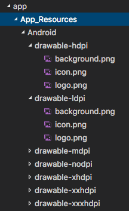

# Platform-Specific Development with NativeScript

From day one, [NativeScript](https://www.nativescript.org/) has allowed you to leverage one codebase to create native mobile apps for multiple platforms ([including the web!](https://www.nativescript.org/nativescript-is-how-you-build-native-mobile-apps-with-angular)). It's undeniable that writing code once and generating native apps for iOS, Android, and (soon) Windows is a tremendous time-saver. NativeScript's robust [modules](https://docs.nativescript.org/core-concepts/modules) abstract away platform-specific implementations and provide one clean and easy way to write cross-platform apps.

A reality that many NativeScript developers experience (especially as apps get more complex), is that each app is likely to have at least a few unique tweaks for each platform - whether they are UI customizations or accessing functionality that is only available on a specific platform (i.e. [3D Touch](https://developer.apple.com/ios/3d-touch/) on iOS).

Thankfully, NativeScript is flexible enough to allow us to customize virtually every aspect of our apps for specific mobile platforms. Let's take a closer look:

- [Customizing Your User Interface](#customizing-ui)
- [Customizing Your App Styles](#customizing-styles)
- [Customizing JavaScript/TypeScript Code Behind](#customizing-logic)
- [Platform-Specific Resources](#platform-specific-resources)

## Customizing Your User Interface

NativeScript allows you to create truly native UI and you construct your UI markup with an XML syntax. And there may be times when you want to express different UI elements, or different properties of UI elements, for each mobile platform.

### Separate UI Views

If you want to completely separate your UI views by platform, you simply use this self-explanatory file name syntax:

	myview.ios.xml
	-- and --
	myview.android.xml

The name of the view (when referenced within your app) is still `myview`, but only the iOS or the Android version of the UI will be loaded into the app at build time (based on the platform listed in the name of the file).

### Blocks of Markup Within a View

Odds are that having completely separate UI views is a little overkill, and that you will be reusing far more of your UI markup between platforms.

A slightly more realistic use case is to specify blocks of markup for each platform, within one view, like so:

	<Page>
		<ios>
			<Label...
		</ios>
		<android>
			<Label...
		</android>
	</Page>

Using the `<ios>` and `<android>` tags allows the NativeScript compiler to include or remove those markup blocks depending on the device. Easy enough!

### UI Element Attributes

Getting even more granular, you can specify platform-specific attributes of your UI elements, like so:

	<Button ios:text="I'm an iOS button!" android:text="I'm an Android button!" />

> Every UI element attribute can be customized on a platform-by-platform basis!

There is a clever trick in the [NativeScript getting started guide](http://docs.nativescript.org/angular/start/introduction.html) that hides a trash can icon on a listview item on iOS (because the iOS implementation uses "swipe to delete"):

	<ListView.itemTemplate>
	    <GridLayout columns="*, auto">
	        <Label text="{{ name }}"/>
	        <Image src="res://ic_menu_delete" ios:visibility="collapsed" col="1" tap="delete" />
	    </GridLayout>
	</ListView.itemTemplate>

## Customizing Your App Styles

NativeScript uses a [subset of CSS](https://docs.nativescript.org/ui/styling) to style the UI of your app. And just like with your XML-based view markup, you can customize CSS styling by platform:

### Separate CSS Files

Yes, you can have completely separate CSS files using the same file naming syntax introduced above:

	myapp.ios.css
	-- and --
	myapp.android.css

However, it's more likely that you'll have a single CSS file (globally or for a specific view) with common styles, and two separate, platform-specific, CSS files. So how do we combine three style sheets into one?

Simple, use the `@import` command in your main CSS file. For example, our `myapp.css` file could look something like this:

	@import { url('~/myapp.ios.css') }
	@import { url('~/myapp.android.css') }
	
	.button {
	    border-color: #b2b2b2;
	    background-color: #f8f8f8;
		...

The iOS-specific styles would only be imported on iOS, and the Android-specific styles imported only on Android.

### One CSS File, Multiple Platforms

If you don't want to maintain separate style sheets, you can still create different styling options for each platform within one CSS file. This is most easily accomplished using the [nativescript-platform-css plugin](https://github.com/NathanaelA/nativescript-platform-css) from [Nathanael Anderson](https://twitter.com/CongoCart).

This plugin adds platform classes to your style sheet, such that you can write the following:

	<Page>
		<Label class="color-me" text="Hello World!">
	</Page>
	
	.ios .color-me { color: blue; }
	.android .color-me { color: green; }
	.windows .color-me { color: red; }

In this example, on iOS the `.color-me` class will provide blue colored text. The others will be ignored.

> Related to this is another plugin you may use to customize styles by the [orientation of the device](https://github.com/NathanaelA/nativescript-orientation).

## Customizing JavaScript/TypeScript Code Behind

Each NativeScript view has a corresponding code behind JavaScript file to handle your app's logic.

### Separate JavaScript Files

Just like with XML and CSS files, you can have completely separate JavaScript files for each platform:

	myview.ios.js
	-- and --
	myview.android.js

### Code Blocks

You may just need to segment blocks of your JavaScript code to make sure you're exposing platform-specific functionality the right way. For example, if you want to set the header bar text color on your iOS device, you don't want to run that code on Android:

	if (page.ios) {
	    var navigationBar = frameModule.topmost().ios.controller.navigationBar;
	    navigationBar.barStyle = UIBarStyle.UIBarStyleBlack;
	}

If it isn't obvious, the key here is `page.ios` (and `page.android`), which simply returns a boolean to tell you which platform the app is running on.

## Platform-Specific Resources

The `App_Resources` directory is where you can store platform-specific assets for your app. Most commonly you will store images of varying pixel densities in this directory.

For example, to [display an image](https://docs.nativescript.org/ui/images) in your app, you could use markup like this:

	<Image src="res://logo" />

The `res://` prefix tells NativeScript to grab that resource from the `App_Resources` directory. More than that though, it actually leverages native methods for loading the best image for the current display density!

### Android Assets

Android resources are stored in the `drawable-` folders inside the `App_Resources/android` folder:

### iOS Assets

iOS resources are kept in the `App_Resources\ios` folder. Note that you'll want to use the @1x, @2x, and @3x prefixes to target specific devices:

- @1x == Non-Retina
- @2x == Retina
- @3x == iPhone 6/7 Plus

If you haven't done so already, take a spin around NativeScript by using our free step-by-step tutorials for [TypeScript/Angular](http://docs.nativescript.org/angular/tutorial/ng-chapter-0) or [JavaScript](http://docs.nativescript.org/tutorial/chapter-0)! 

