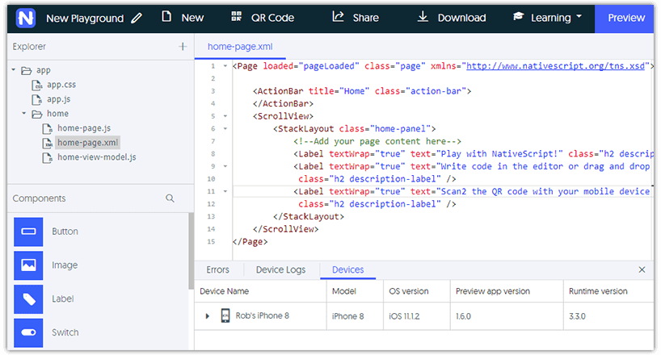
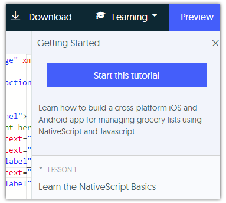
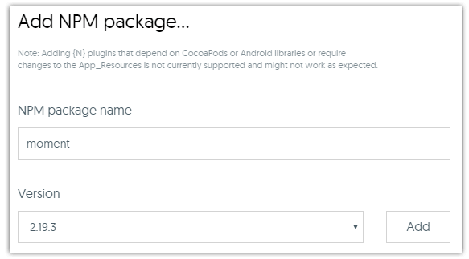
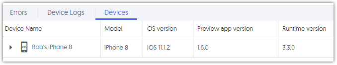

# NativeScript Playground is on 🔥

One of the most exciting [new NativeScript resources](https://www.nativescript.org/resources), the [NativeScript Playground](https://play.nativescript.org/) has already evolved from being the best way to *experiment* with NativeScript to the best way to *learn* NativeScript. By using the Playground, you can edit code, drag-and-drop UI components, deploy to iOS or Android with a QR code, and now even add NPM packages to your apps!

Last week the NativeScript Playground team released some fantastic updates:

- [Embedded NativeScript Tutorials](#tutorials)
- [Ability to Add NPM Packages](#npm)
- [Improvements to Devices Tab](#devices)

Let's take a closer look!

## Embedded NativeScript Tutorials

Most of us got started with NativeScript by going through one of the [Angular](http://docs.nativescript.org/angular/tutorial/ng-chapter-0) or [JavaScript](http://docs.nativescript.org/tutorial/chapter-0) versions of the Groceries app tutorial. The only hiccup with this process is that you were forced to set up your local dev environment before you could even see the power of NativeScript. That changes now as we introduce both tutorials in the Playground.

As of last week, you can access either tutorial by using the **Learning** menu within the Playground:

Look for more improvements with these tutorials in the Playground as we make them even more digestible (and add additional content)!

## Ability to Add NPM Packages

Likely the most-requested Playground feature, the ability to add arbitrary NPM packages from npmjs.com is key to making the Playground experience as true-to-form as possible. To add an NPM package to your Playground app you simply:

- Click on the "+" icon in the file explorer and select "Add NPM Package";
- Type in the name of the package you would like to add (and optionally select a version);
- Click "Add", and you're done!

The Playground will then download the corresponding .tgz file from the public repository, analyze its content, and recreate its structure directly in your app. Also, if you are using the Angular or Typescript templates, the Playground will analyze all typing files (.d.ts) that are part of the package and will automatically enrich its Intellisense with the new classes available.

> Please note that adding NativeScript plugins that depend on CocoaPods or Android libraries (or require changes to `App_Resources`) is not currently supported!

**Did you read the note above? Even if you did, read it again!** This feature is limited in scope to packages that don't rely on CocoaPods or Android libraries. These plugins require recompiling the application to include the native dependencies in the resulting binary. For obvious reasons, such packages cannot work with the Playground companion apps that you download from the app stores.

What this means for you is that we support all NPM packages that only call into pure native libraries that are already part of the pristine underlying Android or iOS operating systems.

*For example:*

- The [nativescript-facebook plugin](https://market.nativescript.org/plugins/nativescript-facebook) is **not** going to work with the Playground because this plugin depends on the `FBSDKCoreKit` and `FBSDKLoginKit` Pods on iOS and `com.facebook.android:facebook-android-sdk` on Android. Adding those native dependencies to an application would require full recompilation.

- The [nativescript-drop-down plugin](https://market.nativescript.org/plugins/nativescript-drop-down) **is going to work** because it doesn't depend on any third party native libraries.

- The [lodash package](https://www.npmjs.com/package/lodash) **is also going to work** because it is a pure platform-independent JavaScript utility.

> We are considering including a subset of the most popular plugins in the NativeScript Playground companion apps, so that you may use some common plugins. Stay tuned!

## Improvements to Devices Tab

You may have missed the addition of the **Devices** tab to the Playground. This tab shows you which devices are connected to your current instance of the Playground. What gets even more useful is the addition of the device name in front of each log entry in the **Device Logs** tab, allowing you to do some basic debugging to capture issues on a per-device basis.

Thanks to everyone for your support of NativeScript and the NativeScript Playground. Happy NativeScripting! 😎