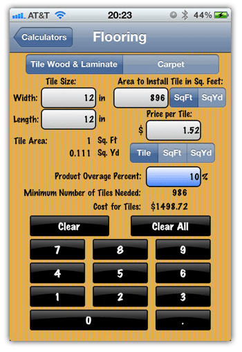
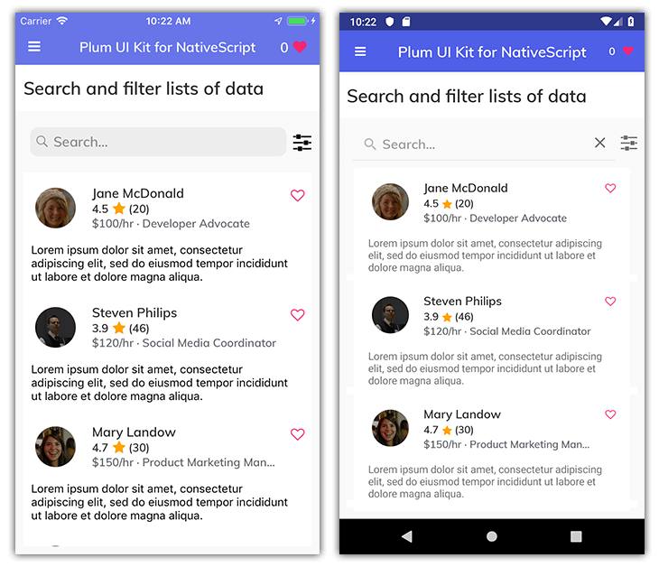
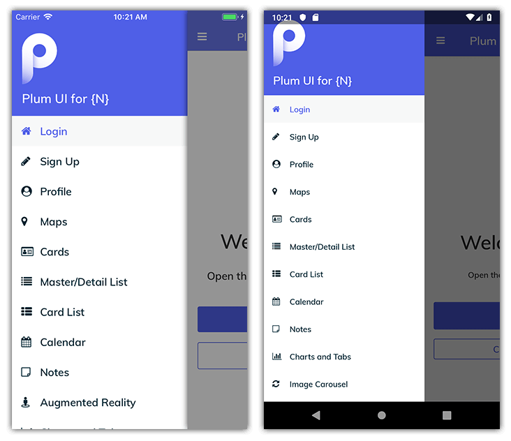
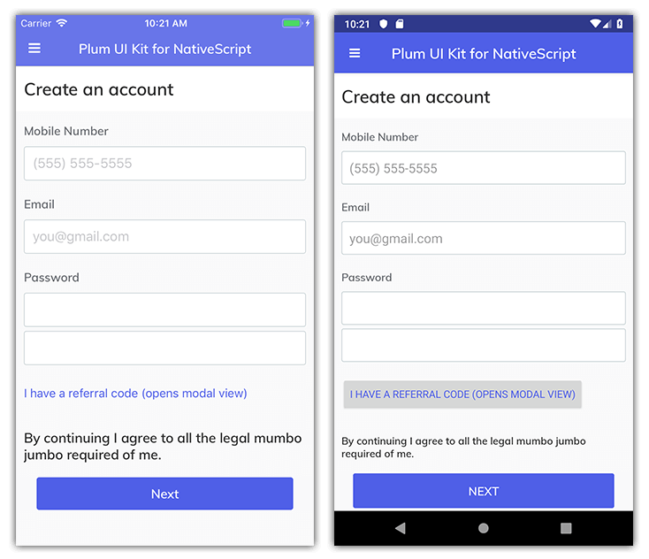
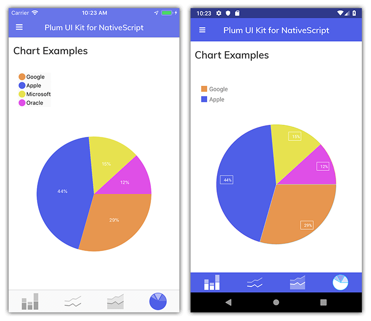
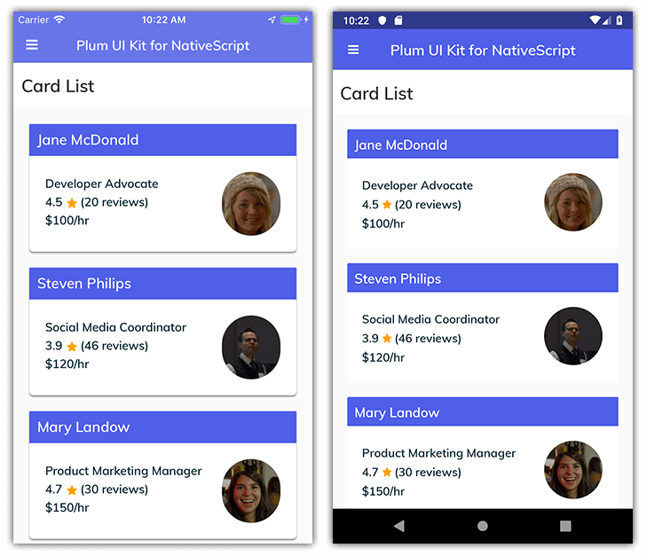
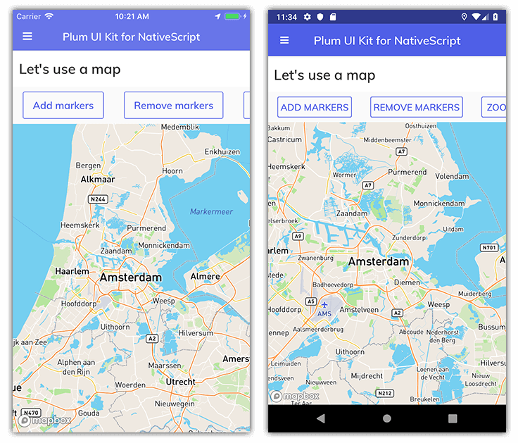
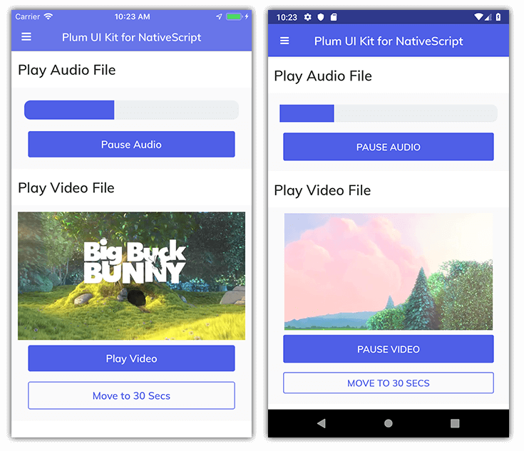

# Introducing the Plum UI Kit for NativeScript

I'm not sure there is anything that annoys and/or delays developers more than creating an app design from scratch. I mean, some of us have designers who do the heavy lifting, but many are left with their own color blind and white-space-disaster user interface implementations:

Add in iOS and Android platform intricacies, and much of the fun of creating native mobile apps falls to the wayside.

This is where UI kits for web and mobile apps come into play. In general, UI kits provide pre-built sets of components and styling to allow easy copying-and-pasting of either entire views or individual widgets into your app.

> Looking for a good resource for UI design inspiration? We are a big fan of [Uplabs](https://www.uplabs.com/).

This is where the Plum UI kit comes into play. Plum is an open source UI kit (community-built and supported by yours truly) for NativeScript developers to use when looking for a clean and elegant way to design a traditional mobile app UI. Plum is loosely based on the [Plum iOS UI Kit](https://www.uplabs.com/posts/plum-ios-ui-kit-kit) on Uplabs.

Built using NativeScript Core (a "plain TypeScript" and framework-free version of NativeScript), Plum leverages the MVVM pattern for easy development and SASS for an improved way of managing normally complicated CSS.

Plum includes a variety of mobile app screens (all completely iOS and Android compatible of course). While this list will likely expand, as of this writing, Plum includes the following:

- Side Drawer Navigation
- Login
- Sign Up
- Profile
- Maps
- Cards
- Master/Detail List
- Card List
- Calendar
- Notes
- Augmented Reality (iOS only)
- Charts
- Carousel UI
- Audio/Video
- Settings

## Plum in Action

The following gif provides a very brief overview of just some of the screens that Plum provides.

> Note that all of the functionality you see here works equally well on Android, except for Augmented Reality (which is coming soon to Android).

## iOS + Android + 🔌 = 💓

One of the key value props of using NativeScript is developing for iOS and Android simultaneously, and Plum is no different. While the app was constructed for iOS only in the beginning, a mere handful of UI tweaks and a few lines of CSS were needed to provide full compatibility with Android.

In addition, thanks to the extensive set of plugins available on the [NativeScript Marketplace](https://market.nativescript.org/), it was incredibly easy to add complicated-seeming app functionality (such as Augmented Reality, charts, swipe-to-delete, carousel, card UIs, and so on).

> A special shout-out to [Eddy Verbruggen](https://twitter.com/eddyverbruggen) and his plugin demo app for [iOS](https://itunes.apple.com/us/app/plugins/id1281334006?mt=8) and [Android](https://play.google.com/store/apps/details?id=org.nativescript.pluginshowcase) which helped to make this possible!

## Plum Screens

Want to see more before you try it out yourself? Take a peek at the following set of cross-platform UI screens:

## Ready to Play with Plum?

Plum uses numerous NativeScript plugins that are not available for preview on the [NativeScript Playground](https://play.nativescript.org/). Therefore due to the complexity of the app, you'll have to download/clone the app yourself to take it for a spin. No worries though, as the code is [freely available on GitHub](https://github.com/rdlauer/plum).

Enjoy using Plum and feel free to [submit an issue](https://github.com/rdlauer/plum/issues) on GitHub if you run into any troubles!