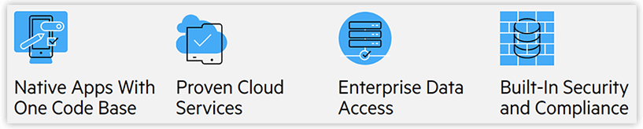

# Adobe Decreases Investment in PhoneGap and Cordova - What this Means for Hybrid Apps

Over the past few months, Adobe has ramped down the number resources focused on PhoneGap. PhoneGap is known as the preeminent *hybrid* mobile app development framework. Also known as Apache Cordova (its open source cousin), PhoneGap allows developers to use their web skills (HTML, CSS, and JavaScript) to develop native-like apps that can be deployed to a variety of mobile operating systems.

Progress, by way of Telerik, has been involved in the hybrid development space for some time. Kendo UI Mobile and Icenium were two products created at a time when it appeared the hybrid app development methodology was going to skyrocket. Enterprises and hobbyists alike could save time and money by adopting hybrid as a way to ease into this new "mobile-first" world.

Icenium became Telerik Platform, and it was one of the first Mobile App Development Platforms (MADPs) to fully embrace PhoneGap and provide a one-stop-shop for developers to address every aspect of the hybrid app development cycle. From writing code, to analytics, to testing, to deployment, Telerik Platform became well known in this space.

By 2016 however, the writing was on the wall. **Hybrid was hitting some barriers that it wasn't likely to ever overcome.**

> [Contact us](https://www.nativescript.org/hybrid-to-native/contact) for more information on modernizing your hybrid apps.

## The Stuggles of Hybrid

It's no surprise to both developers AND consumers of hybrid apps built with PhoneGap/Cordova that the native-like experience oftentimes just isn't native enough. Apps were written for critical business functions that:

- **Don't perform well:** The performance limitations of hybrid apps led to a sub-par consumer experience.
- **Don't *feel* native:** Hybrid apps can provide an "uncanny valley" effect. Not a web site, but also not quite a mobile app.
- **Are difficult to complete:** Developers can get 80% of a hybrid app done quickly, but the last 20% is a struggle.

In 2015 Progress released the 1.0 version of [NativeScript](https://www.progress.com/nativescript). NativeScript is a free and open source framework that allows you to create truly native cross-platform mobile apps **using the *same* skills developers use to create hybrid apps** with PhoneGap. NativeScript is considered a "JavaScript-native" framework, meaning using the JavaScript language to create *truly native* apps for the leading mobile platforms (iOS and Android) from a single codebase.

## Growth of JavaScript-Native

NativeScript helped to usher in a new era of mobile app development. By re-using web skills developers had been honing for years, NativeScript made developing apps without the limitations of hybrid a more palatable option for the enterprise. **You could actually have your cake and eat it too!**

This did, however, mean some new product market realities at Progress. Telerik Platform was built for hybrid and simply, as a product, doesn't make sense in this new world. It was decided that Telerik Platform would be shut down in May of 2018.

> The deprecation of Telerik Platform is now further reinforced by Adobe's decision to diminish its PhoneGap investment.

## Progress Mobility

But Progress was not abandoning mobility, not even close. With the Telerik Platform door closing, other doors opened thanks to the ascent of NativeScript. Supporting a free and open source framework is just the beginning of the new Progress mobility journey.

Providing [enterprise-grade support for NativeScript](https://www.nativescript.org/enterprise) enables businesses of all sizes to trust that their commitment to NativeScript is backed by a company with a history of unparalleled support. Not only that, but [NativeScript Sidekick](https://www.nativescript.org/nativescript-sidekick) enables developers to avoid the hassle of SDK and configuration management and build their apps in a secure cloud.

[Progress Kinvey](https://www.progress.com/kinvey) is widely known as a [leader](http://go.kinvey.com/forrester-wave-mobile-development-platforms/) in the serverless cloud space. **Kinvey provides features developers love, in a [secure and compliant environment](https://www.progress.com/kinvey/platform) that enterprises adore.** Leveraging the tight integration with NativeScript allows business to embrace one *open* stack for both the front end and back end.

## Conclusion

While the future of hybrid mobile apps are unclear, today is also an opportunity to modernize legacy apps. **New frameworks like NativeScript embrace the hybrid philosophy of saving time (and money)**, and also move *beyond* hybrid to achieve performance and engagement previously only available via traditional native app development methods.

*Curious to learn more about NativeScript and Progress mobility solutions?*

- Read about the open source [NativeScript framework](https://www.progress.com/nativescript);
- Learn about [Progress Mobility](https://www.progress.com/solutions/mobility);
- [Contact us](https://www.nativescript.org/hybrid-to-native/contact) for information on modernizing your existing hybrid apps.