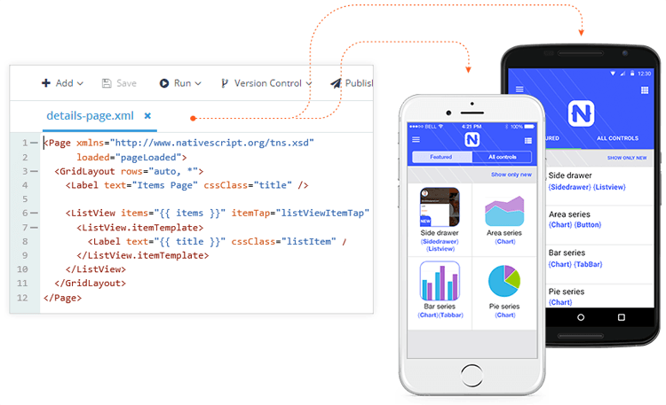
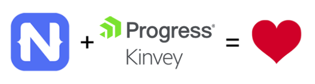

# Why Does Progress Support NativeScript?

Of all the non-technical NativeScript questions I'm asked, this is surely at the top of the list.

Why *does* [Progress](https://www.progress.com/) support NativeScript? Why would a company, any company really, dump loads of money into a free and open source project?

The truly skeptical folks continue with questions like, "What's *really* in it for Progress?" and "How do we know NativeScript will be around long enough for us to commit to it?"

I get it. Open source offerings from a vendor of developer productivity tooling can feel unfamiliar to some. Usually companies like Progress are laser-focused on revenue and don't have the same spending flexibility as some of the giants behind OSS like Facebook and Google.

*So let's start there:*

## Facebook, Google, and...Progress?

Some of you may know this, but NativeScript actually started under [Telerik](https://www.telerik.com/) back in early 2014. At that time, Telerik (primarily known for .NET tooling and [Kendo UI](https://www.telerik.com/kendo-ui)) was branching out into mobility - and the NativeScript project was a perfect fit.

*An early look at NativeScript from years past.*

Towards the end of 2014, Progress acquired Telerik. And as part of this acquisition came a lot of amazing people and amazing technology, NativeScript included. Since then, Progress has invested a lot of resources to continue to build and maintain NativeScript. And just like Facebook and Google aren't necessarily generating explicit revenue from their OSS offerings, nor is Progress.

But Facebook and Google are billion-dollar companies that one could assume have cash to burn 💵🔥. So what *is* in it for Progress?

Well ok, Progress does generate *some* revenue directly from NativeScript in these ways:

- [Enterprise-level support](https://www.nativescript.org/enterprise)
- ...and that's about it!

Companies looking to bank on NativeScript often come to us, cash-in-hand, to pay for dedicated support. And we are happy to oblige. However, support doesn't easily scale, and it's not part of the Progress long term vision to provide support licenses and call it a day.

So if direct revenue isn't the end goal, what are the *other* reasons Progress supports NativeScript?

## Progress Kinvey

Another key value of NativeScript for Progress is integrating with commercial offerings in the Progress portfolio. A shining example of this is the [Progress Kinvey platform](https://www.progress.com/kinvey). You've heard us talk about Kinvey before (mostly as an mBaaS), however, NativeScript is a linchpin in certain Kinvey capabilities:

- [Kinvey Chat](https://www.progress.com/kinvey/chat): {N} is the primary means of deploying a chatbot to a mobile device.
- [Kinvey Microapps](https://www.progress.com/kinvey/micro-apps): {N} is the framework behind creating focused units of work, known as microapps.
- [Kinvey Studio](https://www.progress.com/kinvey/studio): {N} is the way you take your visually-designed mobile app and build it for iOS and Android.

> Read more about [What is a Microapp?](https://www.progress.com/blogs/what-is-a-microapp) if you're curious.

Of course Kinvey as a mobile backend (mBaaS) is critically important as well, which is why Progress offers a full [NativeScript SDK](https://devcenter.kinvey.com/nativescript) and promotes the ability for long-time [Progress Open Edge](https://www.progress.com/openedge) customers to easily access legacy data and modernize their apps.

At the end of the day, **Progress is a developer tooling company, with developer DNA**, that is providing the best (free) open source means of creating native cross-platform experiences. A positive byproduct is adding that same experience to commercial tooling that *also* benefits developers.

## Developer ❤️

This all being said, companies like Progress aren't *just* about the bottom line! The act of supporting open source projects can also be altruistic in nature and just give developers warm fuzzies when they think of Progress 🤗.

Did you know that Progress supports a variety of other [free and/or open source projects](https://www.telerik.com/open)? Such as:

- [Kendo UI Core](https://www.telerik.com/kendo-ui/open-source-core)
- [Fiddler](https://www.telerik.com/fiddler)
- [UI for Windows Universal Platform](https://www.telerik.com/universal-windows-platform-ui)
- [JustDecompile](https://www.telerik.com/products/decompiler.aspx)
- [JustAssembly](https://www.telerik.com/justassembly)

## NativeScript is Here to Stay

Needless to say, NativeScript isn't going anywhere. Well, it's going somewhere (just look at the [roadmap](https://www.nativescript.org/roadmap-and-releases)!). But the real meaning behind this statement is that **NativeScript is a core component of the Progress mobility strategy** going forward. It's a very symbiotic relationship: when open source NativeScript succeeds, Progress succeeds, and vice versa.

To summarize, Progress supports the open source NativeScript project for good reasons. It makes good business sense in and of itself, it supports a growing JavaScript developer community, and it provides Progress indirect revenue via other paid products. Happy NativeScripting! 🥳
