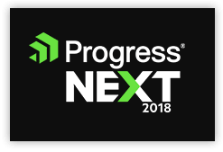

# The NEXT NativeScript Conference

Last September in New York City, we held the second-ever [NativeScript Developer Day](http://developerday.nativescript.org/). A fantastic array of speakers and attendees combined to provide an opportune environment for learning more our about beloved open source framework.

Well there is an *even larger* conference at the end of May with **massive mobility-focused tracks** that include loads of NativeScript content!

**[ProgressNEXT](https://www.progress.com/next) is a global gathering of developers and IT professionals that covers the entire Progress portfolio, including NativeScript, [Kinvey](https://www.kinvey.com/), and [Kendo UI](https://www.telerik.com/kendo-ui).**

> Did you know that Progress sponsors the open source work behind NativeScript? Now you know!

Hosted at the beautiful [Westin Waterfront Hotel](https://aws.passkey.com/go/ProgressSoftware2018) in Boston, from May 29th to June 1st, ProgressNEXT is your next opportunity to attend sessions and interact with key personalities in the NativeScript ecosystem.

## NativeScript Sessions

If you're curious about what NativeScript-specific content you'll find, how about topics such as:

- Cross-Platform Augmented Reality
- Access Remote Databases from NativeScript Mobile Apps
- Boost Your App's Emotional Intelligence with NativeScript and Machine Learning
- Sharing Code Between Web and Mobile with NativeScript and Kendo UI
- Building a Robot Army with NativeScript
- Getting Started with NativeScript
- Build for iOS from Windows with NativeScript Sidekick

> Feel free to [browse the full NativeScript agenda](https://www.progress.com/next/agenda#filters-nativescript) at ProgressNEXT

## Register Today

Registration is open now, and if a wealth of NativeScript content isn't enough to convince you, how about:

- Keynote speakers from **NASA**, BayHealth Development, TVH Group, and Progress;
- **150 unique sessions** covering not only the Progress portfolio, but thought leadership sessions spanning many technology topics;
- An opportunity to interact with Progress executives, and maybe more importantly for you: NativeScript engineering, product management, and developer relations!

Curious? Take a closer look 🧐 at [ProgressNEXT](https://www.progress.com/next) to get all of the details and secure your registration today!