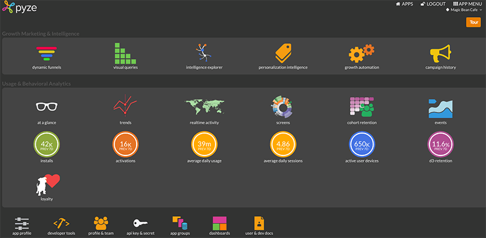
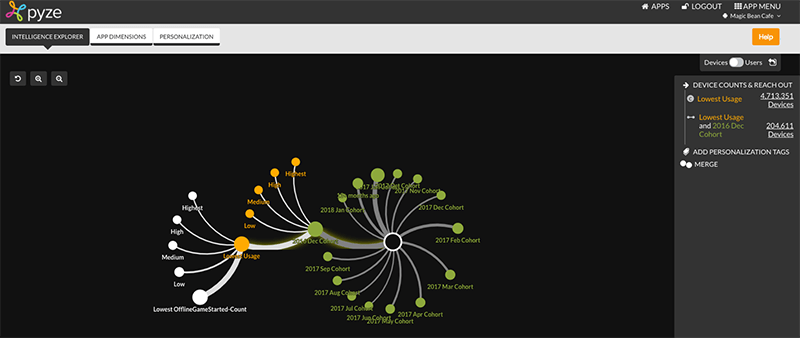
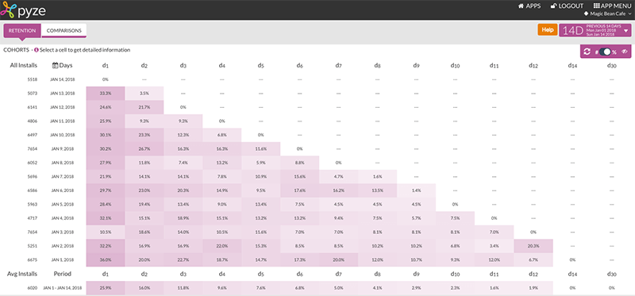
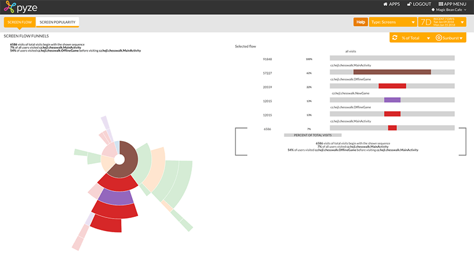
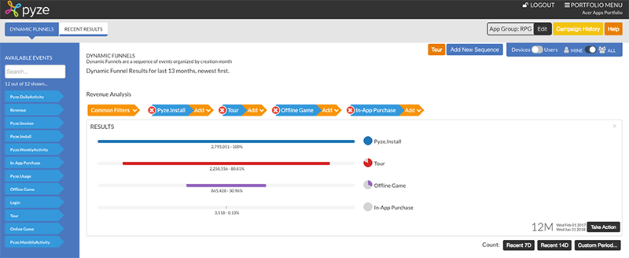
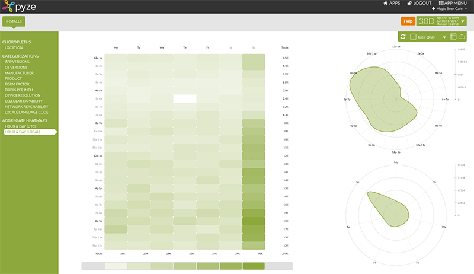

# Automating Growth and Data Analytics in NativeScript Apps

*This is a guest post by Prabhjot Singh , President & CEO of [Pyze](https://pyze.com/).*

In a 2017 survey conducted by [Pyze](https://pyze.com/), the overwhelming majority of publishers said that their biggest challenges to growth are user engagement and retention. Regardless of whether an app wants to monetize users, build brand loyalty or even just provide a channel to increase productivity, it goes without saying that continued usage of an app is significantly important for meeting its goal. 

**Building successful apps – whether consumer or enterprise - is tough.** Even though there are millions of apps available on Google Play and Apple’s App Store, most people use very few apps. Whether it’s a game that provides 10 minutes of unwinding or a workflow process management app, each must be intuitive to use, deliver meaningful notifications and display personalized content to each user in order to be successful.

All apps must perform a continuous *Product Market Fit* exercise in which they promote features that work, improve on the ones that under-perform and retire those are universally unused.  Apps must also deliver timely messages to keep users engaged while ensuring that the content that is displayed to each user is meaningful. At Pyze, we believe that this iterative exercise is an imperative for long term app success. 

The challenge till now has been that companies and enterprises required teams of data scientists, product managers and marketing analysts all using a multitude of systems to understand product analytics, perform segmentation, create marketing campaigns, and deliver personalized content. In this first installment of a multi-part series, we will examine how best to architect the instrumentation framework to enable Data Analytics and conduct segmentation to maximize growth.

The Pyze Growth Intelligence automates [app analytics](https://pyze.com/portfolio/cross-platform-analytics/) and [user segmentation](https://pyze.com/portfolio/automated-segmentation/). To collect Analytics data on installs, usage, screen paths, loyalty, and retention, Pyze simply requires minimal the integration of one line of code.

## Installing Pyze NativeScript SDK

Run the following command inside your project directory:

	tns plugin add pyze-nativescript

Now you are ready to [Setup and Initialize](https://docs.pyze.com/nativescript.html#pyze-nativescript-app-sdk-setup--initialize) for iOS and Android.

## Pyze NativeScript App SDK: Setup & Initialize

The instructions on this page assume you have installed the Pyze SDK into your NativeScript project. If not, Install the SDK and come back to this page. See [Getting Started with NativeScript Guide](https://docs.pyze.com/nativescript.html#getting-started).

### iOS

Register for the iOS app Delegate events, as mentioned in [Application Management](https://docs.nativescript.org/core-concepts/application-lifecycle)

Inside the `applicationWillFinishLaunchingWithOptions` of the application delegate call the following method:

	Pyze.initializeWithLogThrottling("PYZE_APP_KEY", PyzelogLevelMinimal);

*Usage:*

	MyDelegate.prototype.applicationWillFinishLaunchingWithOptions = function (application, launchOptions) {
		Pyze.initializeWithLogThrottling("PYZE_APP_KEY", PyzelogLevelMinimal);
		return true;
	};

The possible Log Level values are:

- `PyzelogLevelAll`
- `PyzelogLevelErrors`
- `PyzelogLevelWarnings`
- `PyzelogLevelMinimal`

### Android

Add the Pyze App Key in the manifest’s application tag, which is present under the `App_Resources` folder:

	<meta-data android:name="PyzeAppKey" android:value="PYZE_APP_KEY"/>

Register for the activity lifecycle [here](https://docs.nativescript.org/core-concepts/application-lifecycle). Inside the `onCreate` method call `Pyze.initialize();` to initialize pyze

*Usage:*

	var application = require("application");
	var Pyze = require("pyze-nativescript").Pyze;
	if (application.android) {
		application.android.on(application.AndroidApplication.activityCreatedEvent, function (args) {
			Pyze.initialize();
		});
	}
	application.start({ moduleName: "main-page" });

Alternatively you can specify the log level, using following method:

	Pyze.initializeWithLogLevel("PyzelogLevelAll");

The possible Log Level values are:

- `PyzelogLevelAll`
- `PyzelogLevelErrors`
- `PyzelogLevelWarnings`
- `PyzelogLevelMinimal`

## Behavior Reporting

The Automated Analytics Provide detailed user behavior reporting including:

*Automated User Segmentation*

*Retention Cohort Analysis*

*Screen Flow Analysis*

*Funnel Conversion Analysis*

*Install and Usage Reports*

## Summary

Pyze includes out of the box [Nativescript Support](https://www.npmjs.com/package/pyze-nativescript). Get started with Free Analytics at [Pyze.com](https://pyze.com/).

Join us for the next installment in this multi-part series covering app growth where we will discuss using user behavioral triggers to enable personalized notifications & app engagement.